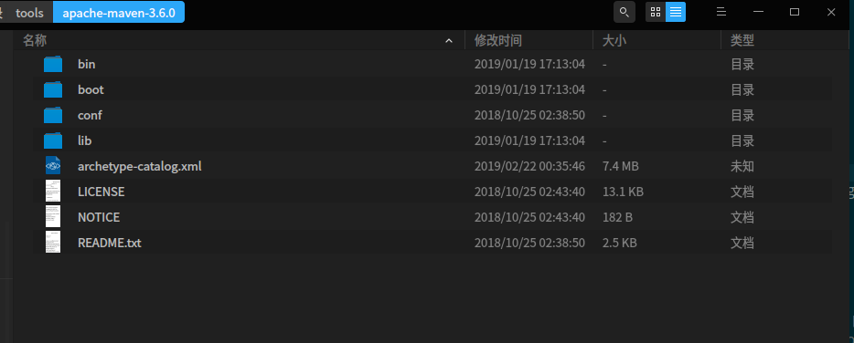

# Maven相关内容学习

我这里安装的是 maven 3.6.0 版本的，在idea中也安装了相关插件


## pom.xml文件如何配置
我这里先粘一个模版

```xml
<?xml version="1.0" encoding="UTF-8"?>
<project xmlns="http://maven.apache.org/POM/4.0.0"
         xmlns:xsi="http://www.w3.org/2001/XMLSchema-instance"
         xsi:schemaLocation="http://maven.apache.org/POM/4.0.0 http://maven.apache.org/xsd/maven-4.0.0.xsd">
    <modelVersion>4.0.0</modelVersion>
    <!--基本配置-->
    <groupId>com.dlut.sparkLearning</groupId>
    <artifactId>sparkSql</artifactId>
    <version>1.0-SNAPSHOT</version>
    <packaging>jar</packaging>
    <!--依赖配置-->
    <properties>
        <spark.version>2.4.0</spark.version>
        ...
    </properties>
    <dependencies>
        <!--参考 https://www.cnblogs.com/zlslch/p/7446002.html -->
        <!--查找相关 https://mvnrepository.com/artifact/org.apache.spark/ 的写法-->
        <!-- https://mvnrepository.com/artifact/org.apache.spark/spark-core -->
        <dependency>
            <groupId>org.apache.spark</groupId>
            <artifactId>spark-core_2.11</artifactId>
            <version>${spark.version}</version>
            <scope>provided</scope>
        </dependency>
        <dependency>
            ...
        </dependency>
    </dependencies>
    <parent>...</parent>
    <dependencyManagement>...</dependencyManagement>
    <modules>...</modules>
    <!-- 构建配置 -->
    <build>...</build>
    <reporting>...</reporting>
</project>
```
### 基本配置
- **每个项目都只有一个pom.xml文件**
- 第一行规定了xml文档的版本和编码
- project是pom.xml文件的根元素，规定了一些pom相关的命名空间及xsd元素
- 基本配置
  - modelVersion规定了pom模型的版本，maven2和3只能是4.0.0
  - groupId、artifactId、version是用来区分项目的基本元素，规定了项目属于哪个项目组，项目在组中唯一id，项目版本
  - packaging规定了项目打包方式，默认是jar。可选pom, jar, maven-plugin, ejb, war, ear, rar, par

### 依赖配置

- 依赖配置
  - properties定义pom中的常量，比如上面定义spark版本为2.4.0，引用时通过`${spark.version}`调用即可
  - dependencies定义了项目中需要的一些依赖
    - 父项目中的依赖会被子项目所引用，通常用来申明一些公共依赖，比如java版本啥的
    - 我通常会在 https://mvnrepository.com 查找一些依赖jar的dependency写法
    - dependency详细应用在下面展开
  - parent用来确定父项目位置，如下
    - groupId、artifactId、version和上文一样，但指定的是父项目的
    - relativePath，maven首先在当前项目中找父项目，然后在文件系统的这个位置（relativePath），然后在本地仓库，再在远程仓库找
    > 仓库是个啥？可以看下这篇文章的介绍：https://juejin.im/post/5a4a5e2bf265da4322418d7f
    ```xml
    <parent>
      <groupId>com.dlut.Bigdata</groupId>
      <artifactId>spark-parent</artifactId>
      <relativePath></relativePath>
      <version>0.0.1-SNAPSHOT</version>
    </parent>
    ```
   - dependencyManagement一般是在父项目中写，写法同dependencies。父项目定义了依赖，子项目不会直接使用相应依赖，只有子项目需要使用才引用，但无需写相关版本。可能没讲请
     ```xml
     <!--父项目-->
     <dependencyManagement>
       <dependencies>
         <dependency>
           <groupId>org.apache.spark</groupId>
           <artifactId>spark-core_2.11</artifactId>
           <version>${spark.version}</version>
           <scope>provided</scope>
         </dependency>
       </dependencies>
     </dependencyManagement>
     <!--子项目不写spark-core相关依赖则不会引用该依赖-->
     <!--除非子项目写，但无需写版本信息-->
     <dependency>
           <groupId>org.apache.spark</groupId>
           <artifactId>spark-core_2.11</artifactId>
     </dependency>
     ```
  - models是一些maven项目会拆分成若干模快，暂时不太清楚

#### 细说依赖dependency
```xml
<dependency>
  <groupId>...</groupId>
  <artifactId>...</artifactId>
  <version>...</version>
  <type>依赖类型</type>
  <scope>依赖范围</scope>
  <optional>依赖是否可选</optional>
  <!--排除传递依赖-->
  <exclusions>
    <exclusion>
      <groupId>…</groupId>
      <artifactId>…</artifactId>
    </exclusion>
  </exclusions>
</dependency>
```
**我通常会在 https://mvnrepository.com 查找一些依赖jar的dependency写法**

1. groupId、artifactId和上面讲的一样，不用管
2. version是你需要考虑的，选择适合的版本
3. type是类型，默认是jar，和上面讲的packaging是一样的，不用管
4. scope是范围
    1. 有*compile*（默认）、*provided*、*test*、*runtime*、*system*选项
    2. 不写scope时默认是compile
    > | 依赖范围  | /                                                                                            |
    >| :------- | :------------------------------------------------------------------------------------------- |
    >| compile  | 编译、测试、运行时都会用到该依赖（该依赖会编译打到jar包内，默认）                                   |
    >| provided | 编译、测试时用到该依赖（运行环境中有该依赖时适用）                                                 |
    >| test     | 编译测试代码和运行测试代码时会用到该依赖                                                          |
    >| runtime  | 测试、运行时用到该依赖，但编译时不会用到                                                          |
    >| system   | 和provided一样，但需要通过systemPath来指明依赖在系统中位置，谨慎使用，毕竟移到其他系统下位置可能不一样 |
    >
    >```xml
    > <!-- https://mvnrepository.com/artifact/org.apache.spark/spark-hive -->
    > <!--举个例子，改动了scope-->
    > <dependency>
    >   <groupId>org.apache.spark</groupId>
    >   <artifactId>spark-hive_2.11</artifactId>
    >   <version>2.4.0</version>
    >   <scope>system</scope>
    >   <systemPath>/home/xxx/Jars/spark-hive_2.11-2.4.0.jar</systemPath>
    > </dependency>
    > ```
5. optional可选依赖，有true和false选择
    1. `<optional>true</optional>`，还是针对A->B->C这种传递依赖，如果在B的pom文件中写明C依赖是`<optional>true</optional>`，则A不会引入C依赖。如果A需要C依赖的话，需要显示添加C依赖；或者将optional设为false或去掉
    2. **optional选项在统一控制版本的情况下会失效**
    ```xml
    <!--参考https://blog.csdn.net/lovejj1994/article/details/80283240-->
    <!--A项目-->
    <groupId>A</groupId>
    <artifactId>A</artifactId>
    <version>1.0-SNAPSHOT</version>

    <dependencyManagement>
        <dependencies>
            <dependency>
                <groupId>joda-time</groupId>
                <artifactId>joda-time</artifactId>
                <version>2.9.9</version>
                <optional>true</optional>
            </dependency>
        </dependencies>
    </dependencyManagement>
    <!--B项目-->
    <groupId>B</groupId>
    <artifactId>B</artifactId>
    <version>1.0-SNAPSHOT</version>
    <!--指明父项目是A-->
    <parent>
        <groupId>A</groupId>
        <artifactId>A</artifactId>
        <version>1.0-SNAPSHOT</version>
    </parent>

    <dependencies>
            <!--B可以正常引用到joda-time-->
        <dependency>
            <groupId>joda-time</groupId>
            <artifactId>joda-time</artifactId>
        </dependency>
    </dependencies>
    ```
6. exclusions用来排除传递性依赖，主动排除子项目传递过来的依赖
> 传递性依赖，项目A依赖B，B中又对C有依赖，所以A也间接对C依赖，有传递之意。不用管那么多，Maven会解析各个直接依赖的pom文件，将那些必要的间接依赖，以传递性依赖的形式引入到当前的项目中
> 不过有一点要记得，compile依赖范围选项会把该依赖打进jar包中，所以该依赖是直接打进项目还是借助环境中现有的依赖要考虑清除

- 只需要groupId和artifactId
- 排除一些不适合的版本的依赖
```xml
<dependency>
  <groupId>...</groupId>
  <artifactId>...</artifactId>
  <version>...</version>
  <!--排除传递依赖A-->
  <exclusions>
    <exclusion>
      <groupId>A</groupId>
      <artifactId>A</artifactId>
    </exclusion>
  </exclusions>
</dependency>
<!--指定A依赖相关信息-->
<dependency>
  <groupId>A</groupId>
  <artifactId>A</artifactId>
  <version>...</version>
  <scope>...</scope>
</dependency>
```


### 构建配置

- 构建配置
  - 
## setting.xml文件如何配置


### 参考文章
- https://www.jianshu.com/p/0e3a1f9c9ce7
- https://juejin.im/post/5a4a5e2bf265da4322418d7f