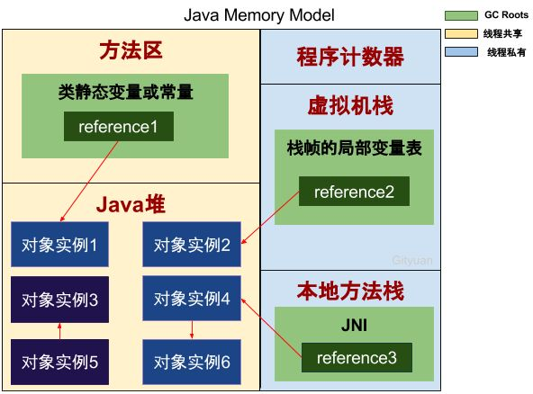

### JVM堆内存分布

### JVM堆内存分配策略

分新生代、老年代、永久代（jdk 1.8之后替换成了Metaspace）

- 新生代 【8:1:1】

  - Eden区+Survivor1区+Survivor2区，Eden和Survivor默认8:1，两块Survivor一样大（读完本书可以知道是因为新生代多采取复制清除GC算法）
  - 对象优先在 Eden 分配

- 老年代 【新生代：老年代=1:2】

  - 大对象直接放入老年代

  - 长期存活的对象晋入老年代

    > 动态对象年龄判断：
    >
    > 对象最新进入Eden区，进过第一次MinorGC后如果该对象任然存活，移入Survivor区，并维护一个年龄计数器，设为1。后续如果再次经过一次MinorGC，还没死亡的话年龄计数器自增1，如果年龄超过15，自动晋入老年代。或者相同年龄的对象超过Survivor内存区域一般时，也会自动把这些对象移入老年代

- 永久代在jdk 1.8中被Metaspace元空间取代 

  - 参考：[Java8内存模型—永久代(PermGen)和元空间(Metaspace)](https://www.cnblogs.com/paddix/p/5309550.html)
  - 可由**-XX:MaxPermSize**进行设置，永久代也称为方法区 ，用来存放类的信息、常量池、方法数据、方法代码等
  - 元空间不再是存放在虚拟机中了，而是直接使用本地内存

  > 永久代也是会发生垃圾回收的，但有三点条件：
  >
  > 1. 该类的实例都被回收。 
  >
  > 2. 加载该类的classLoader已经被回收 
  >
  > 3. 该类不能通过反射访问到其方法，而且该类的java.lang.class没有被引用 
  >
  > 满足这三个条件可以回收，但回不回收还得看jvm
  >
  > 但很少说永久代垃圾回收，垃圾回收侧重新生代、永久代

#### 堆内存各区域比例及相关控制参数

总的来说，堆可分为新生代+老年代，可由参数**–Xms（初始堆大小）、-Xmx（最大堆大小）**来控制大小，新生代大小由参数**-Xmn**控制，新生代三块分区比例可由**–XX:SurvivorRatio**控制，新生代和老年代比例可由参数**–XX:NewRatio**控制

### 如何判断对象已死亡？

#### 引用计数法

最容易想到的就是这种，每有一个引用指向对象，引用计数器就加一，引用失效就减一。一旦引用计数器为0，表明对象已死亡，可回收。

**问题是如果两个对象相互引用，引用计数器始终不会为0**

#### 可达性分析算法

提出一个GC Roots 对象的概念，GC Roots为起点向下搜索，所走过的路径为引用链，如果没有GC Roots对象到该对象的引用链，表明该对象可回收

- GC Roots对象包含哪些？
  - JVM虚拟机栈中引用的对象（栈帧是对象调用方法时生成的，具体说是局部变量表中引用的对象）
  - 本地方法栈中的JNI引用的对象（Java Native Interface缩写，Native方法是jav调用其他语言的方法，多用来提高效率、和底层硬件、小做系统交互）
  - 方法区中静态变量、常量引用的对象

 [图片引自：Gityuan的回答 - 知乎](https://www.zhihu.com/question/21539353/answer/95667088)

如图，像对象实例1、2、4、6是GC Roots可达的，3和5是可被回收的

> 这里有个问题是，搜索时是采用广度优先还是深度优先搜索？搞不清

### 什么时候会进行垃圾回收GC？

垃圾回收不能像C++似的手动进行，java中是由JVM自动判断进行GC的，但System.gc()可以提示进行GC

- 新生代内存空间不足时，会进行Minor GC
- 长期存活的对象由新生代晋升入老年代时，老年代内存空间不足的话也会进行full GC

#### 看下对象的引用

引用分为四种：强引用、软引用、弱引用、虚引用

- 强引用：强引用存在的话，即使内存不够，也不会对强引用对象回收。`P p = new P()`就是强引用
- 软引用：内存空间足够时，不会回收；不足时才会对其回收。**可用来实现内存敏感的高速缓存**
- 弱引用：垃圾回收器扫描到弱引用对象时就会对其回收，无论内存空间足不足
- 虚引用：“虚”字可知，表明该引用可有可无。该虚引用对象被垃圾回收器回收时候，系统能够接收到一个通知

### GC 算法有哪些？

- 标志-清除法
  - 适合老年代
  - 问题：标记和清除效率不高、内存空间碎片化的问题
- 标志-整理法
  - 适合老年代
  - 也是为了解决碎片问题，标志同上，但会将所有存活的对象向一端移动，再回收
- 复制清除法
  - 适合新生代
  - 两块一样大小的内存，每次用一块，这也是它的缺点（内存只使用一半）
  - 每次只对一块内存空间回收，效率高，不会出现空间碎片
- 分代收集法 【用的最多的GC算法】
  - 根据新生代和老年代对象的性质，采取新生代使用复制清除法，老年代使用标志-清除/整理法
  - 新生代会有大量对象死亡，所以Minor GC发生频率高，而老年代中对象存活率高，GC没那么频繁

### 垃圾回收器

#### Serial回收器

单线程、独占式GC

#### ParNew回收器

多线程的Serial

#### CMS回收器

#### G1回收器

### 补充

看到一篇博客提到了死亡对象如何搜索BFS、DFS，有点兴趣，[见此](http://blog.jobbole.com/109833/)

> 为什么新生代用广度搜索，老生代用深度搜索?
>
> 深度优先DFS一般采用递归方式实现，处理tracing的时候，可能会导致栈空间溢出，所以一般采用广度优先来实现tracing（递归情况下容易爆栈）。
> 广度优先的拷贝顺序使得GC后对象的空间局部性（memory locality）变差（相关变量散开了）。
> 广度优先搜索法一般无回溯操作，即入栈和出栈的操作，所以运行速度比深度优先搜索算法法要快些。
> 深度优先搜索法占内存少但速度较慢，广度优先搜索算法占内存多但速度较快。
>
> 结合深搜和广搜的实现，以及新生代移动数量小，老生代数量大的情况，我们可以得到了解答。