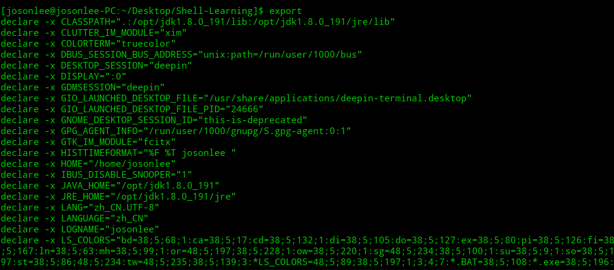
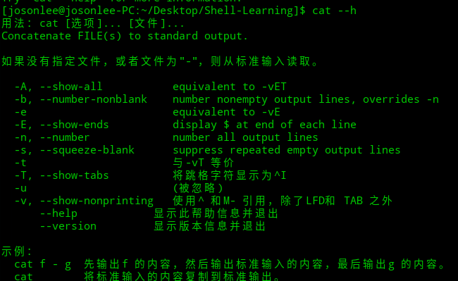
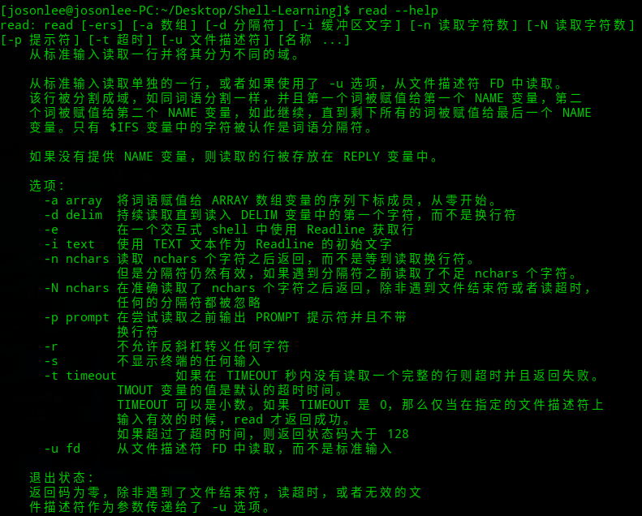
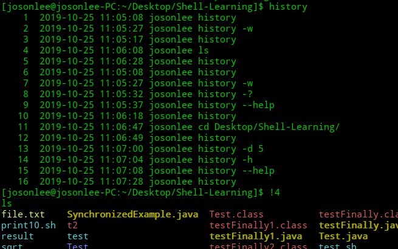
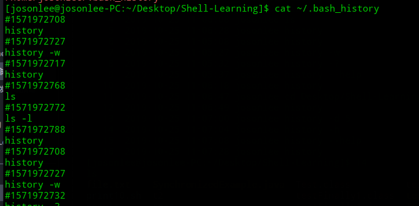
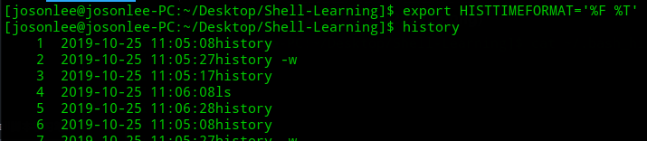
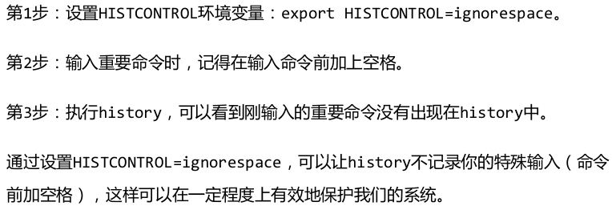
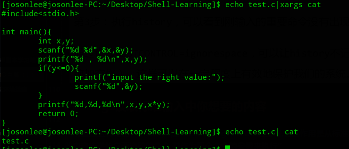

# 什么是Shell

- 查看当前系统安装了哪些Shell

`/etc/shells`文件中有记录
```shell
[josonlee@josonlee-PC:~/Desktop/Shell-Learning]$ cat /etc/shells 
# /etc/shells: valid login shells
/bin/sh
/bin/bash
/bin/rbash
/bin/dash
```
- 查看当前系统采用的Shell
```shell
[josonlee@josonlee-PC:~/Desktop/Shell-Learning]$ echo $SHELL
/bin/bash
```
用的多的主要是bash和zsh，bash是主流采用的，zsh功能更强大，还完全兼容bash

```shell
apt-get install zsh
chsh -s /bin/zsh
```
可以安装zsh，并切换Shell类型为zsh（重新登陆才会生效）

# 用export来展示Shell环境变量

自己在Linux下配过java环境或是其他环境的话，都会遇过export这个命令吧，一般会在`～/.bashrc`文件中通过它把环境变量导入系统，比如常见的`$PATH`。直接export可以查看所有的Shell的环境变量，下面截了部分图


除了export，还有env、set、declare可以查看Shell的环境变量，区别是export/env是显示当前用户的环境变量，set/declare是显示当前的环境变量和用户自定义变量，但又有些不一样的地方。我感觉具体啥也不用管，知道如何修改设置Shell环境变量就可以了

- 通过export设置环境变量

之前说的`$PATH`这个环境变量，代表的是绝对路径，如果一条命令运行时没指定其绝对路径，系统就会去`$PATH`申明下的路径去找

```shell
# $PATH变量的值由通过冒号分隔的多个路径组成
# 如下是添加scala的绝对路径
export PATH=$SCALA_HOME/:$PATH
```
> 通过export设置的变量是环境变量，没使用而是直接定义的是自定义变量。
> 环境变量可以在其进程的子进程中继续生效，自定义变量不能

# 需要知道的Linux命令
## cat命令


## 用read来读取键盘或者文件输入


## 不仅仅是计算的expr

- 四则运算
  - 每项用空格分隔开
  - 对Shell中的特殊字符需要转义，像`*`、`()`等
  - 对包含空格和其他特殊字符的字符要用引号括起来

```shell
[josonlee@josonlee-PC:~/Desktop/Shell-Learning]$ expr 1+1
1+1
[josonlee@josonlee-PC:~/Desktop/Shell-Learning]$ expr 1 + 1
2
[josonlee@josonlee-PC:~/Desktop/Shell-Learning]$ expr 1 / 1
1
[josonlee@josonlee-PC:~/Desktop/Shell-Learning]$ expr 1 - 1
0
[josonlee@josonlee-PC:~/Desktop/Shell-Learning]$ expr 1 * 2
expr: 语法错误
[josonlee@josonlee-PC:~/Desktop/Shell-Learning]$ expr 1 \* 2
2
[josonlee@josonlee-PC:~/Desktop/Shell-Learning]$ expr \( 1 + 1 \) \* 2
4
```

- 字符串操作
  - match匹配（返回）
  - substr截取（要注意默认的下标是从1开始）
  - index起始位置（要注意默认的下标是从1开始）
  - length字串长度
```shell
[josonlee@josonlee-PC:~/Desktop/Shell-Learning]$ expr length "abcde"
5
[josonlee@josonlee-PC:~/Desktop/Shell-Learning]$ expr index "abcde" "cd"
3
[josonlee@josonlee-PC:~/Desktop/Shell-Learning]$ expr substr "abcde" 1 2
ab
[josonlee@josonlee-PC:~/Desktop/Shell-Learning]$ expr match "abcde" ".*d"
4
```

## history历史相关的命令
就是查看历史输入命令，有几点需要注意：
- `!+行号`就是执行历史输入的命令，还可以用`Ctrl+r`搜索
   

- `history -c`清空内存中的历史输入记录，但是记录任然保存在`~/.bash_history`文件中
  

- `history -cw`先清空内存中的记录，再覆盖掉`~/.bash_history`文件，才能彻底清除
- `history -d offset` 清除内存中第offset条记录
- history的配置项
  - 比如设置历史记录的时间，`export HISTTIMEFORMAT='%F %T'`
    
  - `export HISTSIZE=1000`设置内存中保存的历史记录条数
  - `export HISTFILESIZE=50000`设置文件中保存的历史记录条数
- 避免记录重要隐式命令，比如密码啥的
  

## xargs读取标准输入中你想要的内容

> 书里是这样写的：“xargs,是execute arguments的缩写,它的作用是从标准输入中读取内容,并将
此内容传递给它要协助的命令,并作为那个命令的参数来执行”

和管道符`|`非常相似，但区别在于`|`只能把前面的标准输出作为后面命令的标准输入，但这个输入无法作为后面命令的参数，而xargs的强处在于将标准输入作为其后命令的参数


> 注意：xargs的标准输入中出现的换行符、空格、制表符都会被空格取代

