虚拟机网卡设置

- 桥连接：虚拟机网段和本机A在同一网段下(192.168.10.xxx)
  - 和A处在同一网络下的机器可以和虚拟机相互访问
  - 可能造成ip冲突（ip地址不够用）

- NAT网络地址转换：本机A假设IP 192.168.10.11，这时会生成一个新的IP 192.168.17.1（假设，可以自己设置的），然后虚拟机网段也在192.168.12.xxx下
  - 和A处在同一网络下的机器B不能访问虚拟机，但后者可通过本机A代理访问B
  - 不会造成ip冲突
- 主机模式：虚拟机IP独立，于外网无关系

Linux手动分区：根分区`/`，`/swap`分区，`/boot`分区

- boot分区用来放引导文件，选择挂载点boot，200M足以
- swap分区是系统内存不够用时，暂时代替内存。无挂载点，是文件系统类型选择swap。（我看有的说是物理内存的1.5到2倍，有的说是一半，**暂且不管**）
- 根分区，选择挂载点`/`，用剩下所有空间即可

### Linux常用基本命令

#### cd命令

cd ~ [~切换到宿主目录下]，- [-切换到前一个工作目录]，.. [..上一级目录]，/[/根目录]
#### ls命令
```
ls -R -f [-R是以树的形式遍历输出目录下所有文件，-f输出隐藏文件]
ls -lh [-l列出详细信息，h是human人更容易理解的展示]
```

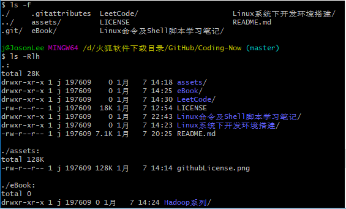

#### touch和mkdir命令
```
touch file1
touch file1 file2 [可同时创建多个文件]

mkdir d1 d2 创建同级目录
mkdir -p d1/d2/d3 创建包含子目录的目录
```

#### cp和mv命令
复制文件，`cp [-R] 源文件路径s 目标文件路径`；剪切文件，`mv 源文件路径s 目标文件路径`，mv用法也类似cp

```
<!-- -R 可以遍历文件夹下的文件已达到复制文件夹作用 -->
cp file1 folder/    把file1复制到目录folder下
cp file1 file2
cp f1 f2 f3 folder/     把f1f2f3都复制到folder下
cp -R folder/ folderCP/     把目录folder复制给folderCP

mv folder/ folder2/     把目录folder剪切到folder2下，不用什么-R
mv f1 ff1       同级目录下mv等同于重命名
```
有一点值得提下，文件名可用通配符，比如`file*`,`*.py`指以file和`.py`结尾的所有文件

#### rmdir和rm命令
rmdir只用来删除空目录，rm命令要慎用，可用来删除文件和目录

```
rmdir folder1   folder1非空的话无法删除

rm -i file1     -i是交互式询问确认是否要删除
rm -r folder/   -r是遍历folder目录删除【如果是-ir，可以选择删其中那些文件。要是有保留的话，folder不会被删除】
rm -rf folder/  -f是强制执行，慎用【-f 在很多命令中都可用来强制执行】
```

#### cat和more命令
用来查看文件内容，`cat file`，`-v[表示组合键] -t[显示table制表符，以^I表示] -e[显示ending结束符，以$表示] （简写-vte）`

可以借助管道符`>`，`>>`把文件数据合并，前者是覆盖，后者是追加
```
cat f1 > f2
cat f3 > f2     f3的数据会覆盖原有被写入f2中的数据
cat f1 f3 >> f2     这个是把f1f3的数据追加到f2
```
cat 可以同时显示多个文件的内容，比如我们可以在一个cat命令上同时显示两个文件的内容； 
`cat f1 f2`

cat 对于内容极大的文件来说，可以通过管道|传送到more 工具，然后一页一页的查看； 
`cat /etc/fstab /etc/profile | more `

```
> 把命令的输出写到文件中，如 dat > date.out
>> 同上，但是是追加方式写入文件；上面是覆盖
2> 错误的信息写入文件/日志，如 data 2> error.log [data是错误命令，报错写入日志]
ls -Rl / >> out 2> error 【正确信息写入out，2>把错误信息写入error】
有的时候不需要错误信息，直接 2>/dev/null 给空即可
```

cat还有创建文件的功能，创建文件后，要以EOF或STOP结束
```
$ cat>abc.txt<<eof      //创建(或覆盖创建)abc.txt并以eof退出编辑状态；如果是>>，就是追加创建到abc.txt中
> adflhlaskfd
> 阿斯顿发货款了
> eof

$ cat abc.txt 
adflhlaskfd
阿斯顿发货款了

```

more命令查看文件，以翻页形式，适合大文件

```
Enter       向下n行，需要定义，默认为1行； 
Ctrl+f    向下滚动一屏； 
空格键          向下滚动一屏； 
Ctrl+b  返回上一屏； 
=         输出当前行的行号； 
:f      输出文件名和当前行的行号； 
v      调用vi编辑器； 
! 命令            调用Shell，并执行命令； 
q     退出more当我们查看某一文件时，想调用vi来编辑它，不要忘记了v动作指令，这是比较方便的； 
```
#### tail和head查看文件末尾和头部
tail多和-f参数连用，表示查看末尾多少行，比如100f代表末尾100行
```
tail -f file  //实时查看文件末尾
tail -20f file  //文件确定后，查看末尾20行
tail -n 20 file  //查看文件后20行，非实时的

head file  //一般用来看下文件数据长啥样
head -n 10 file  //查看前10行
```

**注意:**`tail -f`可以实时一直查看文件
#### echo命令

```
echo hello [屏幕打印]
echo hello> f1 [hello输出到文件f1]
```
> 更多文件查看命令的详细可参考：https://my.oschina.net/junn/blog/304868

#### 文件权限 chmod命令

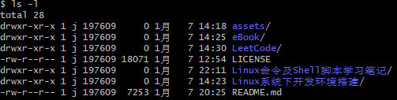

如图所示第一列就是文件权限内容，第一列的第一个字母有的是`d`（表示目录），有的是`-`（表示文件），有的是`l`（表示链接，同win下的快捷方式）。余下九个字母，每三个代表一类用户的权限。前三个是User权限【u】，中间是group同组用户权限【o】，最后是除了user、group之外的用户对文件的所有权限【g】。其次`rwx`分别表示读、写、可执行，`-`是空缺，无的意思

`chmod [用户]+/-[xx权限] file`，增加删减用户的对file的xx权限

```
chmod u+x file1	//u增加对file1的可执行权限
chmod o-wx f1  //对o删减f1的写、执行权限
chmod a+x f1  //a代表所有用户，增加执行权限
chmod uo+w f1  //对u、o增加f1的写权限
chmod  u=rw,go=  f1  //u赋予读写权限，g、o不赋予任何权限，逗号后面不能有空格
```

也可以用二进制数来表示权限，三个字母刚好可用二进制的0~7表示，如rwxrw-r--，对应数字764
```
chmod 764 f1
```

#### 更改文件所属用户chown和所属组chgrp命令
```
chown userName file
chgrp groupName file
```
针对目录的话，要使用-R参数对目录进行迭代，如`chown -R root /home/josonlee/Test`

#### 添加新用户及密码
```
useradd newUser
passwd newUser
```

#### 删除用户
```
userdel userName
```

#### 查询用户信息
```
id userName  //查询userName的信息，用户不存在时,返回无此用户

whoami/w/who  //查询当前用户
```

#### 用户组管理
```
groupadd newGroup   //新增组
groupdel groupName  //删除组
useradd -g groupName userName   //增加用户时指定所属组，默认是归为userName组
usermod -g groupName userName   //修改用户所属组
```
#### find搜索命令

find用来查找文件，命令格式 `find [指定目录][查找条件][指定动作]`

指定目录：不指定，默认当前目录。指定的话，默认该目录及其子目录下查找

查找条件：

```
    -name 根据名字查找
    -iname 同上，但文件名不区分大小写
    -size 根据文件大小查找, +,-:大于设置的大小,直接写大小是等于
    -user 查找用户名的所有者的所有文件
    -group 根据所属组查找相关文件
    -type  根据文件类型查找(f文件,d目录,l软链接文件)
    -inum  根据i节点查找
    -amin  访问时间access
    -cmin  文件属性change
    -mmin  文件内容modify
```

比如说文件名以txt结尾，`-name *.txt`

其次，可以多个选项一起添加查询

```
-a 是前后条件都要满足
-o 是满足一个条件就好
```

例如查找60分钟内被修改的文件,并且文件名字包含conf：

```
find ~ -cmin -60 -a -name *conf
```

至于指定的动作，如`-ls`显示详细信息，我觉得没必要，可以找到文件即可了，其他多数一行命令就行了


#### whereis搜索命令

> whereis命令只能用于程序名的搜索，而且只搜索二进制文件（参数-b）、man说明文件（参数-m）和源代码文件（参数-s）。如果省略参数，则返回所有信息

#### which搜索命令

> which命令的作用是，在PATH变量指定的路径中，搜索某个系统命令的位置，并且返回第一个搜索结果。也就是说，使用which命令，就可以看到某个系统命令是否存在，以及执行的到底是哪一个位置的命令

#### locate搜索命令

这个是个工具，没有自带的要自己装。deepin下安装locate，`sudo apt-get install locate`

[deepin linux下怎么安装使用locate进行文件搜索_百度经验](https://jingyan.baidu.com/article/2a138328f3ebb0074a134ff5.html) 

> locate命令其实是"find -name"的另一种写法，但是要比后者快得多，原因在于它不搜索具体目录，而是搜索一个数据库（/var/lib/locatedb），这个数据库中含有本地所有文件信息。Linux系统自动创建这个数据库，并且每天自动更新一次，所以使用locate命令查不到最新变动过的文件。为了避免这种情况，可以在使用locate之前，先使用**updatedb**命令，手动更新数据库

```
locate -i ~/py  //搜索用户目录下所有py开头不区分大小写的文件
locate ~/*.txt
```

详细locate使用可参考：[Linux 命令（文件和目录管理 - locate）](https://blog.csdn.net/liang19890820/article/details/53285624) 

### Linux系统管理命令

#### uname命令显示系统内核
```
uname
uname -r //具体内核信息
cat /proc/cpuinfo  //查看cpu信息
cat /proc/meminfo   //查看内存使用信息

```

#### date查看日期，cal查看日历表
```
date  //显示系统时期，2019年 01月 17日 星期四 16:17:04 CST
date -R  //显示标准时区，Thu, 17 Jan 2019 16:17:21 +0800  

cal 2019  //显示2019年的日历
```

- date设置时间

> 切换root用户，
date -s 2019-01-01 即可设置


#### 查看文件和文件夹大小 df和du命令

- df查看一级文件夹大小、使用情况、挂入点（**是只对文件夹有效**）

```
df -T  //查看所有所有文件系统的可用空间及使用的情况
df -h  //同上，不过h代表用户容易查看的，human-readable
```
- du可查看文件和文件夹大小
    - 参数`--max-depth`指定可以深入查看目录的层数，否则会遍历目录下的所有文件输出
    - `-D`或`–-dereference-args` 显示指定符号连接的源文件大小
    - `–exclude=<目录或文件>` 略过指定的目录或文件
    - `-s` 仅显示总计，即当前目录的大小
    - 还有是不赋予root权限无法查看一些不可访问的目录、文件啥的
```
du -h --max-depth=1 YOUR_DIR
du -sh *  //显示当前目录内文件夹和文件的情况
du -sh /home/josonlee/Download  //显示该目录空间大小
du -sh --exclude='*Mu*' *  //显示当前目录内不包括名字含MU的文件夹、文件的情况
```

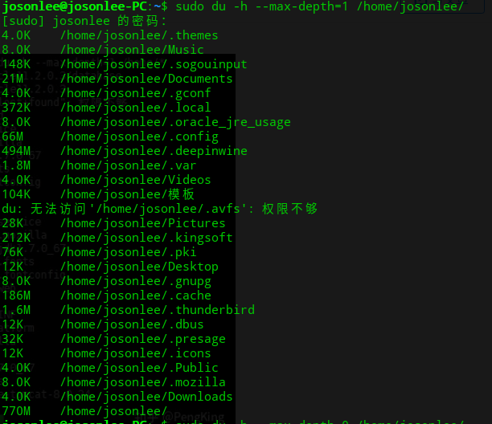

***

***
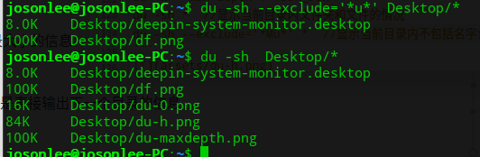
***
还有一点是，你指定的YOUR_DIR
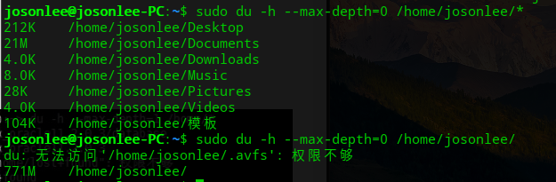
如图，是指定当前YOUR_DIR目录，还是YOUR_DIR下的目录

#### fdisk查看磁盘使用情况
```
sudo fdisk -l [磁盘号]  //不带上磁盘号，会显示所有磁盘使用情况
```
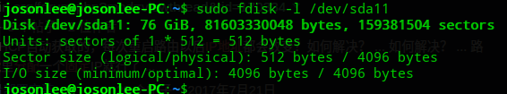
像`/dev/sda3`表示C盘

> 如果磁盘有坏道，可以用`fsck 磁盘号`修复

#### 挂载磁盘mount和卸载umount
```
mount  //可以查看所有磁盘挂载信息
mount [磁盘号] 目的目录  //挂载设备到该目录下，如 mount /dev/sda10 /media/data
umount [磁盘号]  //卸载该挂载的磁盘设备
```

#### 查看内存使用命令 free和top
```
free [-m -h]  //显示当前系统内存使用情况，默认是以Kb为单位的，-m或-h参数是Mb和Gb为单位
top  //显示当前系统进程内存使用情况
```

### Linux下软件安装的方式
- 通过apt、rpm、yum下载安装
- 通过tar解压源码文件安装

> 应用中apt和dpkg主要针对debian体系的linux，yum和rpm主要针对centos系列的linux
可参考：[白话apt、dpkg和yum、rpm安装命令的详述与差异（集成版）](https://hk.saowen.com/a/b7e536f5e8c18900c790176892dde9f1717f4c13d317818240b17f3819efc739)

```
#查看某个软件是否安装
rpm -qa|grep java
#卸载已安装软件
rpm -e --nodeps xxxx
#安装软件
rpm -ivh xxx.rpm
```
因为Deepin是debian体系的，所以支持apt
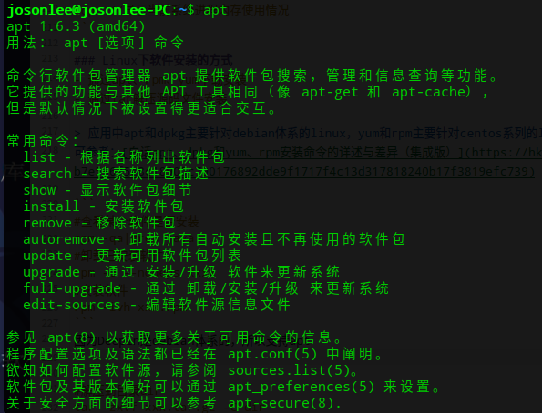

***

```
#解压到目录dir
tar -zxvf xxx.tar.gz -C dir

#压缩为xxx.tar.ga
tar -zxcf xxx.tar.gz dir|file  //把目录DIR或文件file压缩成xxx.tar.gz
```

### 防火墙相关
Deepin不清楚，我用下面的查看命令没用
```
sudo service iptables status  //查看防火墙状态
# 临时性防火墙处理，重启又会生效
sudo service iptables stop/start  //关闭/启动防火墙

# 永久性处理
sudo chkconfiig iptables off/on  //永久关闭/打开防火墙
# 还要关闭selinux，感觉是可选的，原来在配置hadoop时这步没做也能关闭防火墙
sudo vi /etc/sysconfig/selinux
# 修改selinux=disabled
```
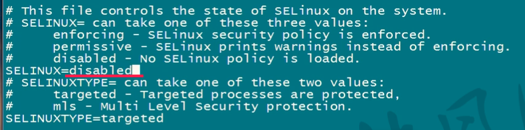

### 定时任务 crontab命令
```
josonlee@josonlee-PC:~$ crontab --help
crontab: 不适用的选项 -- -
crontab: usage error: unrecognized option
usage:	crontab [-u user] file
	crontab [ -u user ] [ -i ] { -e | -l | -r }
		(default operation is replace, per 1003.2)
	-e	(edit user's crontab)
	-l	(list user's crontab)
	-r	(delete user's crontab)
	-i	(prompt before deleting user's crontab)

```
- 参数：
    - -e：创建并编辑定时任务
    - -l：列出用户的所有定时任务
    - -r：删除用户的所有定时任务

#### crontab任务文件中定义任务的语法
`* * * * * cmd`，这就是一个任务，由六个字段组成，最后是该任务要执行的命令或shell脚本。字段由空格分隔开。前面5个星，分别代表分（1-59）、时（0-23）、日（1-31）、月（1-12）、星期（0-6,0是周日）

```
# 每隔1分钟，执行xxx
*/1 * * * * date>>~/Desktop/log.txt
# 每天12点半，执行xxx
30 12 * * * cmd
# 每个月7,14,21号，执行xxx
* * 7,14,21 * * cmd
# 每天20点到23点，每半小时，执行xxx
0,30 20-23 * * * cmd
```
编写一个crontab中可以有多个任务，其中`#`用来注释。
第一个任务结果如图
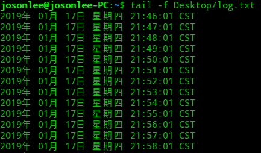
由上可知，连续值可由`-`连接，每隔多少可由`/`连接，零散值可由`,`连接

### ssh连接远程Linux服务器

有些linux貌似是没装ssh的，例如ubuntu，所以要先安装

```
sudo apt-get install openssh-server
```

`ssh [Linux主机名]@Linux服务器所在IP`，之后要输了linux的登录密码（可以本地通过ssh-keygen生成公私钥，并推送到Linux上可以省去每次登录输入密码）


#### ssh连接Linux服务器报错 Host key verification failed.

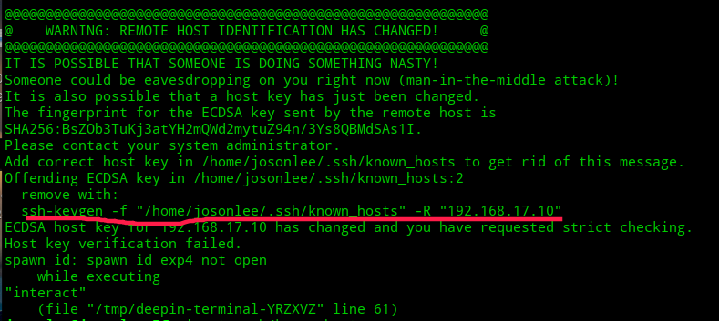
如图，像红线处显示的是.ssh/known_hosts出了问题。删除.ssh/known_hosts中和１９２．１６８．１７．１０相关的rsa相关信息即可，或者把整个known_howts删除即可，然后再次连接

#### 使用scp命令来进行文件传输

scp是基于ssh的，如下使用

```
#从服务器上下载文件
scp [主机名]@主机IP:[文件路径]  目的路径
#上传文件
scp 文件路径 [主机名]@主机IP:[目的路径]
```

如果是拷贝目录，加上`-r`参数即可。scp命令成功执行后，返回代码为0, 任何错误出现返回代码都大于0

### rz/sz命令使用
首先要安装lrzsz工具（lrzsz就是一个支持 Zmodem 传输协议的工具），`yum -y install lrzsz`
​    
- sz：使用（服务器发送文件，也就是客户端下载文件）
- rz：使用（服务器接受文件，也就是客户端上传文件）

> [Linux基础：利用SSH上传、下载（使用sz与rz命令）](http://blog.51cto.com/skypegnu1/1538371)

### 注意
- `^`这个符号在linux中敲ctrl键


```
ln 创建链接 [-s 创建符号链接(软连接)，相当于快捷方式]

ln f1 f2 【创建硬链接，实际上f1到f2的镜像，f1和f2在同一分区下才有用，软连接可跨分区】
ln -s f1 f3 【删除f1，f3就没用了，但f2有用】

文件访问权限
chown 把权限赋予给某个用户，一般是root修改文件后把权限给其他用户

通配符
* 匹配所有字符
？匹配任一字符
[ ] 匹配括号内任一个字符，比如[1-4]或[1234]
[! ] 括号中！是取反，[!123]不匹配123
^ 以什么字符开头
wc -l 统计输出结果的字符单词数行数

定义快捷方式 如：alias c=clear，把clear定义为c，就是取别名 【当前进程空间有效，修改配置文件可改为永久有效】
unalias c 可以删除别名

\ 反斜线，另起一行写命令，有时命令太长换行写，紧接\不能有空格

$引用变量，
自定义a=10
a=$a 【=两边不能有空格】
set 可以看环境变量【$PATH 搜索路径，这个非常有用，等同于Windows下环境变量path】；$PS1：[\u@\h \W]\$ 【用户名@主机名 当前目录】权限；$RANDOM 随机变量
可以重赋值添加Path，PATH=$PATH:.   [.表示当前目录]
readonly定义只读变量

year=$(date +%Y)，$()命令替换，或者用反引号year=`date +%Y`替换，他是把命令输出结果赋成一个变量

命令行下要做运算不能类似用a+b，默认是字符串加法，【要使用expr $a + $b 【+两边要有空格，*前要加\ 转义】，输出到界面中，c=$(expr $a+$b)是赋值给另一个变量】

let 命令

进程查看
ps 
ps -f 	【PID进程id、PPID父进程id】 
bash命令开启一个子进程，exit可以退出子进程
父子进程变量不干扰，父进程结束子进程也结束（也有方法不结束），反之不会

进程操作
Ctrl+c终止，Ctrl+z暂停进程
jobs -l 可以查看暂停运行的进程
fg %1 把暂停进程[1] 提到前台运行
bg %1 把暂停进程[1] 提到后台运行

进程后加&直接在后台运行，比如sleep 500 &
kill 杀死进程， kill pid 即可

file * 可以查看目录下文件类型

find 查找文件

df -T 【查看文件系统】

hdfs

创建文件时，如果文件已存在 -f可以强制覆盖

-text 可以查看非文本文件

文件不可修改，只能追加、覆盖

hdfs dfs -setrep <copy num> <filename> 设置数据文件备份的份数


```

## 用户目录下的`.bashrc`文件可以自定义命令的快捷方式(alias)
比如`alias c=clear`，然后`source .bashrc`使之生效

## 设置普通用户的sudo权限(免密)
切换到root用户，`vi /etc/sudoers`，然后第一行添加 `用户名 ALL=(root)NOPASSWD:ALL`
## Linux下如何离线安装Chrome插件
- 搜索相应的crx后缀名在插件
- 命令行下输入`/usr/bin/google-chrome-stable --enable-easy-off-store-extension-install` 启动chrome
- chrome中打开网址chrome://extensions/
- 把下载好的插件拖到网页中即可

chrome一定要装的插件有：oneTab、谷歌访问助手、

## vi/vim常用快捷键

在查看模式下(Esc):
- `dd`是删除光标所在的哪一行内容
- `ZZ`是快速保存修改
- `x`是删除光标所在的那个字符
- `o`是跳一行输入
- `G`是跳到最后一行，`gg`是跳到第一行

- `:set nu/nonu`是文件添加/删除行号
- `:/关键字`是搜索关键字，按‘n’是搜索下一个

更多常用命令如图：
【图片来源网络，出处不详】
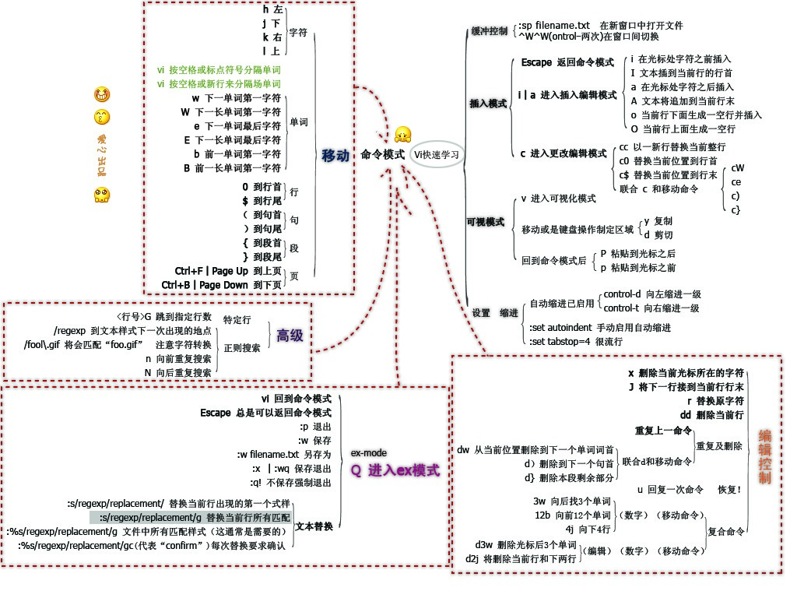