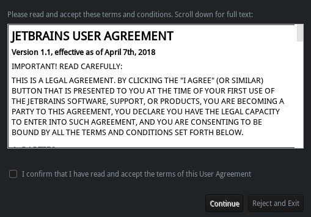
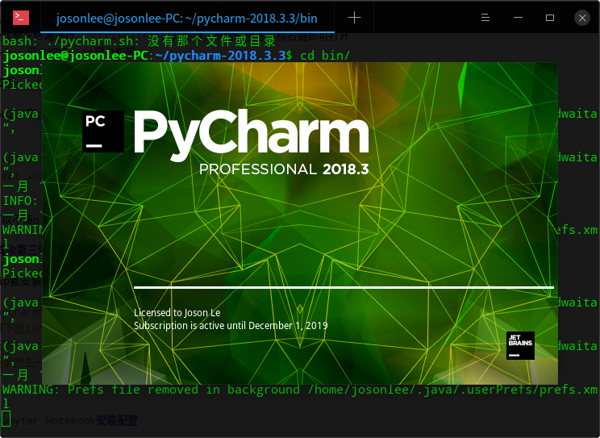
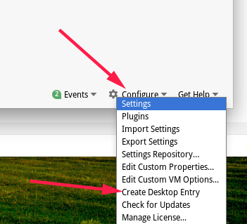
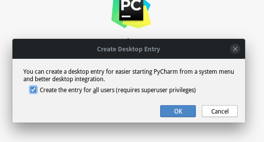
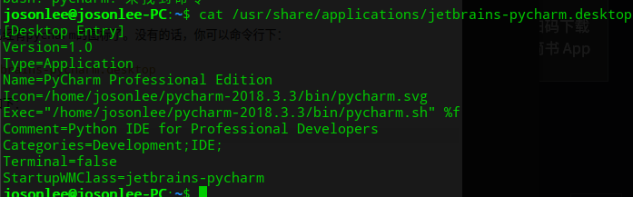
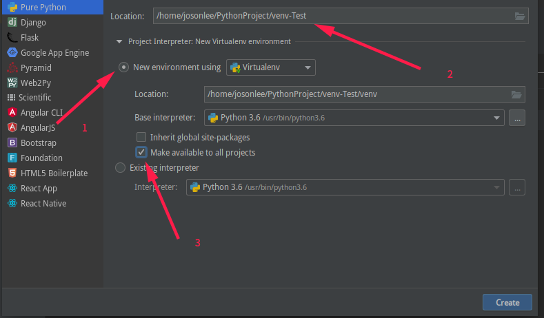
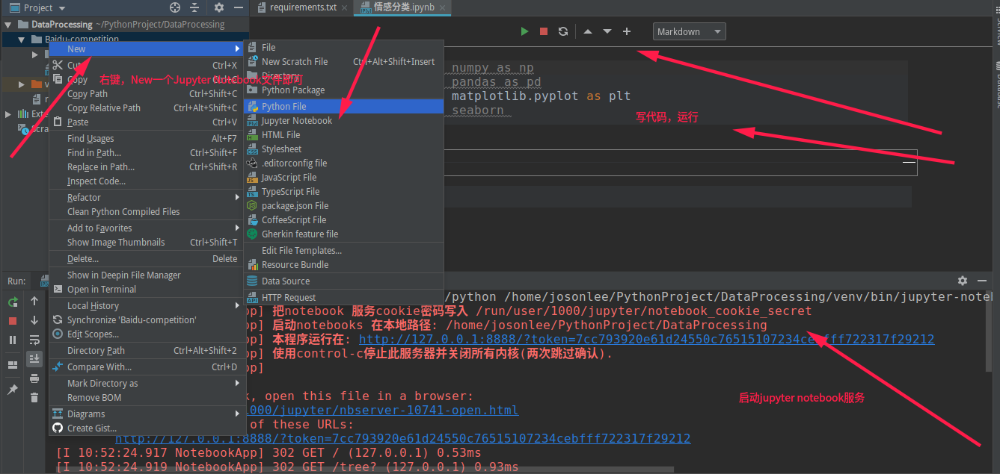
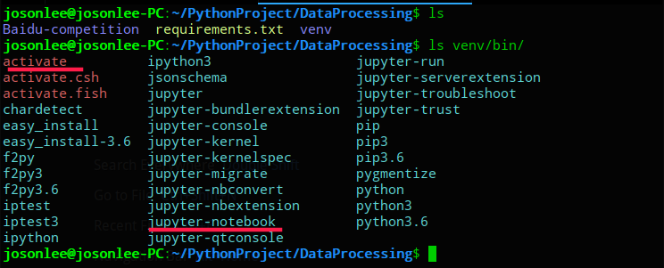
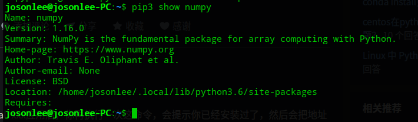

以下操作都在终端进行，`Ctrl+Alt+t`打开终端，或者随便哪鼠标右键即可打开
`sudo su`可以切换root用户权限

### 安装pip3和pip

python2.7和python3.6都已经安装好了，但是没有pip，执行下面指令

```
sudo apt install python3-pip  //安装pip3
sudo apt install python-pip   //安装pip（对应Python2）
```

你也可以不装pip，但有的地方还是有python2.7的需求

### 其余第三包的安装

毕竟pip都安装好了，其他的包通过 `pip install`安装即可

pip版本老旧更新问题：命令行下输入：`pip install --upgrade pip` 即可

还有就是这里pip源在国外，下载巨慢。可以参考这个：https://bbs.deepin.org/forum.php?mod=viewthread&tid=167144
在用户目录下配置下pip源即可，我这里选的是阿里云的，也推荐中科大的速度也很快

```
mkdir ~/.pip  //创建一个.pip目录
vi ~/.pip/pip.conf  //创建并修改旗下的pip.conf文件

#写入下面内容
[global]
index-url = https://mirrors.aliyun.com/pypi/simple/

[install]
trusted-host=mirrors.aliyun.com
```
> 阿里云：http://mirrors.aliyun.com/pypi/simple
中科大：https://pypi.mirrors.ustc.edu.cn/simple/
豆瓣：http://pypi.douban.com/simple/


### pycharm安装
- 官网下载linux版本的pycharm，我这里下的是专业版（pycharm-professional-2018.3.3.tar.gz，我有edu账号）
- 解压到`/home/用户/`目录下，`tar -zxvf pycharm-professional-2018.3.3.tar.gz -C ~`
- 解压会产生一个pycharm-2018.3.3文件夹，其下bin目录中会有一个pycharm.sh脚本，`./pycharm.sh`执行即可安装
- 安装过程依据提示进行，大多是默认选项，下一步即可。

 
 这个是接受用户协议,之后就是激活步骤了(省略)，完成后就是如下图进行安装
  

#### 如何添加桌面快捷方式和启动器快捷方式



**按图片上创建桌面快捷方式可能没用**

怎么说呢，我的deepin是15.8版本的，安装后启动器里就已经有pycharm的图标了。没有的话，你可以命令行下：
```
ls /usr/share/applications  //看下有没有一个jetbrains-pycharm.desktop
```
它默认给我生成的jetbrains-pycharm.desktop中内容如下：


没有的话，你可以在新建一个pycharm.desktop，然后`sudo vi pycharm.desktop`
```
[Desktop Entry]
Type=Application
Name=Pycharm
GenericName=Pycharm3
Comment=Pycharm3:The Python IDE
Exec=sh ~/pycharm-2018.3.3/bin/pycharm.sh
Icon=~/pycharm-2018.3.3/bin/pycharm.png
Terminal=pycharm
Categories=Pycharm;
```
**主要是Exec、Icon改成你pycharm安装的位置**，然后启动器里会有pycharm图标，你右键给发送到桌面即可

### 开发环境配置
- numpy
- pandas
- scipy
- matplotlib
- seaborn
- scikit-learn（sklearn）
- Pillow（3.x好像是自带的）
- jupyter notebook

以上常用，需要啥装啥吧。不知道是不是，好像linux下不用考虑这些包之间的依赖关系（比如说sklearn依赖numpy、pandas），也就是版本是否对应上，因为我每次安装时依赖的包会被重新下载安装

#### 如何快速导出及安装项目依赖的的包

经常可以看到有些项目中会有requirements.txt文件，这就是这个项目依赖的第三方包，如下命令行中：
```
# 导出
pip freeze > requirements.txt
# 快速安装
pip install -r requirements.txt
```
我在项目中付了一个我最初安装时的[requirements.txt文件](https://github.com/josonle/Coding-Now/blob/master/Linux%E7%B3%BB%E7%BB%9F%E4%B8%8B%E5%BC%80%E5%8F%91%E7%8E%AF%E5%A2%83%E6%90%AD%E5%BB%BA/requirements.txt)配置

**其次是我建议单独创建一个虚拟环境来安装这些包，和本地的环境隔离，便于开发及版本间切换等等**

### 通过pycharm创建虚拟环境

如图所示，创建环境时选择创建虚拟环境。第三步两个选择：第一个是使用本地的第三方包，不选的话完全和本地环境隔离。第二个是表示该虚拟环境也适用于其他项目

### Jupyter Notebook安装配置
强烈建议pycharm不要和Jupyter一起使用（即在pycharm中打开jupyter），不仅页面难看，而且快捷键什么的都操作不方便
如图是大概地怎样在pycharm中运行jupyter



然后在第一个cell里输入一些内容，然后shift+return（或者点击运行），pycharm就会弹框提示

注意！如果要在其他服务器上运行notebook，这时候你可以填写你所使用的服务器地址；但一般情况下，我们只是想本地编辑notebook，这里我们点击“cancel”。接着pycharm会提示”Cannot connect to Jupyter Notebook. Run Jupyter Notebook”。利用这个提示，我们在pycharm中启动本地的notebook服务器

然后，点击”Run Jupyter Notebook”，pycharm就会在本地运行notebook。

如上步骤很繁琐吧，不推荐，直接命令行下执行就可以了，见下文

### 命令行下进入pycharm创建好的虚拟环境并运行jupyter notebook
当然，你可以打开Pycharm后在下面打开Terminal后默认就进入了venv，但是pycharm太占内存了，又想用jupyter的话，还是命令行方便

如图，我创建的虚拟环境DataProcessing，其下有一个`venv/bin`目录，我划红线的一个是进入虚拟环境，一个是启动jupyter的命令

如下图，`source activate`进入虚拟环境了，然后jupyter-notebook就能打开jupyter了


### 注意事项
#### pip下载的包安装在哪里？
比如说下的numpy，你直接命令行下如图输入

可以看到在这里：`Location: /home/josonlee/.local/lib/python3.6/site-packages`