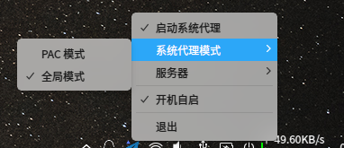

推荐这个项目，具体干嘛用的我不多说，你自己看
**1. 使用截图**

**2. 优点介绍**
​	**1. 支持全局模式和pac双模式**
​	**2. 开机自动后自动依附在托盘（ss-qt5开机自启会弹出烦人的配置弹窗，然后手动点连接才可以）**
​	**3. 支持导入导出配置、二维码等高级功能**	

**3. 项目地址** [https://github.com/lolimay/](https://github.com/lolimay)