# 目录

- [安装java环境](#安装java环境)
- [eclipse安装](#eclipse安装)
  - [Deepin Linux下配置eclipse启动图标并添加到桌面](#配置eclipse启动图标并添加到桌面)
  - [配置maven](#配置maven)
- [MySQL数据库安装](#MySQL数据库安装)
- [VMWare安装](#VMWare安装)
  - [Virtual-machine-monitor-failed导致无法启动VMWare解决](#Virtual-machine-monitor-failed导致无法启动VMWare解决)
  - [如何卸载VMWare](#如何卸载VMWare)
- [VMware最小化安装centos搭建集群](#VMware最小化安装centos搭建集群)
  - [修改VMWare的网络配置](#修改VMWare的网络配置)
- [Scala下载及安装](#Scala下载及安装)
  - [eclipse安装Scala IDE插件](#eclipse安装Scala-IDE插件)
  - [启动scala报错 java.lang.NumberFormatException: For input string: "0x100" 解决](#启动scala报错-java.lang.NumberFormatException:-For-input-string:-"0x100"-解决)
- [hadoop完全分布式集群搭建](#hadoop完全分布式集群搭建)
  - [ssh免密登录](#ssh免密登录)
- [启动hadoop](#启动hadoop)
  - [格式化hdfs文件系统](#[格式化hdfs文件系统)
  - [启动hdfs和yarn](#启动hdfs和yarn)
  - [Master节点无法启动ResourceManager解决](#Master节点无法启动ResourceManager解决)
- [基于Hadoop集群的Hive安装配置](#基于Hadoop集群的Hive安装配置)
- [Spark本地模式及基于Yarn的分布式集群环境搭建](#Spark本地模式及基于Yarn的分布式集群环境搭建)
- [为集群配置Spark-History-Server](#为集群配置Spark-History-Server)


以下操作都在终端进行，`Ctrl+Alt+t`打开终端，或者随便哪鼠标右键即可打开
`sudo su`可以切换root用户权限

## 安装java环境

- [官网下载](https://www.oracle.com/technetwork/java/javase/downloads/jdk8-downloads-2133151.html)，我这里下的是`jdk-8u191-linux-x64.tar.gz`（我电脑64位的，你看情况选择其他版本也可以）
- 解压到 `/opt/` 目录下（其他位置也可以，opt下用来安装的），

```
tar -zxvf jdk-8u191-linux-x64.tar.gz -C /opt/
```

- 如图配置全局环境变量`sudo vi /etc/profile`，在末尾添加图中内容即可（红线内容替换成你下的版本）

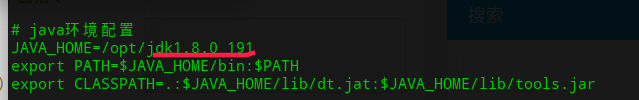

- 使用source命令使之生效 `source /etc/profile`
- 然后输入 `java -version` 可以看到java版本信息就成功了

## eclipse安装
[点击这里下载](https://www.eclipse.org/downloads/packages/)

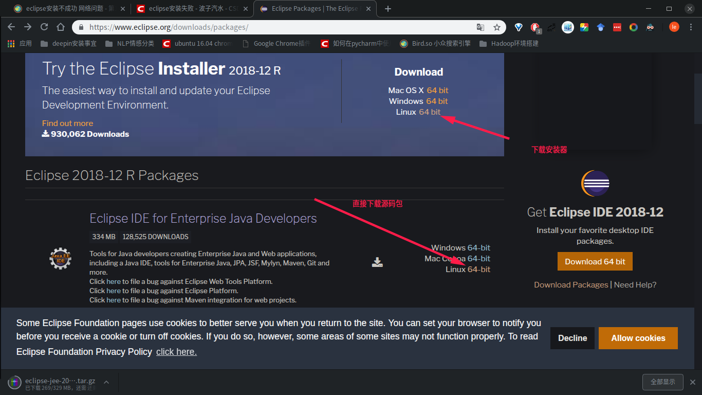

建议选择下面的源码包直接下载下来用，省的因为网络原因导致eclipse installer无法成功安装
- 选择eclipse installer安装过程
    - `tar -zxvf eclipse-inst-linux64.tar.gz -C ～`，我这里是解压到用户目录下
    - 解压后会生成一个eclipse-installer目录，用ll命令查看，可见其下有一个可执行文件eclipse-inst
    - 命令行下运行 `eclipse-installer/eclipse-inst`,就进入图形化安装了

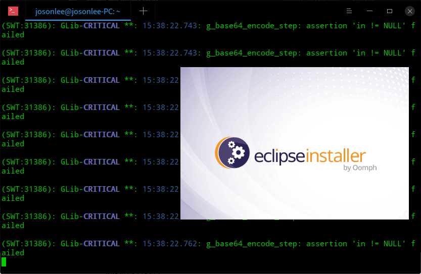
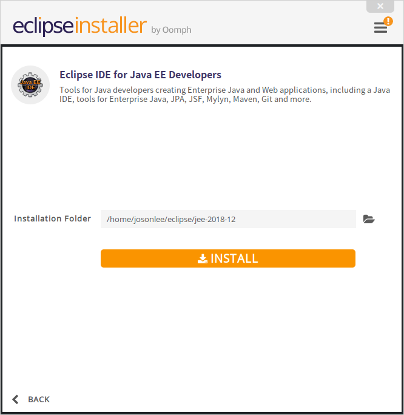


然后，就是等待安装结束即可。我花了300多M手机流量，没按成功，网络延迟问题吧。然后，我又花了300多M手机流量直接下载源码包安装了，如下

- 直接下载package使用

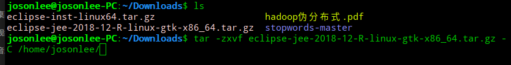
解压后会在用户目录下生成一个eclipse文件夹，用ll命令查看下文件夹下内容

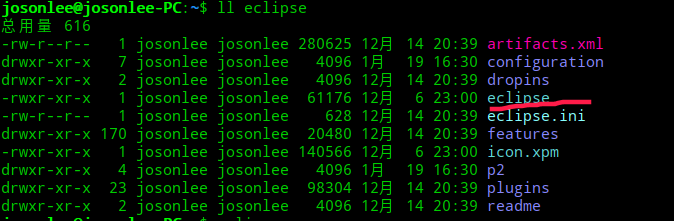

如下运行该可执行文件，然后选择下工作区间workspace就可以了
```
josonlee@josonlee-PC:~$ eclipse/eclipse 
```
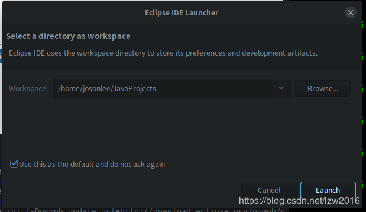

#### 配置eclipse启动图标并添加到桌面
看过我上一篇文章Deepin下Python开发环境配置的应该知道如何处理。在`/usr/share/applications`下新建一个eclipse.desktop文件并编辑，添加如下内容：
```
[Desktop Entry]
Version=1.0
Type=Application
Name=Eclipse For J2EE
Icon=/home/josonlee/eclipse/icon.xpm
Exec="/home/josonlee/eclipse/eclipse" %f
Comment=Java IDE for J2EE Developers
Categories=Development;IDE;
Terminal=false
```
Icon:启动项图片，Exec：可执行文件（上面提到的执行他才能启动eclipse），Comment：概述，Categories：分类，Terminal：启动时是否显示终端

#### 配置maven
1. 下载，https://mirrors.tuna.tsinghua.edu.cn/apache/maven/
2. 解压，我这里是用户目录下的tools文件夹，`tar -zxvf apache-maven-3.6.0-bin.tar.gz -C ~/tools/`
3. 配置maven的环境变量，`vi /etc/profile`，追加如下内容
```
# Maven环境配置
export MAVEN_HOME=/home/josonlee/tools/apache-maven-3.6.0
export PATH=$PATH:$MAVEN_HOME/bin:

```
4. `source /etc/profile` 使配置生效，然后输入`mvn -version`检验是否成功，如图就是OK了
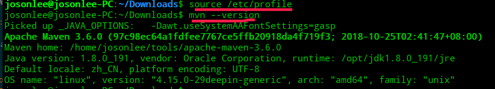

5. 在apache-maven-3.6.0/conf/setting.xml中配置阿里的镜像源

```
<mirror>
      <id>alimaven</id>
      <name>aliyun maven</name>
      <url>http://maven.aliyun.com/nexus/content/groups/public/</url>
      <mirrorOf>central</mirrorOf>        
    </mirror>
```
如图处
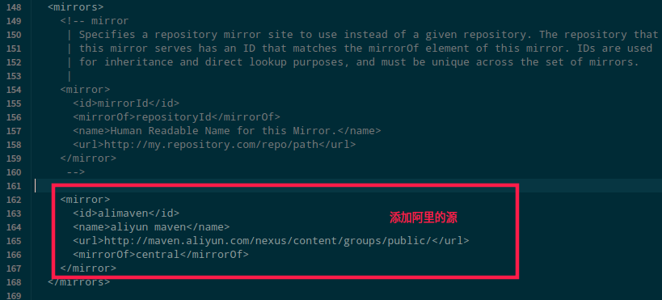

6. 再配置下jar包下载在本地的什么位置,apache-maven-3.6.0/conf/setting.xml中配置

默认是用户目录下的`.m2`目录下
```
<localRepository>/home/josonlee/tools/Maven_Repository/</localRepository>
```

7. 命令行下执行 `mvn help:system` ,下载一些必须的包

8. 配置eclips中maven插件

因为我们这里已经安装好maven了，所有直接在eclipse中导入就好了。窗口Window->preferences–>maven–>Installations。如图选择add，然后把你maven安装的目录导进来就好了。
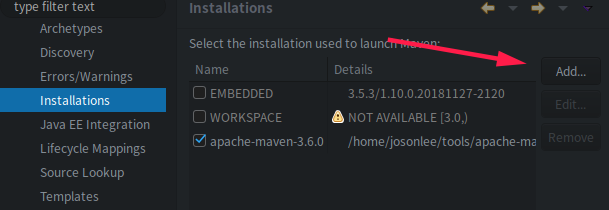

下面这个也要配置一下

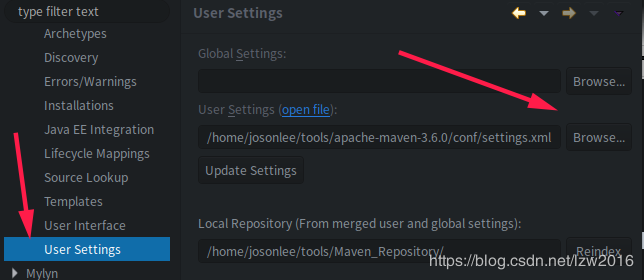

## MySQL数据库安装
- [deepin安装MySQL5.7](https://blog.csdn.net/sinat_37064286/article/details/82224562)
- [在deepin上安装mysql](https://blog.csdn.net/guanripeng/article/details/79626033)

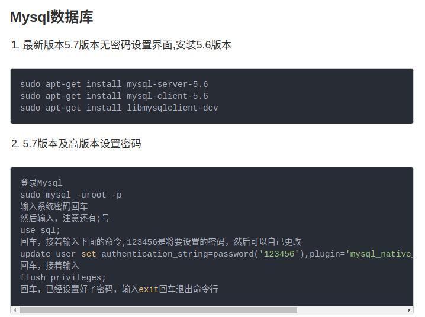
https://www.jianshu.com/p/de6abe2245fb

## VMWare安装
首先是下载，Deepin应用商店里有这个可以直接下载。但它默认是安装在opt目录下，我根目录给的空间不够大，所以只好找它的源码包安装了。
最新的VMWare已经15版本了，版本新未必适合自己，所以就搜索了些旧版本。
- [点击这里下载最新版本](https://www.vmware.com/products/workstation-pro.html)
- [下载VMWare 14版本](http://www.anxia.com/l/vmware-workstation-12-pro)
- [下载VMWare 12](http://www.anxia.com/l/vmware-workstation-12-pro_87497)

我这里下的是14的，之前在win10上也是用的14,再分享下使用的激活码Key
```
# 14的
VF19H-8YY5L-48DQY-JEWNG-YPKF6
FF31K-AHZD1-H8ETZ-8WWEZ-WUUVA
# 15的
ZF582-0NW5N-H8D2P-0XZEE-Z22VA
```

下载下来会是类似`VMware-Workstation-Full-14.1.0-7370693.x86_64.bundle`的文件
- 移动的目标目录下（我依然是选用户目录），`mv VMware-Workstation-Full-14.1.0-7370693.x86_64.bundle ~/`
- 因为这是个安装文件，是可执行的，所有要付权限
    - `chmod 755 VMware-Workstation-Full-14.1.0-7370693.x86_64.bundle`
- 执行该文件，**执行该文件要付root权限**，否则无法安装
    - `cd ~`
    - `sudo ./VMware-Workstation-Full-14.1.0-7370693.x86_64.bundle`
- 进入界面化安装过程，剩余同Windows下一样的

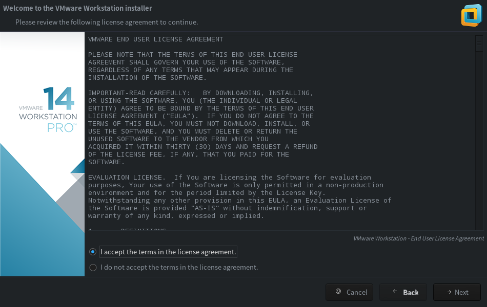

安装完成后，命令行输入vmware启动虚拟机。我这里会有弹窗提示，如图

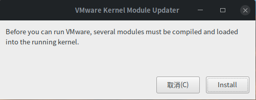

这是因为你安装的Linux内核比较新，比当前VMware编译时调用的版本高，某些内核code接口对应不上

然后，我就遇到了下图所示的问题
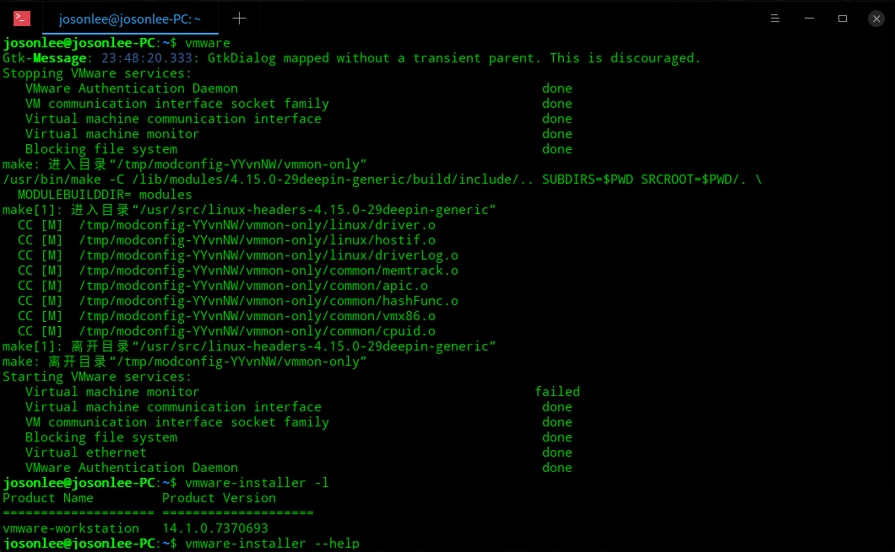

#### Virtual-machine-monitor-failed导致无法启动VMWare解决

查了很久，找到解决办法，进入bios里把secure boot关掉就行了

> 参考：http://stackmirror.caup.cn/page/s1dw3oz5em9d 和
https://askubuntu.com/questions/767791/vmware-virtual-machine-monitor-failed-in-ubuntu-16-04-lts

此方法不一定有用，我试了两台机子，两台都遇到了这个问题，但有一台对该方法没有用（最后是在应用商店上装的，可以用）
#### 如何卸载VMWare

上面这个方法不一定有用，没用的话，你可以选择卸载它，然后考虑安装VirtualBox
```
# 卸载vmware
sudo vmware-installer -u vmware-workstation
```
还有就是，我从deepin的启动器里看到还有vmware-Networkeditor啥的，也是用`sudo vmware-installer -u 名字 `来卸载


## VMware最小化安装centos搭建集群
我这里选择最小化安装，没啥难度，不会网上搜一波吧。

有一点需要注意，最小化安装Centos时，网络配置处要打开网络，否则重启不能上网。如果忘选了的话，如下配置网卡也可以
```
# 激活网卡
# 切换root用户

vi /etc/sysconfig/network-scripts/ifcfg-enp0s3

# 将 ONBOOT=no 改为 ONBOOT=yes
# 重启network服务

service network restart

```

然后还需要安装net-tools包，否则ifconfig不起作用
```
yum install net-tools
```

避免网络原因导致下载速度慢，还需配置下Centos的源

0、先下载wget工具 `yum -y install wget`

---------------------
1、备份

`mv /etc/yum.repos.d/CentOS-Base.repo /etc/yum.repos.d/CentOS-Base.repo.backup`

2、下载新的`CentOS-Base.repo` 到`/etc/yum.repos.d/`

```
CentOS 5

wget -O /etc/yum.repos.d/CentOS-Base.repo http://mirrors.aliyun.com/repo/Centos-5.repo


CentOS 6

wget -O /etc/yum.repos.d/CentOS-Base.repo http://mirrors.aliyun.com/repo/Centos-6.repo


CentOS 7

wget -O /etc/yum.repos.d/CentOS-Base.repo http://mirrors.aliyun.com/repo/Centos-7.repo

--------------------- 
参考：[CentOS源设置 作者：Pipci](https://blog.csdn.net/Pipcie/article/details/80005006)
```

3、清理yum缓存 
`yum clean all`
4、重建缓存 
`yum makecache` 
5、升级yum
`yum -y update `

###　修改VMWare的网络配置

这一步主要是为了给虚拟机分配一个固定ｉｐ地址，便于集群间通讯

启动器或者打开ＶＭＷａｒｅ找到ｖｍｗａｒｅ　Ｎｅｔｗｏｒｋ　Ｅｄｉｔｏｒ，如下图配置

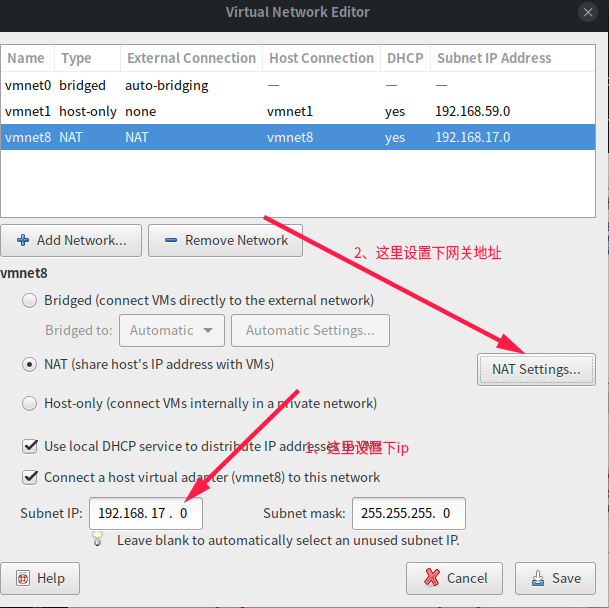
## Scala下载及安装

> Spark runs on Java 8+, Python 2.7+/3.4+ and R 3.1+. For the Scala API, Spark 2.4.0 uses Scala 2.11. You will need to use a compatible Scala version (2.11.x).
>
> Note that support for Java 7, Python 2.6 and old Hadoop versions before 2.6.5 were removed as of Spark 2.2.0. Support for Scala 2.10 was removed as of 2.3.0.

我这里是选择Spark 2.4.0，所以Scala选择2.11.12版本

下载：https://www.scala-lang.org/download/2.11.12.html

- 解压到用户目录下（你随便，我这里是应为根目录空间不太够） `tar -zxvf scala-2.11.12.tgz -C ~`
- 同java一样要配置环境变量

```
sudo vi /etc/profile

# 末尾添加
# SCALA_HOME指定scala安装在哪里
export SCALA_HOME=/home/josonlee/tools/scala-2.11.12
export PATH=$SCALA_HOME/bin:$PATH
```
如图是我scala解压的位置，以及环境变量写法
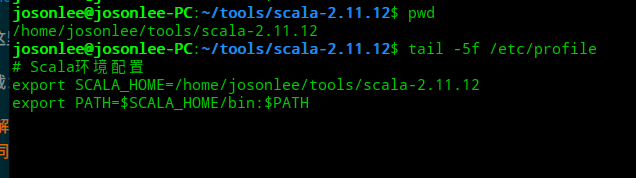

- scala就这样安装好了，试着命令行下输入scala写两行代码

### eclipse安装Scala-IDE插件

**注意：eclipse版本不要太新**
其实我建议直接下载Scala IDE for Eclipse：http://scala-ide.org/download/sdk.html

如果已安装eclipse的话，可以去安装scala IDE插件，不建议直接在eclipse MarketPlace安装,版本太新可能不适配，如图
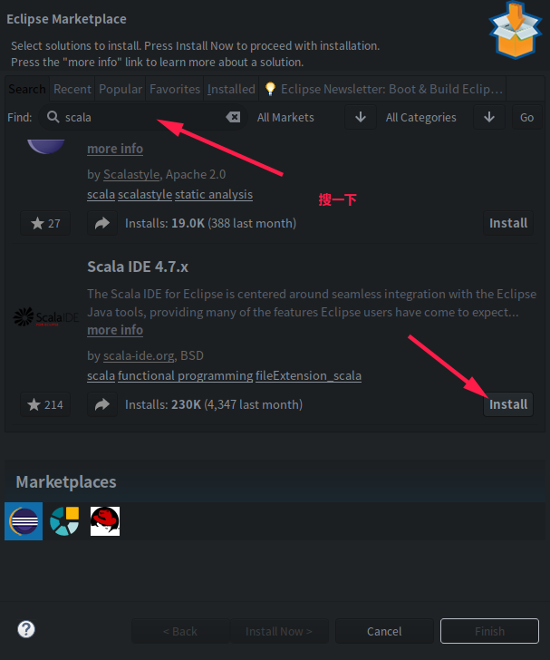

[点击这里下载](http://scala-ide.org/download/prev-stable.html)，选择和你eclipse、scala适配的的版本，下载如下方所示的zipfile
> This release is only available for Eclipse 4.x and can be retrieved as **zipfile**.

解压zipfile后，将解压文件放到eclipse文件夹下的dropins目录下，重启eclipse，然后按提示默认安装即可


***


### 启动scala报错-java.lang.NumberFormatException:-For-input-string:-"0x100"-解决

报错信息如下，貌似也不影响scala运行，因为还是可以编译代码的
```
josonlee@josonlee-PC:~$ scala
Welcome to Scala 2.11.12 (Java HotSpot(TM) 64-Bit Server VM, Java 1.8.0_191).
Type in expressions for evaluation. Or try :help.
[ERROR] Failed to construct terminal; falling back to unsupported
java.lang.NumberFormatException: For input string: "0x100"
	at java.lang.NumberFormatException.forInputString(NumberFormatException.java:65)
	at java.lang.Integer.parseInt(Integer.java:580)
	at java.lang.Integer.valueOf(Integer.java:766)
	at jline.internal.InfoCmp.parseInfoCmp(InfoCmp.java:59)
	at jline.UnixTerminal.parseInfoCmp(UnixTerminal.java:242)
	at jline.UnixTerminal.<init>(UnixTerminal.java:65)
	at jline.UnixTerminal.<init>(UnixTerminal.java:50)
	at sun.reflect.NativeConstructorAccessorImpl.newInstance0(Native Method)
	at sun.reflect.NativeConstructorAccessorImpl.newInstance(NativeConstructorAccessorImpl.java:62)
	at sun.reflect.DelegatingConstructorAccessorImpl.newInstance(DelegatingConstructorAccessorImpl.java:45)
	at java.lang.reflect.Constructor.newInstance(Constructor.java:423)
	at java.lang.Class.newInstance(Class.java:442)
	at jline.TerminalFactory.getFlavor(TerminalFactory.java:211)
	at jline.TerminalFactory.create(TerminalFactory.java:102)
	at jline.TerminalFactory.get(TerminalFactory.java:186)
	at jline.TerminalFactory.get(TerminalFactory.java:192)
	at jline.console.ConsoleReader.<init>(ConsoleReader.java:243)
	at jline.console.ConsoleReader.<init>(ConsoleReader.java:235)
	at jline.console.ConsoleReader.<init>(ConsoleReader.java:223)
	at scala.tools.nsc.interpreter.jline.JLineConsoleReader.<init>(JLineReader.scala:64)
	at scala.tools.nsc.interpreter.jline.InteractiveReader.<init>(JLineReader.scala:33)
	at sun.reflect.NativeConstructorAccessorImpl.newInstance0(Native Method)
	at sun.reflect.NativeConstructorAccessorImpl.newInstance(NativeConstructorAccessorImpl.java:62)
	at sun.reflect.DelegatingConstructorAccessorImpl.newInstance(DelegatingConstructorAccessorImpl.java:45)
	at java.lang.reflect.Constructor.newInstance(Constructor.java:423)
	at scala.tools.nsc.interpreter.ILoop$$anonfun$scala$tools$nsc$interpreter$ILoop$$instantiater$1$1.apply(ILoop.scala:858)
	at scala.tools.nsc.interpreter.ILoop$$anonfun$scala$tools$nsc$interpreter$ILoop$$instantiater$1$1.apply(ILoop.scala:855)
	at scala.tools.nsc.interpreter.ILoop.scala$tools$nsc$interpreter$ILoop$$mkReader$1(ILoop.scala:862)
	at scala.tools.nsc.interpreter.ILoop$$anonfun$22$$anonfun$apply$10.apply(ILoop.scala:873)
	at scala.tools.nsc.interpreter.ILoop$$anonfun$22$$anonfun$apply$10.apply(ILoop.scala:873)
	at scala.util.Try$.apply(Try.scala:192)
	at scala.tools.nsc.interpreter.ILoop$$anonfun$22.apply(ILoop.scala:873)
	at scala.tools.nsc.interpreter.ILoop$$anonfun$22.apply(ILoop.scala:873)
	at scala.collection.immutable.Stream.map(Stream.scala:418)
	at scala.tools.nsc.interpreter.ILoop.chooseReader(ILoop.scala:873)
	at scala.tools.nsc.interpreter.ILoop$$anonfun$process$1$$anonfun$newReader$1$1.apply(ILoop.scala:893)
	at scala.tools.nsc.interpreter.ILoop$$anonfun$process$1.newReader$1(ILoop.scala:893)
	at scala.tools.nsc.interpreter.ILoop$$anonfun$process$1.scala$tools$nsc$interpreter$ILoop$$anonfun$$preLoop$1(ILoop.scala:897)
	at scala.tools.nsc.interpreter.ILoop$$anonfun$process$1$$anonfun$startup$1$1.apply(ILoop.scala:964)
	at scala.tools.nsc.interpreter.ILoop$$anonfun$process$1.apply$mcZ$sp(ILoop.scala:990)
	at scala.tools.nsc.interpreter.ILoop$$anonfun$process$1.apply(ILoop.scala:891)
	at scala.tools.nsc.interpreter.ILoop$$anonfun$process$1.apply(ILoop.scala:891)
	at scala.reflect.internal.util.ScalaClassLoader$.savingContextLoader(ScalaClassLoader.scala:97)
	at scala.tools.nsc.interpreter.ILoop.process(ILoop.scala:891)
	at scala.tools.nsc.MainGenericRunner.runTarget$1(MainGenericRunner.scala:74)
	at scala.tools.nsc.MainGenericRunner.run$1(MainGenericRunner.scala:87)
	at scala.tools.nsc.MainGenericRunner.process(MainGenericRunner.scala:98)
	at scala.tools.nsc.MainGenericRunner$.main(MainGenericRunner.scala:103)
	at scala.tools.nsc.MainGenericRunner.main(MainGenericRunner.scala)

scala>
```

解决方法如下：
```
sudo vi /etc/profile
# 在环境变量中导入
export TERM=xterm-color
```

还有一中方法是：
>
> I found the package which causes this issue: ncurses. I downgraded ncurses to version ncurses-6.0+20170429-1 (I am using Arch Linux) and SBT starts just fine.
>
> Steps for Arch Linux:
> ```
> cd /var/cache/pacman/pkg
> sudo pacman -U ncurses-6.0+20170429-1-x86_64.pkg.tar.xz # or some other older version
> ```
Steps for Mac: see https://github.com/jline/jline2/issues/281
>
I think this issue was introduced with ncurses version 20170506, see: http://invisible-island.net/ncurses/NEWS.html#index-t20170506
>
>+ modify tic/infocmp display of numeric values to use hexadecimal when
  ​    they are "close" to a power of two, making the result more readable.
I filed an issue on the SBT issue tracker: https://github.com/sbt/sbt/issues/3240

参考stackoverflow上的问题：https://stackoverflow.com/questions/44317384/sbt-error-failed-to-construct-terminal-falling-back-to-unsupported

***

## hadoop完全分布式集群搭建
可参考我在csdn上的文章：[【向Linux迁移记录】Deepin Linux下快速Hadoop完全分布式集群搭建](https://mp.csdn.net/postedit/86618345)

三台虚拟机分别对应master、slave1、slave2

主机名	IP地址
namenode1	192.168.17.10
datanode1	192.168.17.11
datanode2	192.168.17.12

core-site.xml
```
<configuration>
 <property>
​        <name>fs.defaultFS</name>
​        <value>hdfs://master:9000</value>
​    </property>
​    <property>
​        <name>hadoop.tmp.dir</name>
​        <value>/home/hadoop/hadoop-2.6.0-cdh5.12.1/tmp</value>
 </property>
</configuration>
```
hdfs-site.xml
```
<configuration>
<property>
​    <name>dfs.namenode.name.dir</name>
​    <value>/home/hadoop/hadoop-2.6.0-cdh5.12.1/hdfs/name</value>
</property>
<property>
​    <name>dfs.datanode.data.dir</name>
​    <value>/home/hadoop/hadoop-2.6.0-cdh5.12.1/hdfs/data</value>
</property>
<property>
​    <name>dfs.replication</name>
​    <value>2</value>
</property>
  <property>
​    <name>dfs.permissions</name>
​    <value>false</value>
  </property>
</configuration>
```

yarn-site.xml
```
<property>
​	<name>yarn.nodemanager.aux-services</name>
​	<value>mapreduce_shuffle</value>
</property>
<property>
​	<name>yarn.resourcemanager.resource-tracker.address</name>
​	<value>master:8031</value>
</property>
<property>
​	<name>yarn.resourcemanager.address</name>
​	<value>master:8032</value>
</property>
<property>
​    	<name>yarn.resourcemanager.admin.address</name>
​        <value>master:8033</value>
</property>
<property>
​	<name>yarn.resourcemanager.scheduler.address</name>
​	<value>master:8034</value>
</property>
<property>
​	<name>yarn.resourcemanager.webapp.address</name>
​	<value>master:8088</value>
</property>
<property>
​	<name>yarn.log-aggregation-enable</name>
​	<value>true</value>
</property>
<property>
  	<name>yarn.log.server.url</name>
​	<value>http://master:19888/jobhistory/logs/</value>
</property>
```

配置好后关闭虚拟机，进入文件系统将该虚拟机复制两份（当然虚拟机放在哪是你安装是定义的）
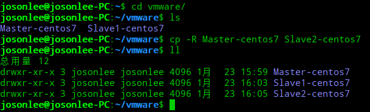
然后在虚拟机中导入并重命名
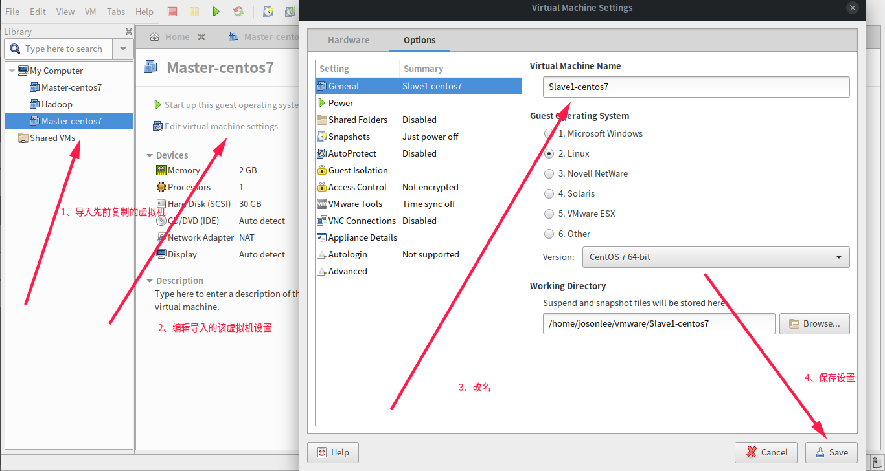

启动虚拟机，分别修改slave1、slave2的IP地址和主机名，并重启服务（参见前文）

修改之后，重启三台虚拟机。我介意你用命令行工具来链接虚拟机,因为我是Deepin上借助vm实现centos最小化安装，不知道怎么搞定vm tools一直安装不成功。搞的虚拟机中命令界面很难看、别扭。我这里借助Deepin的命令行自带的连接服务器功能，如图
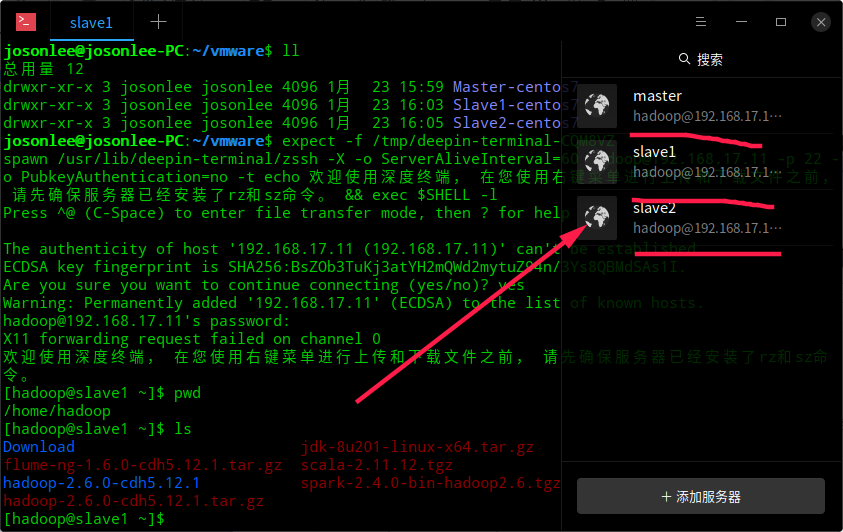

### ssh免密登录
1. 分别在三台虚拟机上设置秘钥，`ssh-keygen -t rsa`，然后三下回车，如图

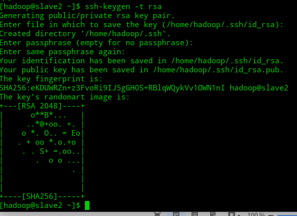
默认在**/home/hadoop/.ssh**目录(用户目录下的.ssh)下生成公钥id_rsa.pub和私钥文件id_rsa

2. 将slave1、slave2节点的公钥汇总到mster的.ssh/authorized_keys文件中

```
ssh-copy-id -i ~/.ssh/id_rsa.pub master
```
然后如图操作
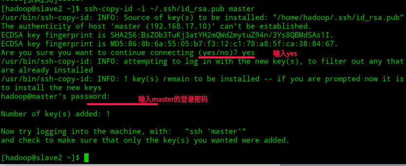

3. 把master的公钥也汇总到authorized_keys文件

```
# master节点上执行
cd .ssh/
cat id_rsa.pub >> authorized_keys
chmod 600 cat authorized_keys  //有必要赋予访问权限
```
4. 把汇总后的authorized_keys文件分别发送到slave1、slave2的.ssh目录下

```
# master节点上执行
scp authorized_keys slave1:.ssh  //执行两次
scp authorized_keys slave2:.ssh
```
如图，输入yes后，分别输入slave1、slave2的登录密码
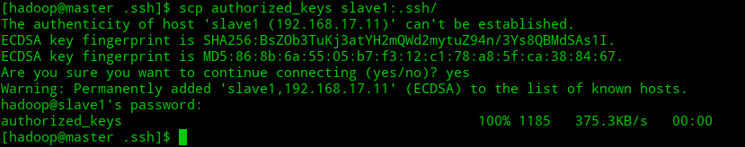

5. 测试ssh免密登录
```
ssh 主机名		//第一次连接时如有提示，输入yes，以后则没有提示也不需要密码即可连接
```
如图是slave2免密登录master、slave1，不成功的话删掉.ssh下面的文件重复上面步骤

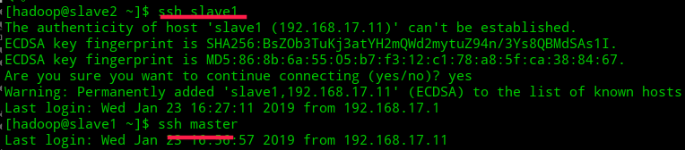

## 启动hadoop
以下操作全在master上进行
### 格式化hdfs文件系统
```
hdfs namenode -format
```
### 启动hdfs和yarn
```
start-dfs.sh  //启动hdfs
start-yarn.sh  //启动yarn
jps  //查看启动进程
```
浏览器查看hdfs：http://192.168.17.10:50070，yarn：http://192.168.17.10:8088

注意：master下只能看到NameNode、SecondaryNameNode(未配置但依然会启动，配置的话还需要一台虚拟机)、ResourceManager；slave下有Datanode、NodeManager

```
# master上
[hadoop@master hadoop-2.6.0-cdh5.12.1]$ jps
3809 ResourceManager
3491 NameNode
3668 SecondaryNameNode
4072 Jps

# slave上
[hadoop@slave2 ~]$ jps
2102 NodeManager
2232 Jps
1998 DataNode
```
### Master节点无法启动ResourceManager解决
进入日志文件查看信息
```
cd /home/hadoop/hadoop-2.6.0-cdh5.12.1/logs/
tail -100f yarn-hadoop-resourcemanager-master.log
```

报错信息如下：
```
Caused by: java.net.BindException: Problem binding to [master::8031] java.net.BindException: 无法指定被请求的地址; For more details see:  http://wiki.apache.org/hadoop/BindException
​	at sun.reflect.NativeConstructorAccessorImpl.newInstance0(Native Method)
​	at sun.reflect.NativeConstructorAccessorImpl.newInstance(NativeConstructorAccessorImpl.java:62)
​	at sun.reflect.DelegatingConstructorAccessorImpl.newInstance(DelegatingConstructorAccessorImpl.java:45)
​	at java.lang.reflect.Constructor.newInstance(Constructor.java:423)
​	at org.apache.hadoop.net.NetUtils.wrapWithMessage(NetUtils.java:791)
​	at org.apache.hadoop.net.NetUtils.wrapException(NetUtils.java:720)
​	at org.apache.hadoop.ipc.Server.bind(Server.java:482)
​	at org.apache.hadoop.ipc.Server$Listener.<init>(Server.java:688)
​	at org.apache.hadoop.ipc.Server.<init>(Server.java:2376)
​	at org.apache.hadoop.ipc.RPC$Server.<init>(RPC.java:1042)
​	at org.apache.hadoop.ipc.ProtobufRpcEngine$Server.<init>(ProtobufRpcEngine.java:535)
​	at org.apache.hadoop.ipc.ProtobufRpcEngine.getServer(ProtobufRpcEngine.java:510)
​	at org.apache.hadoop.ipc.RPC$Builder.build(RPC.java:887)
​	at org.apache.hadoop.yarn.factories.impl.pb.RpcServerFactoryPBImpl.createServer(RpcServerFactoryPBImpl.java:169)
​	at org.apache.hadoop.yarn.factories.impl.pb.RpcServerFactoryPBImpl.getServer(RpcServerFactoryPBImpl.java:132)
​	... 17 more
Caused by: java.net.BindException: 无法指定被请求的地址
​	at sun.nio.ch.Net.bind0(Native Method)
​	at sun.nio.ch.Net.bind(Net.java:433)
​	at sun.nio.ch.Net.bind(Net.java:425)
​	at sun.nio.ch.ServerSocketChannelImpl.bind(ServerSocketChannelImpl.java:223)
​	at sun.nio.ch.ServerSocketAdaptor.bind(ServerSocketAdaptor.java:74)
​	at org.apache.hadoop.ipc.Server.bind(Server.java:465)
​	... 25 more
2019-01-23 17:26:56,226 INFO org.apache.hadoop.yarn.server.resourcemanager.ResourceManager: SHUTDOWN_MSG: 
/************************************************************
SHUTDOWN_MSG: Shutting down ResourceManager at master/192.168.17.10
************************************************************/

```

从日志可以看出是ip地址绑定出了问题`Caused by: java.net.BindException: Problem binding to [master::8031] java.net.BindException: 无法指定被请求的地址`，我这里多写了个冒号

重新编辑下yarn-site.xml，修改如下
```
<property>
​        <name>yarn.resourcemanager.resource-tracker.address</name>
​        <value>master:8031</value>
</property>

```
> 我上文的配置是修改后的，没有错

## 基于Hadoop集群的Hive安装配置

Hive可以安装在任一节点或集群之外，我这里是计划装在Master节点上。
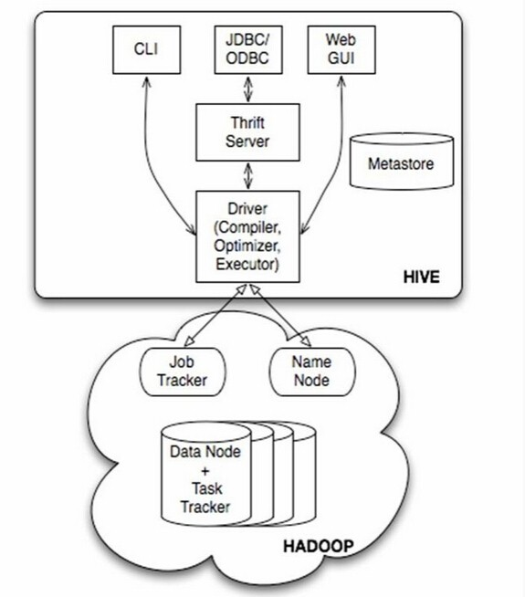
其次Hive也就是在hadoop上加了一层SQL接口，便于通过简单的SQL语言翻译成MapReduce作业。而hdfs的特性是可追加不可修改，但数据库表是可以修改删除的，所以Hive的所存储的数据应当分成两部分，表的元数据外部存储以便修改，表中数据存储在hdfs上即可。
hive是默认将元数据保存在本地内嵌的 Derby 数据库中，但Derby不支持多会话连接，所以我这里选择mysql来存储metadata元数据

### 准备
- Hive CDH发行版本（http://archive-primary.cloudera.com/cdh5/cdh/5/ ），为了和Hadoop、HBase、flume等版本对应，这里限定使用cdh5.12.1结尾的hive-1.1.0-cdh5.12.1.tar.gz
- 下载mysql驱动（https://dev.mysql.com/downloads/connector/j/）
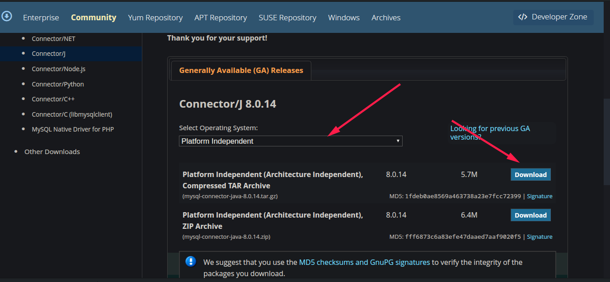

### 在线安装并配置MySQL
1. 上传MySQL在线安装源的配置文件

用root账号登录master节点
将mysql-community.repo 文件上传到 `/etc/yum.repos.d/` 目录
将c 文件上传到 `/etc/pki/rpm-gpg/` 目录
> 这两文件是指定mysql的yum源，centos系统盘里是没有的。我放了个链接在最后
```
# Enable to use MySQL 5.6
[mysql56-community]
name=MySQL 5.6 Community Server
baseurl=http://repo.mysql.com/yum/mysql-5.6-community/el/7/$basearch/
enabled=1           #enabled=1表明下载使用MySQL5.6，如果要用5.7的话把下面的enabled改为1
gpgcheck=1
gpgkey=file:/etc/pki/rpm-gpg/RPM-GPG-KEY-mysql

# Note: MySQL 5.7 is currently in development. For use at your own risk.
# Please read with sub pages: https://dev.mysql.com/doc/relnotes/mysql/5.7/en/
[mysql57-community-dmr]
name=MySQL 5.7 Community Server Development Milestone Release
baseurl=http://repo.mysql.com/yum/mysql-5.7-community/el/7/$basearch/
enabled=0
gpgcheck=1
gpgkey=file:/etc/pki/rpm-gpg/RPM-GPG-KEY-mysql
```

2. 更新yum源并安装mysql server（默认同时会安装mysql client）

```
# yum repolist
# yum install mysql-server
```

3. 查看MySQL各组件是否成功安装

```
# rpm -qa | grep mysql
```
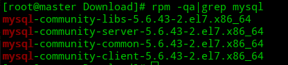

4. 启动MySQL Server并查看其状态
```
# systemctl start mysqld
# systemctl status mysqld
```
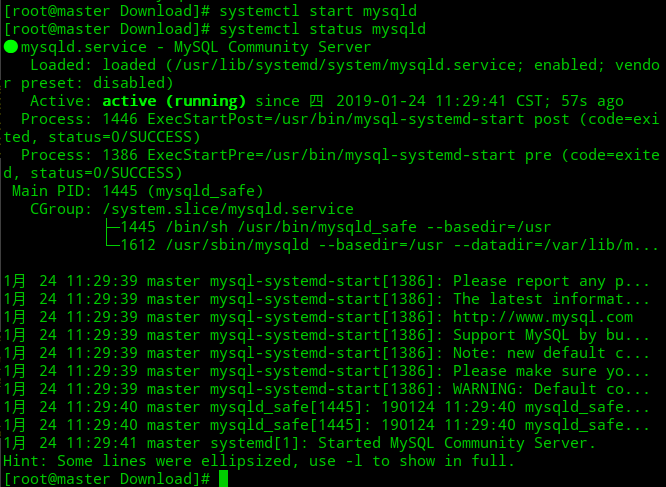

> 设置开机启动mysql服务：systemctl enable mysqld
> 关闭开机自启动：systemctl diable mysqld
> 停止MySQL服务：systemctl stop mysqld

5. 查看MySQL版本
```
# mysql -V
```

6. 连接MySQL，默认root密码为空
```
# mysql -u root 
mysql> 
```

> 为root用户设置密码：
mysql>set password for 'root'@'localhost'=password('newPasswd');

7. 查看数据库
```
mysql> show databases; （注意：必须以分号结尾，否则会出现续行输入符“>”）
```

8. 创建hive元数据数据库（metastore）
```
mysql> create database hive; 
```

9. 创建用户hive，密码是123456
```
mysql> CREATE USER 'hive'@'%' IDENTIFIED BY '123456';
```

注意：删除用户是DROP USER命令 ，%代表可以在任一台主机（IP地址）上使用hive用户

10. 授权用户hadoop拥有数据库hive的所有权限
```
mysql> GRANT ALL PRIVILEGES ON hive.* TO 'hive'@'%' WITH GRANT OPTION;
```
11. 查看新建的MySQL用户（数据库名：mysql，表名：user）
```
mysql> select host,user,password from mysql.user;
```

12. 删除空用户记录，如果没做这一步，新建的hive用户将无法登录，后续无法启动hive客户端
```
mysql> delete from mysql.user where user='';
```
13. 刷新系统授权表（不用重启mysql服务）
```
mysql> flush privileges; 
```
14. 测试hive用户登录
```
$ mysql -u hive -p
Enter password：123456
```

### 安装Hive

- 切换hadoop用户登录（我先前centos创建的用户hadoop）
- 上传下载的源码文件并解压到用户目录下 `tar -zxvf hive-1.1.0-cdh5.12.1.tar.gz ~`
- 在.bash_profile文件中添加hive环境变量

```
export HIVE_HOME=/home/hadoop/hive-1.1.0-cdh5.12.1
export PATH=$HIVE_HOME/bin:$PATH
```

并使之生效 `source .bash_profile`

- 编辑$HIVE_HOME/conf/hive-env.sh文件，在末尾添加HADOOP_HOME变量

```
$ cd ​$HIVE_HOME/conf
$ cp hive-env.sh.template hive-env.sh	（默认不存在，可从模板文件复制）
​$ vi hive-env.sh
# 添加HADOOP_HOME=/home/hadoop/hadoop-2.6.0-cdh5.12.1
```
- 同样在conf目录下新建hive-site.xml

```
<?xml version="1.0" encoding="UTF-8" standalone="no"?>
<?xml-stylesheet type="text/xsl" href="configuration.xsl"?>
<configuration>
​        # 下面几步指定使用创建的hive用户访问mysql
​        <property>
​                <name>javax.jdo.option.ConnectionDriverName</name>
​                <value>com.mysql.jdbc.Driver</value>
​        </property>
​        <property>
​                <name>javax.jdo.option.ConnectionURL</name>
​                <value>jdbc:mysql://192.168.17.10:3306/hive</value>
​        </property>
​        <property>
​                <name>javax.jdo.option.ConnectionUserName</name>
​                <value>hive</value>
​        </property>
​        <property>
​                <name>javax.jdo.option.ConnectionPassword</name>
​                <value>123456</value>
​        </property>
​	<property>
​		<name>hive.metastore.warehouse.dir</name> #指定仓库目录，在hdfs上
​		<value>/hive/warehouse</value>
​	</property>
​	<property>
​		<name>hive.exec.scratchdir</name>
​		<value>/hive/tmp </value>
​	</property>
​        <property>
​                <name>hive.metastore.schema.verification</name>
​                <value>false</value>
​        </property>
</configuration>

```

如配置文件中指明了hive仓库在hdfs上，所以要创建/hive/warehouse和/hive/tmp目录

- 启动hdfs服务并创建所述目录

```
start-dfs.sh #起hdfs
hdfs dfs -mkdir -p /hive/warehouse /hive/tmp #创建多级目录
hdfs dfs -ls -R /hive #查看

```

- 将先前下载的mysql驱动上传并解压到$HIVE_HOME/lib目录下

- 启动hive,前提确保hadoop集群启动了，命令行输入`hive`

### hive简单使用
和mysql使用差不多的，类似SQL语句的HSQL
- 启动hive：`hive`
- 退出：quit;
- 查看数据库和表，同sql语句 show databases，show tables from xxx
- 创建表，我这里随便建了个`create table user(name string,age int,id string);`
- 查看表结构 desc user；
- 查看表详细信息 desc fromatted user；
- 插入数据 `insert into user values('hadoop',10,'0x001'),('hbase',6,'0x002'),('josonlee',20,'0x003');`

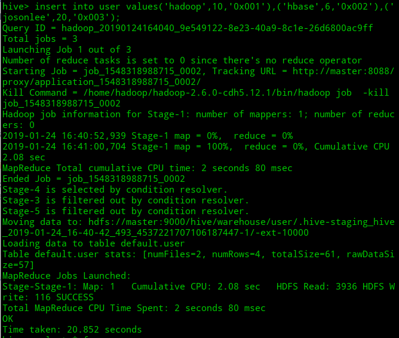

- 查询select * from user;

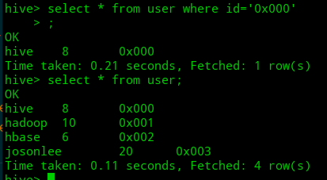

- 创建数据库
```
hive> create database testdb;		//在默认位置创建DB(配置中指定的/hive/warehouse/)
hive> create database testdb location ‘/hive/testdb’		//在HDFS指定目录下创建DB

```
- 查看数据库结构 desc database testdb;
- 切换数据库 use testdb;
- 删除数据库
```
hive> drop database testdb; 	//只能删除空数据库（数据库中没表）
hive> drop database mydb cascade;	          //删除非空数据库
```

Hive就是这样简单搭建成功

可以再去MySQL下看看到底改变了存储了什么信息，如图

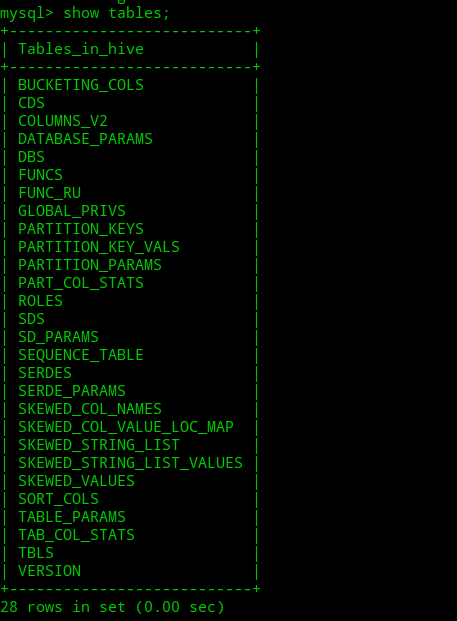

其中上面创建的user表的字段信息存储在COLUMN_V2里，如图

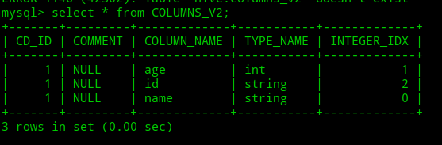

https://www.cnblogs.com/qingyunzong/p/8710356.html#_label5_0

其余表对应Hive数据库相关信息如下：
```
一、存储Hive版本的元数据表（VERSION）
二、Hive数据库相关的元数据表（DBS、DATABASE_PARAMS）
    1、DBS
    2、DATABASE_PARAMS
三、Hive表和视图相关的元数据表
    1、TBLS
    2、TABLE_PARAMS
    3、TBL_PRIVS
四、Hive文件存储信息相关的元数据表
    1、SDS
    2、SD_PARAMS
    3、SERDES
    4、SERDE_PARAMS
五、Hive表字段相关的元数据表
    1、COLUMNS_V2
六、Hive表分区相关的元数据表
    1、PARTITIONS
    2、PARTITION_KEYS
    3、PARTITION_KEY_VALS
    4、PARTITION_PARAMS

```

## Spark本地模式及基于Yarn的分布式集群环境搭建

不要额外安装scala，spark自带了scala环境
- 上传源码包并解压到用户目录下 `tar -zxvf spark-2.4.0-bin-hadoop2.6.tar.gz -C ~`
- 编辑用户配置文件`vi ~/.bash_profile`，并追加下列内容
```
# Spark环境变量配置
export SPARK_HOME=/home/hadoop/spark-2.4.0-bin-hadoop2.6
export PATH=$SPARK_HOME/bin:$SPARK_HOME/sbin:$PATH
```

如上配置后，`source .bash_profile` 后，命令行输入spark-shell可进入spark的命令行模式

- 编辑spark的conf目录下的spark-env.sh，默认只有模版，复制生成一个

spark-conf所在目录：/home/hadoop/spark-2.4.0-bin-hadoop2.6/conf/

```
$ cp spark-env.sh.template spark-env.sh
$ vi spark-env.sh

# 追加如下内容，去掉中文
# 指定java、hadoop及hadoop-conf所在目录
export JAVA_HOME=/opt/jdk1.8.0_201      
export HADOOP_HOME=/home/hadoop/hadoop-2.6.0-cdh5.12.1
export HADOOP_CONF_DIR=/home/hadoop/hadoop-2.6.0-cdh5.12.1/etc/hadoop
# 指定spark的Master节点的ip，我这里是映射master为192.168.17.10
export SPARK_MASTER_HOST=master
# 指定spark集群worker节点的内存、实例、核，依情况而定吧
export SPARK_WORKER_MEMORY=1024m
export SPARK_WORKER_CORES=2
export SPARK_WORKER_INSTANCES=1
```

- 编辑conf目录下的slaves文件，默认只有模版，复制生成一个

```
$ cp slaves.template slaves
$ vi slaves

# 追加如下内容，我这里slave1、2是另外两台虚拟机ip的映射
# A Spark Worker will be started on each of the machines listed below.
slave1
slave2
```

- 将配置好的整个目录 `/home/hadoop/spark-2.4.0-bin-hadoop2.6/` 发送给另外两台虚拟机

```
scp -r ~/spark-2.4.0-bin-hadoop2.6 slave1:/home/hadoop/
scp -r ~/spark-2.4.0-bin-hadoop2.6 slave2:/home/hadoop/
```

- 启动spark

首先，spark下sbin目录中启动和结束的命令是start-all.sh，stop-all.sh，和hadoop启动和结束命令重名了，用mv命令修改为start-spark-all.sh，stop-spark-all.sh

如图在Master节点输入所示命令，启动hdfs、yarn、spark
```
start-dfs.sh
start-yarn.sh 
start-spark-all.sh 
```
Master节点上启动的进程
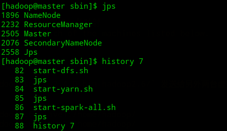

slave节点上启动的进程
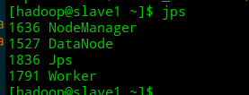

- 测试一下

跑一下spark自带的计算pi的程序
```
cd $SPARK_HOME
./bin/run-example SparkPi 100

# 有输出Pi is roughly 3.1414175141417515的话就OK了
```
job运行过程中可以在浏览器通过http://master:4040查看，但任务结束后就看不了了。但考虑后续运行细节，就需要为集群配置Spark History Server了

## 为集群配置Spark-History-Server
- 修改spark-defaults.conf配置文件
```
$ cp spark-defaults.conf.template spark-defaults.conf
$ vi spark-defaults.conf

# 追加如下
spark.eventLog.enabled           true
spark.eventLog.dir               hdfs://master:9000/eventLogs
spark.eventLog.compress          true
```
- 属性解释
    - spark.eventLog.enabled：是否记录Spark事件，用于应用程序在完成后使用web界面查看
    - spark.eventLog.dir：设置spark.eventLog.enabled为true后，该属性为记录spark时间的根目录。在此根目录中，Spark为每个应用程序创建分目录，并将应用程序的时间记录到此目录中。用户可以将此属性设置为HDFS目录，以便History Server读取
    - spark.eventLog.compress：否压缩记录Spark事件，前提spark.eventLog.enabled为true，默认使用的是snappy

- 修改spark-env.sh配置文件

```
# 追加
export SPARK_HISTORY_OPTS="-Dspark.history.ui.port=18080 -Dspark.history.retainedApplications=3 -Dspark.history.fs.logDirectory=hdfs://master:9000/eventLogs"
```
- 解释
    - spark.history.ui.port：WebUI的端口号。默认为18080，也可以自行设置。
    - spark.history.retainedApplications：设置缓存Cache中保存的应用程序历史记录的个数，默认50，如果超过这个值，旧的将被删除。
    > 注：缓存文件数不表示实际显示的文件总数。只是表示不在缓存中的文件可能需要从硬盘读取，速度稍有差别。
    
    - spark.history.fs.logDirectory:存放历史记录文件的目录。可以是Hadoop API支持的任意文件系统
        - **我看文档上这个目录和上面哪个目录可以是同一个**

- 在hdfs上新建上述用来存储spark历史记录的文件夹

分别是hdfs://master:9000/eventLogs
```
start-dfs.sh

hdfs dfs -mkdir /eventLogs
```

- 重启集群

```
start-all.sh
start-spark-all.sh
start-history-server.sh     //就是这个进程在记录历史任务
```
再次查看进程，出现了HistoryServer进程
```
[hadoop@master conf]$ jps
3696 SecondaryNameNode
4162 Master
3515 NameNode
4283 Jps
4237 HistoryServer
```

浏览器下http://master:18080可查看

参考：

- http://spark.apache.org/docs/latest/monitoring.html
- [SPARK启动历史任务查看](http://blog.51cto.com/beyond3518/1787513)

