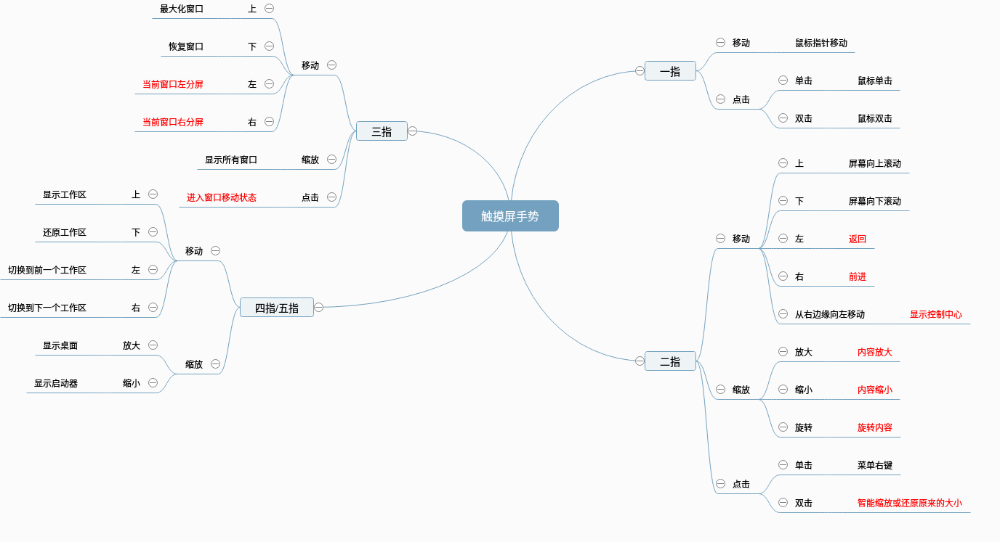

以下只在Deepin下使用成立，有些命令是其他Linux子系统也适用的


## 常用快捷键

先说明键盘上的Windows图标在deepin中是Super键
- Super+s 显示工作区
- 在工作区中使用Ctrl+alt+数字a，可以切换到第a个工作区
- 工作区间中使用Ctrl+Tab可以依次切换其中的任务
- Super+a 显示所以工作区的窗口
- Super+shift+<-和->可把当前窗口起到左右工作区
- Super+<-和->切换左右工作区

- Super+d 显示桌面
- Super+e 打开文件管理器
- Super 打开启动器

- Ctrl+Alt+T 打开终端

> **在深度终端界面上**，按下键盘上的 Ctrl + Shift + ? 组合键来查看快捷键

> 在深度终端界面，点击鼠标右键。
    - 点击 纵向分屏，界面被分为左右两个部分。
    - 点击 横向分屏，界面被分为上下两个部分。
tips ：您也可以按下键盘上的 Ctrl+Shift+J 组合键来纵向分屏，按下键盘上的 Ctrl+Shift+H 组合键来横向分屏

> 按F11键可以全屏显示终端，再按F11会退出全屏


- Ctrl+Alt+A 截图
- Ctrl+Alt+Delete 注销登录

> 经常出现界面“卡顿”，这个时候可以按注销键（Ctrl + Alt +Delete）注销用户，而不是直接去按“电源键”，重新开机

- Super+L 锁屏

## 触摸板手势使用
终端执行
```
sudo modprobe psmouse  ##启用触摸板
sudo rmmod psmouse     ##禁用触摸板
```
默认情况下：
- 三指下滑最大化窗口
- 三指左右滑窗口左右半屏幕
- 三指缩放可以显示所有窗口
- 二指点击相当于鼠标右键
- 还有其他，如图


> 默认的配置文件在 /usr/share/dde-daemon/gesture.json
> 不好说，我联想的本子在win10上是支持4/5指的，但deepin上不行，而且我也尝试修改配置文件，没有毛用啊


## [linux(deepin)在启动器上制作启动图标](https://blog.csdn.net/zhangjingao/article/details/76546363)

