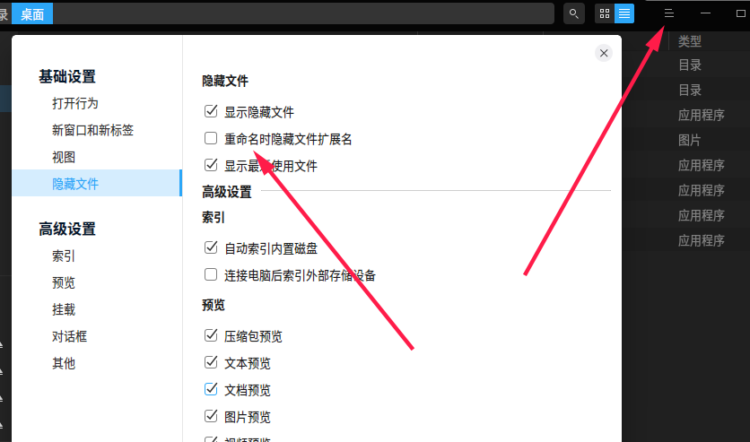
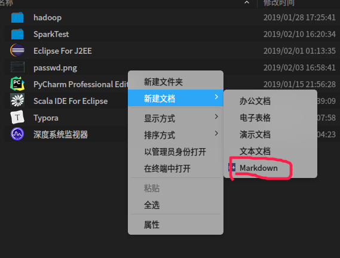
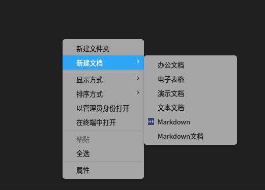

### 如何重命名时修改后缀名

当然，linux下不应该叫什么后缀不后缀的，一切皆文件。但界面鼠标操作时还是会依据后缀名选择不同默认程序打开，所有能修改后缀也是有需求的。如图，Deepin Linux中在文件管理器设置里，找到该选项取消即可



### 如何自定义添加右键新建文件模版

当然你可以直接命令行通过touch命令来新建，但要打开小黑框没有直接鼠标操作快，如图



- 方法一：在`/usr/share/templates` 新建markdown-template.desktop （我这里以markdown模版为例），添加如下内容

```
[Desktop Entry]
Name=Markdown Doc
Name[zh_CN]=Markdown文档
Comment=Enter MD filename:
Comment[zh_CN]=请输入Markdown文档名称：
Type=Link
URL=.source/markdown-template.md
```

Name是右键新建时显示的名称，Comment是此类型文件的新名称的标签，URL是模版文件所具有的初始内容的文件的路径。这些模版通常位于templates文件夹下的隐藏.source文件夹中，因此请使用以.source /开头的相对路径 （没有的话自己新建一个.source文件夹，然后在其中添加markdown-template.md），`Type=Link`是固定的。还有一个Icon图标，但原有的模版选项没有显示图标，所以这里也不设置

然后关闭所有文件管理器，再次打开就可以看到新的可选模版

- 方法二：在用户目录下的`~/.Templates` 新建一个markdown.md即可

同样是关闭所有文管，再次打开后就可以看到。不过这种方法只适合当前用户，同时也会多一个图标



参考：[Adding an entry to the Create New menu](https://userbase.kde.org/Adding_an_entry_to_the_Create_New_menu)