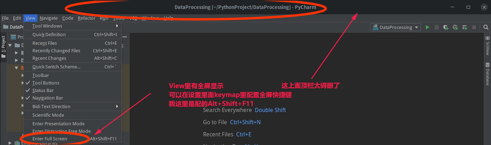

如上文件，顺序如下：

- [Win10下双系统Deepin15.8安装.md](https://github.com/josonle/Coding-Now/blob/master/Linux%E7%B3%BB%E7%BB%9F%E4%B8%8B%E5%BC%80%E5%8F%91%E7%8E%AF%E5%A2%83%E6%90%AD%E5%BB%BA/Win10%E4%B8%8B%E5%8F%8C%E7%B3%BB%E7%BB%9FDeepin15.8%E5%AE%89%E8%A3%85.md)

  - 可参考pdf：Deepin 15.4 Win10双系统安装教程

- [Linux中文件系统各个目录的作用.md](https://github.com/josonle/Coding-Now/blob/master/Linux%E7%B3%BB%E7%BB%9F%E4%B8%8B%E5%BC%80%E5%8F%91%E7%8E%AF%E5%A2%83%E6%90%AD%E5%BB%BA/Linux%E4%B8%AD%E6%96%87%E4%BB%B6%E7%B3%BB%E7%BB%9F%E5%90%84%E4%B8%AA%E7%9B%AE%E5%BD%95%E7%9A%84%E4%BD%9C%E7%94%A8.md)

- [Deepin常用快捷键及快捷其他操作.md](https://github.com/josonle/Coding-Now/blob/master/Linux%E7%B3%BB%E7%BB%9F%E4%B8%8B%E5%BC%80%E5%8F%91%E7%8E%AF%E5%A2%83%E6%90%AD%E5%BB%BA/Deepin%E5%B8%B8%E7%94%A8%E5%BF%AB%E6%8D%B7%E9%94%AE%E5%8F%8A%E5%BF%AB%E6%8D%B7%E5%85%B6%E4%BB%96%E6%93%8D%E4%BD%9C.md)

- Deepin下源码编译安装配置git.md

- [Deepin15.8下搭建Python开发环境.md](https://github.com/josonle/Coding-Now/blob/master/Linux%E7%B3%BB%E7%BB%9F%E4%B8%8B%E5%BC%80%E5%8F%91%E7%8E%AF%E5%A2%83%E6%90%AD%E5%BB%BA/Deepin15.8%E4%B8%8B%E6%90%AD%E5%BB%BAPython%E5%BC%80%E5%8F%91%E7%8E%AF%E5%A2%83.md)
  - 含有如何在Deepin Linux下安装pip、pip3
  - 安装pycharm、jupyter notebook
  - 虚拟环境使用等

- [Deepin下搭建(java)Hadoop、Spark等大数据开发环境.md](https://github.com/josonle/Coding-Now/blob/master/Linux%E7%B3%BB%E7%BB%9F%E4%B8%8B%E5%BC%80%E5%8F%91%E7%8E%AF%E5%A2%83%E6%90%AD%E5%BB%BA/Deepin%E4%B8%8B%E6%90%AD%E5%BB%BAHadoop%E3%80%81Spark%E7%AD%89%E5%A4%A7%E6%95%B0%E6%8D%AE%E5%BC%80%E5%8F%91%E7%8E%AF%E5%A2%83.md)
  - 含有如何在Deepin Linux下安装java、scala、VMware虚拟机、eclipse

  > Eclipse中Alt+F11可以全屏显示，IDEA、Pycharm啥的要自己配置全屏显示快捷键（我设置成了Alt+Shift+F11）
  >
  > 

  - 如何搭建centos集群

  - 搭建hadoop、hive、hbase

  - 搭建spark

  - 待续

- [Deepin下如何科-学(地)上-网.md](https://github.com/josonle/Coding-Now/blob/master/Linux%E7%B3%BB%E7%BB%9F%E4%B8%8B%E5%BC%80%E5%8F%91%E7%8E%AF%E5%A2%83%E6%90%AD%E5%BB%BA/Deepin%E4%B8%8B%E5%A6%82%E4%BD%95%E7%A7%91-%E5%AD%A6(%E5%9C%B0)%E4%B8%8A-%E7%BD%91.md)

- [Deepin使用体验、资源及问题归纳贴.md](https://github.com/josonle/Coding-Now/blob/master/Linux%E7%B3%BB%E7%BB%9F%E4%B8%8B%E5%BC%80%E5%8F%91%E7%8E%AF%E5%A2%83%E6%90%AD%E5%BB%BA/Deepin%E4%BD%BF%E7%94%A8%E4%BD%93%E9%AA%8C%E3%80%81%E8%B5%84%E6%BA%90%E5%8F%8A%E9%97%AE%E9%A2%98%E5%BD%92%E7%BA%B3%E8%B4%B4.md)

- [Deepin自定义右键新建文件模版.md](https://github.com/josonle/Coding-Now/blob/master/Linux%E7%B3%BB%E7%BB%9F%E4%B8%8B%E5%BC%80%E5%8F%91%E7%8E%AF%E5%A2%83%E6%90%AD%E5%BB%BA/Deepin%E8%87%AA%E5%AE%9A%E4%B9%89%E5%8F%B3%E9%94%AE%E6%96%B0%E5%BB%BA%E6%96%87%E4%BB%B6%E6%A8%A1%E7%89%88.md)

- [Deepin设置开机自启动脚本问题.md](https://github.com/josonle/Coding-Now/blob/master/Linux%E7%B3%BB%E7%BB%9F%E4%B8%8B%E5%BC%80%E5%8F%91%E7%8E%AF%E5%A2%83%E6%90%AD%E5%BB%BA/Deepin%E8%AE%BE%E7%BD%AE%E5%BC%80%E6%9C%BA%E8%87%AA%E5%90%AF%E5%8A%A8%E8%84%9A%E6%9C%AC%E9%97%AE%E9%A2%98.md)

- [AppImage打包方式、相关应用、相关Linux游戏站推荐](https://github.com/josonle/Coding-Now/blob/master/Linux%E7%B3%BB%E7%BB%9F%E4%B8%8B%E5%BC%80%E5%8F%91%E7%8E%AF%E5%A2%83%E6%90%AD%E5%BB%BA/AppImage%E6%89%93%E5%8C%85%E6%96%B9%E5%BC%8F%E5%8F%8A%E7%9B%B8%E5%85%B3Linux%E6%B8%B8%E6%88%8F%E7%AB%99%E6%8E%A8%E8%8D%90.md)
- [【Deepin】最新XMind for Linux 破解版安装](https://blog.csdn.net/lzw2016/article/details/88622874)

