## Win10下安装双系统Deepin 15.8

### Deepin介绍及下载

deepin是一份致力于为全球用户提供美观、易用、安全、免费的使用环境的Linux发行。它不仅仅包括对全球优秀开源产品进行的集成和配置，还开发了基于Qt5技术的全新桌面环境、系统设置中心，以及音乐播放器、视频播放器、软件中心等一系列面向普通用户的应用程序。deepin非常注重易用的体验和美观的设计，便于安装和使用，也能够很好地代替Windows系统应用于工作及娱乐等各领域

[深度科技社区](https://www.deepin.org/)，建议安装前去社区论坛看看别人发的帖，好知道安装过程会有什么坑要填

之所以选择它，一是国产，理当支持一波。虽然不少人说它bug不少，谁知道呢，可能就是他们不会用；二是其对Windows上的一些应用支持很好，像QQ、微信、百度云，开发中难免要和别人沟通，我有不想花时间去配置这些，而且它界面UI确实不错，为啥不选Deepin呢？对吧

镜像下载，我这里选的是ISO创库，清华镜像站的，https://www.deepin.org/mirrors/releases/，你看情况选呗

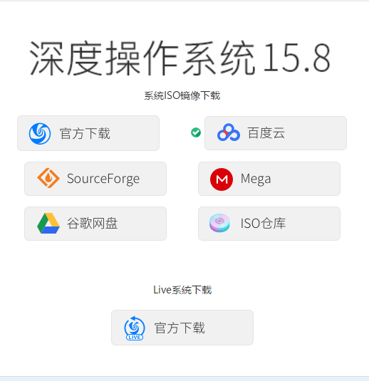

### 制作U盘启动盘

U盘至少8g，因为过程中可能需要格式化u盘，提前备份好数据

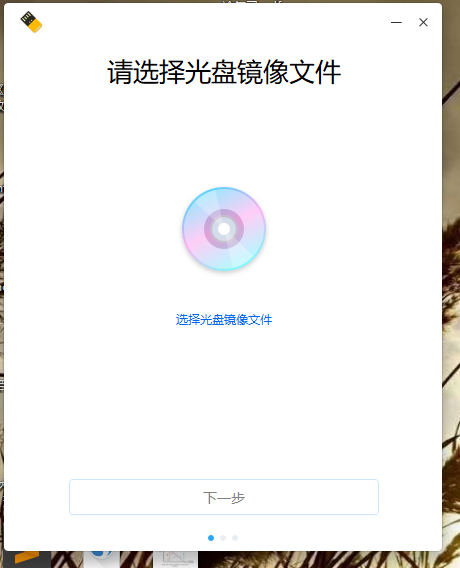

这里选择镜像文件后，下一步选择U盘，然后勾选**格式化U盘**【我勾了反而出错，无语】，然后确认即可

### 分区计划100G

- 根目录`/`：20g
- swap：4g
- 其余都给home目录

### 进入bios进行相关设置

- 如何进入bios，联想有的本子是按F2，有的是F12，你自己查一下看

> 我这几个都进不去，最后是**一直按着shift键**，然后**重启**，会进入一个界面(如下)，选择**疑难解答**
>
> 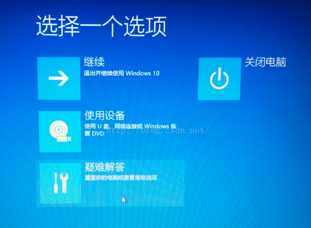
>
> 然后点击高级选项->UEFI固件设置->重启，就可以了
>
> 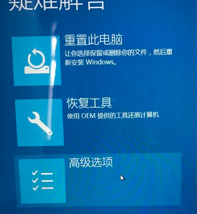
>
> 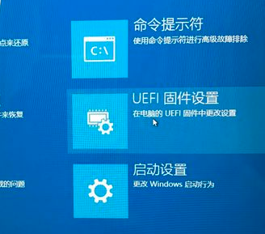
>
> 还有其他无法进入bios的方法：[win10系统bios进不去怎么办？](https://www.jb51.net/os/win10/382360.html) 

- 关闭安全启动项（Security->secure boot设置disabled）
- bios里进入boot选择U盘为第一启动（**boot->efi下的一个什么UDisk什么的**）

> 这里我也稀里糊涂的，因为我看官方论坛里，别人电脑是选择USB硬盘(UEFI)什么的。
>
> 我电脑是**联想天逸300**，进boot后只能看到三个启动选项，第一个是Windows，第二个是UDisk什么的，第三个不认识。看英文名只有UDisk和U盘接近，所以我就选了这个，没想到真的是这个。后来想了下，这个UDisk好像就是U盘的名字吧

- 如上设置完成后，按下F10报错退出，就开始安装Deepin了

### 安装Deepin并分区

其他选择语言、地区、设置用户名密码啥的我就不说了，讲下Deepin该如何分区吧

- 选择安装位置，点击上方的高级，进入如下操作模式

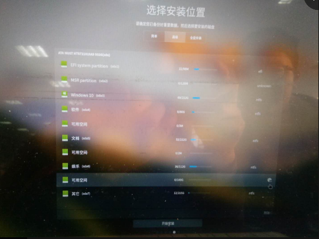

如图，可以看见我选中的是100G的可用空间，鼠标箭头选中的地方，点击

- 创建根目录分区`/`，和swap分区，其余都作为home分区

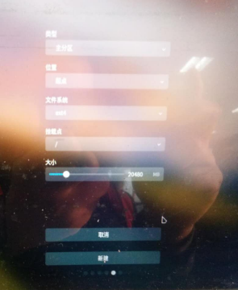

选择挂载点为`/`，分配20g

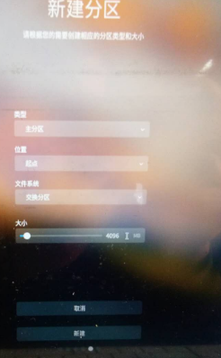

选择文件系统为 **交换分区**，分配4g即可。我看有地方说，如果内存超过8g可以不分配这个swap分区

> swap分区是内存不够用时，作为虚拟内存使用的，不是越大越好，要适当

其余空间都选择挂载点为	`/home`作为home分区

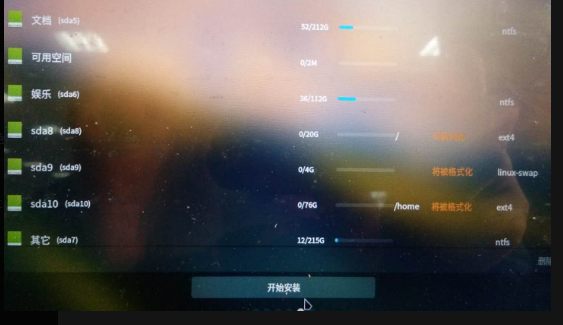

最终，如图，开始安装即可

安装大概花了10来分钟吧，和网络有关。安装完成后，**记得拔掉U盘**，然后重启，默认是直接进入Deepin的

### 重启没有Deepin启动项怎么办？

我还帮我朋友一起装了下双系统，他电脑上惠普的，启动时遇到了没有Deepin启动项，直接进入Win10。如下是解决办法：

> 我这里也是参照别人的

1. windows下搜索**EasyUEFI** [官网](http://www.easyuefi.com/index-cn.html)，下载安装
2. 点击管理 EFI 启动项

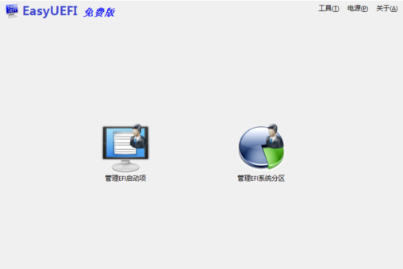

3. 点红框框到的那个加号

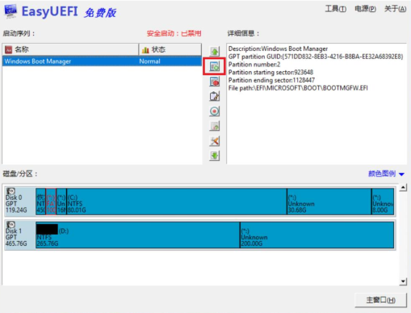

4. 创建一个名为deepin的启动项，如图

5. 选择efi分区，点击Browser，选择efi引导文件

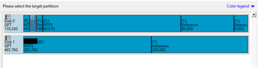

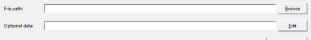

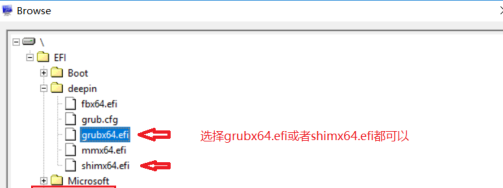

6. 点击OK即可看见deepin引导项建立成了，红框框着的可以选择那个先启动

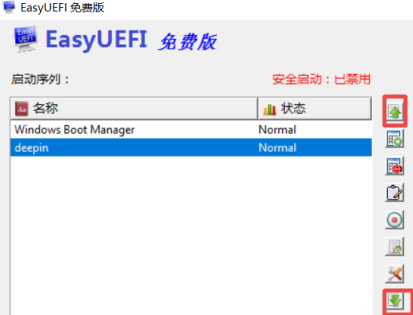

7. 再次重启试试

以上方法，可能有用，仅供参考

> 参考链接：[解决无 Deepin 启动项的问题](https://wiki.deepin.org/index.php?title=Deepin_15.4_Windows_10_%E5%8F%8C%E7%B3%BB%E7%BB%9F%E5%AE%89%E8%A3%85%E6%95%99%E7%A8%8B#.E8.A7.A3.E5.86.B3.E6.97.A0_Deepin_.E5.90.AF.E5.8A.A8.E9.A1.B9.E7.9A.84.E9.97.AE.E9.A2.98)

其实，以上过程可以在deepin的设置中，手动选择启动项顺序

### 后续

[deepin如何寻找、安装非商店软件](https://bbs.deepin.org/forum.php?mod=viewthread&tid=157341&highlight=%E5%AE%89%E8%A3%85)

[办公平台之字体安装](https://bbs.deepin.org/forum.php?mod=viewthread&tid=157250&highlight=%E5%AE%89%E8%A3%85)

参考我接下来几篇如何搭建开发环境的文章

