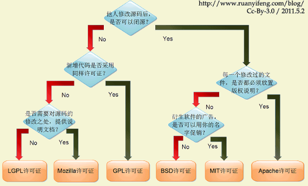

# Coding Now

## 初衷

一是平时看的一些自己认为不错的文章总是很难整理，所以打算开一个项目管理这些，也可以分享给大家；二是记录自己平时所学的一些笔记，一些经历，以供将来翻阅；三是想系统地进阶学习一番，记录这个项目也是想激励自己；四是分享一些平时看的电子书啊、视频等等

## GitHub及Git使用

- [如何选择开源许可证？ from 阮一峰的网络日志](http://www.ruanyifeng.com/blog/2011/05/how_to_choose_free_software_licenses.html) 

原文链接：https://paulmillr.com/posts/simple-description-of-popular-software-licenses/

## Linux系统下开发环境搭建

- [Win10下安装双系统Deepin 15.8.md](https://github.com/josonle/Coding-Now/blob/master/Linux%E7%B3%BB%E7%BB%9F%E4%B8%8B%E5%BC%80%E5%8F%91%E7%8E%AF%E5%A2%83%E6%90%AD%E5%BB%BA/Win10%E4%B8%8B%E5%AE%89%E8%A3%85%E5%8F%8C%E7%B3%BB%E7%BB%9FDeepin%2015.8.md)
- [Deepin15.8下搭建Python开发环境.md](https://github.com/josonle/Coding-Now/blob/master/Linux%E7%B3%BB%E7%BB%9F%E4%B8%8B%E5%BC%80%E5%8F%91%E7%8E%AF%E5%A2%83%E6%90%AD%E5%BB%BA/Deepin15.8%E4%B8%8B%E6%90%AD%E5%BB%BAPython%E5%BC%80%E5%8F%91%E7%8E%AF%E5%A2%83.md)
- [Deepin下搭建Hadoop、Spark等大数据开发环境.md](https://github.com/josonle/Coding-Now/blob/master/Linux%E7%B3%BB%E7%BB%9F%E4%B8%8B%E5%BC%80%E5%8F%91%E7%8E%AF%E5%A2%83%E6%90%AD%E5%BB%BA/Deepin%E4%B8%8B%E6%90%AD%E5%BB%BAHadoop%E3%80%81Spark%E7%AD%89%E5%A4%A7%E6%95%B0%E6%8D%AE%E5%BC%80%E5%8F%91%E7%8E%AF%E5%A2%83.md)
- [Deepin下如何科-学(地)上-网.md](https://github.com/josonle/Coding-Now/blob/master/Linux%E7%B3%BB%E7%BB%9F%E4%B8%8B%E5%BC%80%E5%8F%91%E7%8E%AF%E5%A2%83%E6%90%AD%E5%BB%BA/Deepin%E4%B8%8B%E5%A6%82%E4%BD%95%E7%A7%91-%E5%AD%A6(%E5%9C%B0)%E4%B8%8A-%E7%BD%91.md)
- [Deepin常用快捷键及其他便利操作.md](https://github.com/josonle/Coding-Now/blob/master/Linux%E7%B3%BB%E7%BB%9F%E4%B8%8B%E5%BC%80%E5%8F%91%E7%8E%AF%E5%A2%83%E6%90%AD%E5%BB%BA/Deepin%E5%B8%B8%E7%94%A8%E5%BF%AB%E6%8D%B7%E9%94%AE%E5%8F%8A%E5%BF%AB%E6%8D%B7%E5%85%B6%E4%BB%96%E6%93%8D%E4%BD%9C.md)

## Linux命令及Shell脚本学习笔记

- [Windows转Linux之常用命令学习.md](https://github.com/josonle/Coding-Now/blob/master/Linux%E5%91%BD%E4%BB%A4%E5%8F%8AShell%E8%84%9A%E6%9C%AC%E5%AD%A6%E4%B9%A0%E7%AC%94%E8%AE%B0/Windows%E8%BD%ACLinux%E4%B9%8B%E5%B8%B8%E7%94%A8%E5%91%BD%E4%BB%A4%E5%AD%A6%E4%B9%A0.md)

- [包管理工具apt使用.md](https://github.com/josonle/Coding-Now/blob/master/Linux%E5%91%BD%E4%BB%A4%E5%8F%8AShell%E8%84%9A%E6%9C%AC%E5%AD%A6%E4%B9%A0%E7%AC%94%E8%AE%B0/%E5%8C%85%E7%AE%A1%E7%90%86%E5%B7%A5%E5%85%B7apt%E4%BD%BF%E7%94%A8.md)
- 

## 爬虫篇（Python）

## 数据分析篇

- [Data Science - Quora](https://www.quora.com/topic/Data-Science/faq)

- [How to learn data analysis with Python - Quora](https://www.quora.com/How-do-I-learn-data-analysis-with-Python)

## 机器学习及深度学习篇

### 机器学习网站及教程

- [机器学习入门教程与实例-SofaSofa](http://sofasofa.io/tutorials.php)
- [scikit-learn: Python 中的机器学习 — scikit-learn 0.19.0 中文文档 - ApacheCN](http://sklearn.apachecn.org/cn/0.19.0/index.html)
- [问题构建 (Framing)：机器学习主要术语  |  机器学习速成课程  |  Google Developers](https://developers.google.cn/machine-learning/crash-course/framing/ml-terminology)
- [机器学习实战-ApacheCN-github](https://ailearning.apachecn.org/#/)
- [MachineLearning100/100-Days-Of-ML-Code: 100-Days-Of-ML-Code中文版](https://github.com/MachineLearning100/100-Days-Of-ML-Code)
- [机器学习、图像声音处理文章列表 - TinyMind](https://www.tinymind.cn/articles)
- [机器学习-Label Encoding与One Hot的区别-20180513](https://zhuanlan.zhihu.com/p/36804348)
- [机器学习与深度学习 - 连载 - 简书](https://www.jianshu.com/nb/16049126)
- [【干货】史上最全的Tensorflow学习资源汇总](https://zhuanlan.zhihu.com/p/35515805)
- [GitHub - apachecn/hands_on_Ml_with_Sklearn_and_TF: OReilly Hands On Machine Learning with Scikit Learn and TensorFlow (Sklearn与TensorFlow机器学习实用指南)](https://github.com/apachecn/hands_on_Ml_with_Sklearn_and_TF)
- [AI研习社 - 研习AI产学研新知，助力AI学术开发者成长。](https://ai.yanxishe.com/)

### GitHub上相关项目推荐

- [homemade-machine-learning](https://github.com/trekhleb/homemade-machine-learning) (在家学习机器学习)，现在6.9K星，确实不错，不过全英文的

### 数据分析竞赛

- 哪里可以参加比赛？【我常去的就这几个】
  - 进行中[百度点石](https://dianshi.baidu.com/competition/26/data)
  - [竞赛信息-DC竞赛](http://www.dcjingsai.com/)
  - [大数据挑战赛 - Kesci.com](https://www.kesci.com/)
  - [Kaggle: Your Home for Data Science](https://www.kaggle.com/getting-started)
  - 还有阿里天池大赛，但参加了几次，我还是段位不够啊，太难了

- 赛事代码学习资源
  - [TianChi_IJCAI17_KouBei: 2017天池口碑商家客流量预测](https://github.com/liangyaorong/TianChi_IJCAI17_KouBei)
  - [天池资金流入流出预测-挑战Baseline | 赛题与数据](https://tianchi.aliyun.com/competition/information.htm?spm=5176.100067.5678.2.48573f93Mza8fB&raceId=231573)
  - [Daya-Jin/rental-prediction: 2018年全国大学生计算机应用能力大赛之住房月租金预测大数据赛第一名代码](https://github.com/Daya-Jin/rental-prediction)
- 竞赛相关系列文章
  - [机器学习中特征工程，如何进行数据分析嘞？ - 知乎](https://zhuanlan.zhihu.com/p/33436879)
  - [几个相关系数：Pearson、Spearman、pointbiserialr、kendalltau - 程序园](http://www.voidcn.com/article/p-apdxxgqj-zw.html)
  - [Kaggle: 房价预测 - 代码天地](https://www.codetd.com/article/1548187)
  - [如何在 Kaggle 首战中进入前 10% | Wille](http://dnc1994.com/2016/04/rank-10-percent-in-first-kaggle-competition/)
  - [python进行机器学习（一）之数据预处理 - 光彩照人 - 博客园](https://www.cnblogs.com/gczr/p/6761613.html)
  - [随机森林sklearn FandomForest，及其调参 - 码灵薯的博客 - CSDN博客](https://blog.csdn.net/geduo_feng/article/details/79558572)
  - [【集成学习】scikit-learn随机森林调参小结 - sun_shengyun的专栏 - CSDN博客](https://blog.csdn.net/sun_shengyun/article/details/54618121)
  - [加州房价预测数据预处理 - 多一点 - 博客园](https://www.cnblogs.com/onemorepoint/p/9602734.html)
  - [加州房价预测项目精细解释 - CSDN博客](https://blog.csdn.net/jiaoyangwm/article/details/81671084)
  - [机器学习：数据预处理之独热编码（One-Hot）_慕课手记](http://www.imooc.com/article/35900)

## 大数据篇

### 大数据开发环境安装配置

### Hadoop系列

- 

- 面试篇
  - Hadoop和Hive一些面试题

### Spark系列

## 算法篇

- 网课
  - [《算法第四版》-Coursera网课](https://www.coursera.org/learn/algorithms-part1/supplement/icGHT/welcome-to-algorithms-part-i)
  > 算法课程Coursera网上主推的是Robert Sedgewick的算法课【红宝书的作者，普林斯顿计算机系创始人】

  - [《算法第四版》在线资源](https://algs4.cs.princeton.edu/)
  - 还有一门是Coursera上的斯坦福大学的算法课，我感觉偏理论，难度不如上面的那门

- 推荐一门面试课，我感觉还是可以的，极客时间的【数据结构与算法之美】

- 在线刷题：[LeetCode练手](https://leetcode.com/problemset/all/)

  > LeetCode现在有中文版的了，[力扣中国](https://leetcode-cn.com/problemset/all/)

- 每周基于Java、C++的LeetCode刷题记录

  - [文档记录：LeetCode刷题心得.md](https://github.com/josonle/Coding-Now/blob/master/LeetCode/LeetCode刷题心得/LeetCode刷题心得.md)
  - 代码驱动：【待补充】

- GitHub项目推荐

  - [**LeetCodeAnimation** 用动画的形式呈现解LeetCode题目的思路](https://github.com/MisterBooo/LeetCodeAnimation) 

## eBook

### Python

### Java系列

### Hadoop系列

### Spark系列

### 算法系列

### 数据库

### 计算机网络

### 基础书籍

## 常用网站收纳

- [谷歌 机器学习速成课程](https://developers.google.cn/machine-learning/crash-course/)

- [云+社区](https://cloud.tencent.com/developer/search/article-Spark)

- [Stack Overflow搜索栏](https://stackoverflow.com/tags)，程序猿都该去的网站（当然还有GayHub）

- [Coursera](https://www.coursera.org)，没事可以听听网课

- [All IT eBooks - Free IT eBooks Download](http://www.allitebooks.com/)——电子书下载【English】

- [门户 Linux公社论坛 ](http://www.linuxidc.net/portal.php)

- #### Java各大开发者网站
  - [Java知音-一个专注于技术分享的网站](https://www.javazhiyin.com/)
  - [并发编程网](http://ifeve.com/)——有很多不错的Java文章及外文翻译文章
  - [Learn Java information, news, and how-to advice | JavaWorld](https://www.javaworld.com/category/learn-java/)
  - [DZone Open Source](https://dzone.com/open-source-news-tutorials-tools) 
  - [Java Platform SE 8帮助文档](http://blog.fondme.cn:8000/apidoc//jdk-1.8-baidu/)
- #### Python各大开发者网站

  - [PythonTab：Python中文开发者社区门户](http://www.pythontab.com/)
  - [Planet Python](http://planetpython.org/)
  - [话题列表 | PythonCaff - 高品质的 Python 开发者社区](https://pythoncaff.com/topics)
  - [Practical Business Python -](http://pbpython.com/)
  - [Ricequant & 课程 - RiceQuant米筐量化交易平台](https://www.ricequant.com/courses)
  - [量化课堂 - JoinQuant](https://www.joinquant.com/study#math)
  - [集智俱乐部](https://mp.weixin.qq.com/s?__biz=MzIzMjQyNzQ5MA==&mid=2247483667&idx=1&sn=658da85489324e125dbd2941cca50bd6&scene=0#wechat_redirect)

## 工具

#### 搜索

- [Bird.so 小众搜索引擎](http://caup.cn/)
- [Google 镜像站](http://scholar.hedasudi.com/)
- [GF导航_想你所想](http://www.gatherfind.com/)——网址收纳导航

#### 翻译

- 程序员翻译工具——[彩云小译](http://caiyunapp.com/fanyi/)
  - [插件获取](http://caiyunapp.com/#xiaoyi-web)
- [中日在线翻译](https://www.excite.co.jp/world/jiantizi/)

#### 文档编辑

- [Online LaTeX Equation Editor ](http://latex.codecogs.com/eqneditor/editor.php)——在线 LaTeX 编辑器
- PDF在线转换工具
  - [编辑PDF —— 可在你的浏览器直接使用的免费PDF编辑器](https://smallpdf.com/cn/edit-pdf)
  - [iLovePDF | Online PDF tools for PDF lovers](https://www.ilovepdf.com/)
  - [Free Online OCR - convert scanned PDF and images to Word, JPEG to Word](https://www.onlineocr.net/)

#### 制图、图床

- [ProcessOn ](https://processon.com/)
- [百度脑图](http://naotu.baidu.com/)
- 路过图床

#### 插件

- [Chrome Extension Downloader](https://chrome-extension-downloader.com/)——可以通过此网站来下载因为某些原因无法在线安装 Chrome 插件

