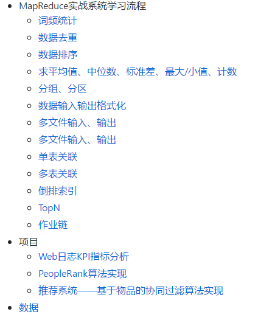
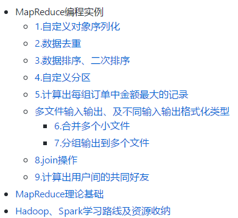

# Coding Now

## 初衷

一是平时看的一些自己认为不错的文章总是很难整理，所以打算开一个项目管理这些，也可以分享给大家；二是记录自己平时所学的一些笔记，一些经历，以供将来翻阅；三是想系统地进阶学习一番，记录这个项目也是想激励自己；四是分享一些平时看的电子书啊、视频等等

## GitHub及Git使用

- [如何选择开源许可证？ from 阮一峰的网络日志](http://www.ruanyifeng.com/blog/2011/05/how_to_choose_free_software_licenses.html) 

> 原文链接：https://paulmillr.com/posts/simple-description-of-popular-software-licenses/

- [Git使用教程：最详细、最傻瓜、最浅显、真正手把手教！from 龙恩0707 www.cnblogs.com/tugenhua0707](https://blog.csdn.net/lzw2016/article/details/86633909) 

## Linux系统下开发环境搭建

- [Win10下安装双系统Deepin 15.8.md](https://github.com/josonle/Coding-Now/blob/master/Linux%E7%B3%BB%E7%BB%9F%E4%B8%8B%E5%BC%80%E5%8F%91%E7%8E%AF%E5%A2%83%E6%90%AD%E5%BB%BA/Win10%E4%B8%8B%E5%AE%89%E8%A3%85%E5%8F%8C%E7%B3%BB%E7%BB%9FDeepin%2015.8.md)
- [Deepin15.8下搭建Python开发环境.md](https://github.com/josonle/Coding-Now/blob/master/Linux%E7%B3%BB%E7%BB%9F%E4%B8%8B%E5%BC%80%E5%8F%91%E7%8E%AF%E5%A2%83%E6%90%AD%E5%BB%BA/Deepin15.8%E4%B8%8B%E6%90%AD%E5%BB%BAPython%E5%BC%80%E5%8F%91%E7%8E%AF%E5%A2%83.md)
  - 含有如何在Deepin Linux下安装pip、pip3
  - 安装pycharm、jupyter notebook
  - 虚拟环境使用等
- [Deepin下搭建Hadoop、Spark等大数据开发环境.md](https://github.com/josonle/Coding-Now/blob/master/Linux%E7%B3%BB%E7%BB%9F%E4%B8%8B%E5%BC%80%E5%8F%91%E7%8E%AF%E5%A2%83%E6%90%AD%E5%BB%BA/Deepin%E4%B8%8B%E6%90%AD%E5%BB%BAHadoop%E3%80%81Spark%E7%AD%89%E5%A4%A7%E6%95%B0%E6%8D%AE%E5%BC%80%E5%8F%91%E7%8E%AF%E5%A2%83.md)
  - 含有如何在Deepin Linux下安装java、scala、VMware虚拟机、eclipse
  - 如何搭建centos集群
  - 搭建hadoop、hive、hbase
  - 待续
- [Deepin下如何科-学(地)上-网.md](https://github.com/josonle/Coding-Now/blob/master/Linux%E7%B3%BB%E7%BB%9F%E4%B8%8B%E5%BC%80%E5%8F%91%E7%8E%AF%E5%A2%83%E6%90%AD%E5%BB%BA/Deepin%E4%B8%8B%E5%A6%82%E4%BD%95%E7%A7%91-%E5%AD%A6(%E5%9C%B0)%E4%B8%8A-%E7%BD%91.md)
- [Deepin常用快捷键及其他便利操作.md](https://github.com/josonle/Coding-Now/blob/master/Linux%E7%B3%BB%E7%BB%9F%E4%B8%8B%E5%BC%80%E5%8F%91%E7%8E%AF%E5%A2%83%E6%90%AD%E5%BB%BA/Deepin%E5%B8%B8%E7%94%A8%E5%BF%AB%E6%8D%B7%E9%94%AE%E5%8F%8A%E5%BF%AB%E6%8D%B7%E5%85%B6%E4%BB%96%E6%93%8D%E4%BD%9C.md)
- [Deepin使用体验、资源及问题归纳贴.md](https://github.com/josonle/Coding-Now/blob/master/Linux%E7%B3%BB%E7%BB%9F%E4%B8%8B%E5%BC%80%E5%8F%91%E7%8E%AF%E5%A2%83%E6%90%AD%E5%BB%BA/Deepin%E4%BD%BF%E7%94%A8%E4%BD%93%E9%AA%8C%E3%80%81%E8%B5%84%E6%BA%90%E5%8F%8A%E9%97%AE%E9%A2%98%E5%BD%92%E7%BA%B3%E8%B4%B4.md)

## Linux命令及Shell脚本学习笔记

- [Windows转Linux之常用命令学习.md](https://github.com/josonle/Coding-Now/blob/master/Linux%E5%91%BD%E4%BB%A4%E5%8F%8AShell%E8%84%9A%E6%9C%AC%E5%AD%A6%E4%B9%A0%E7%AC%94%E8%AE%B0/Windows%E8%BD%ACLinux%E4%B9%8B%E5%B8%B8%E7%94%A8%E5%91%BD%E4%BB%A4%E5%AD%A6%E4%B9%A0.md)

- [包管理工具apt使用.md](https://github.com/josonle/Coding-Now/blob/master/Linux%E5%91%BD%E4%BB%A4%E5%8F%8AShell%E8%84%9A%E6%9C%AC%E5%AD%A6%E4%B9%A0%E7%AC%94%E8%AE%B0/%E5%8C%85%E7%AE%A1%E7%90%86%E5%B7%A5%E5%85%B7apt%E4%BD%BF%E7%94%A8.md)

## 爬虫篇（Python）

爬虫这一块我也没多少可以说的，距离我上次写爬虫程序都有一年多了。谈谈感想吧，别听什么培训机构诳你什么爬虫工程师有前途啥的，当然学好学精爬虫也能拿到高薪，但这一行也有不少人了，精通的自然不用说。而且现在有很多像八爪鱼、火车头这些可以定制的爬虫软件，还有一些自学习的爬虫框架。所以我觉得爬虫这一块只要稍微学下，了解下即可

我建议如果是python的话，了解urllib（http请求），requests（http请求），lxml（文本解析），Scrapy（爬虫框架），多线程爬虫就可以了

原来也在csdn上写过一些scrapy的文章，当然学习一门语言官方文档才是最重要的（scrapy也有中文的）

- [Scrapy入门学习初步总览](https://blog.csdn.net/lzw2016/article/details/79198041)
- [解决Windows下pip install scrapy 出错 及 pycharm使用安利](https://blog.csdn.net/lzw2016/article/details/79174271)
- [scrapy入门学习初步探索之数据保存](https://blog.csdn.net/lzw2016/article/details/79302374)
- [爬取通过ajax动态加载的页面（实时监控华尔街见闻资讯与快讯）](https://blog.csdn.net/lzw2016/article/details/79327340)
- [Python爬虫：人人影视追剧脚本](https://blog.csdn.net/lzw2016/article/details/80384481)
- [爬取大西洋月刊每日新闻](https://blog.csdn.net/lzw2016/article/details/82950192)
- [（补充）爬取大西洋月刊并 使用彩云小译翻译 API 脚本](https://blog.csdn.net/lzw2016/article/details/82952235)

## 数据分析篇

- [Data Science - Quora](https://www.quora.com/topic/Data-Science/faq)

- [How to learn data analysis with Python - Quora](https://www.quora.com/How-do-I-learn-data-analysis-with-Python)

## 机器学习及深度学习篇

### 机器学习网站及教程

- [机器学习入门教程与实例-SofaSofa](http://sofasofa.io/tutorials.php)
- [scikit-learn: Python 中的机器学习 — scikit-learn 0.19.0 中文文档 - ApacheCN](http://sklearn.apachecn.org/cn/0.19.0/index.html)
- [问题构建 (Framing)：机器学习主要术语  |  机器学习速成课程  |  Google Developers](https://developers.google.cn/machine-learning/crash-course/framing/ml-terminology)
- [机器学习实战-ApacheCN-github](https://ailearning.apachecn.org/#/)
- [MachineLearning100/100-Days-Of-ML-Code: 100-Days-Of-ML-Code中文版](https://github.com/MachineLearning100/100-Days-Of-ML-Code)
- [机器学习、图像声音处理文章列表 - TinyMind](https://www.tinymind.cn/articles)
- [机器学习-Label Encoding与One Hot的区别-20180513](https://zhuanlan.zhihu.com/p/36804348)
- [机器学习与深度学习 - 连载 - 简书](https://www.jianshu.com/nb/16049126)
- [【干货】史上最全的Tensorflow学习资源汇总](https://zhuanlan.zhihu.com/p/35515805)
- [GitHub - apachecn/hands_on_Ml_with_Sklearn_and_TF: OReilly Hands On Machine Learning with Scikit Learn and TensorFlow (Sklearn与TensorFlow机器学习实用指南)](https://github.com/apachecn/hands_on_Ml_with_Sklearn_and_TF)
- [AI研习社 - 研习AI产学研新知，助力AI学术开发者成长。](https://ai.yanxishe.com/)

### GitHub上相关项目推荐

- [homemade-machine-learning](https://github.com/trekhleb/homemade-machine-learning) (在家学习机器学习)，现在6.9K星，确实不错，不过全英文的

### 数据分析竞赛

- 哪里可以参加比赛？【我常去的就这几个】
  - 进行中[百度点石](https://dianshi.baidu.com/competition/26/data)
  - [竞赛信息-DC竞赛](http://www.dcjingsai.com/)
  - [大数据挑战赛 - Kesci.com](https://www.kesci.com/)
  - [Kaggle: Your Home for Data Science](https://www.kaggle.com/getting-started)
  - 还有阿里天池大赛，但参加了几次，我还是段位不够啊，太难了

- 赛事代码学习资源
  - [TianChi_IJCAI17_KouBei: 2017天池口碑商家客流量预测](https://github.com/liangyaorong/TianChi_IJCAI17_KouBei)
  - [天池资金流入流出预测-挑战Baseline | 赛题与数据](https://tianchi.aliyun.com/competition/information.htm?spm=5176.100067.5678.2.48573f93Mza8fB&raceId=231573)
  - [Daya-Jin/rental-prediction: 2018年全国大学生计算机应用能力大赛之住房月租金预测大数据赛第一名代码](https://github.com/Daya-Jin/rental-prediction)
- 竞赛相关系列文章
  - [机器学习中特征工程，如何进行数据分析嘞？ - 知乎](https://zhuanlan.zhihu.com/p/33436879)
  - [几个相关系数：Pearson、Spearman、pointbiserialr、kendalltau - 程序园](http://www.voidcn.com/article/p-apdxxgqj-zw.html)
  - [Kaggle: 房价预测 - 代码天地](https://www.codetd.com/article/1548187)
  - [如何在 Kaggle 首战中进入前 10% | Wille](http://dnc1994.com/2016/04/rank-10-percent-in-first-kaggle-competition/)
  - [python进行机器学习（一）之数据预处理 - 光彩照人 - 博客园](https://www.cnblogs.com/gczr/p/6761613.html)
  - [随机森林sklearn FandomForest，及其调参 - 码灵薯的博客 - CSDN博客](https://blog.csdn.net/geduo_feng/article/details/79558572)
  - [【集成学习】scikit-learn随机森林调参小结 - sun_shengyun的专栏 - CSDN博客](https://blog.csdn.net/sun_shengyun/article/details/54618121)
  - [加州房价预测数据预处理 - 多一点 - 博客园](https://www.cnblogs.com/onemorepoint/p/9602734.html)
  - [加州房价预测项目精细解释 - CSDN博客](https://blog.csdn.net/jiaoyangwm/article/details/81671084)
  - [机器学习：数据预处理之独热编码（One-Hot）_慕课手记](http://www.imooc.com/article/35900)

## 大数据篇

### 大数据开发环境安装配置

以下出自我在csdn上的一些文章，https://blog.csdn.net/lzw2016/

- [大数据之Hadoop学习（环境配置）——Hadoop伪分布式集群搭建](https://blog.csdn.net/lzw2016/article/details/84197986)
- [【向Linux迁移记录】Deepin Linux下快速Hadoop完全分布式集群搭建](https://mp.csdn.net/postedit/86618345)
- [【向Linux迁移记录】基于Hadoop集群的Hive安装与配置详解](https://blog.csdn.net/lzw2016/article/details/86631115) 
- [Spark本地安装及Linux下伪分布式搭建](https://blog.csdn.net/lzw2016/article/details/84673410)

### Hadoop系列

- [Apache Hadoop](http://hadoop.apache.org/): 是Apache开源组织的一个分布式计算开源框架，提供了一个分布式文件系统子项目(HDFS)和支持MapReduce分布式计算的软件架构

  - [认识HDFS](https://github.com/josonle/Coding-Now/blob/master/%E5%A4%A7%E6%95%B0%E6%8D%AE/hadoop%E7%B3%BB%E5%88%97/%E8%AE%A4%E8%AF%86HDFS.md)

  - [使用Java API对HDFS进行系列操作](https://github.com/josonle/Coding-Now/blob/master/%E5%A4%A7%E6%95%B0%E6%8D%AE/hadoop%E7%B3%BB%E5%88%97/%E4%BD%BF%E7%94%A8Java%20API%E5%AF%B9HDFS%E8%BF%9B%E8%A1%8C%E7%B3%BB%E5%88%97%E6%93%8D%E4%BD%9C.md)

  - 掌握MapReduce编程

    - [01MapReduce编程初步及源码分析.md](https://github.com/josonle/Coding-Now/blob/master/%E5%A4%A7%E6%95%B0%E6%8D%AE/hadoop%E7%B3%BB%E5%88%97/01MapReduce%E7%BC%96%E7%A8%8B%E5%88%9D%E6%AD%A5%E5%8F%8A%E6%BA%90%E7%A0%81%E5%88%86%E6%9E%90.md)
    - [02【MapReduce详解及源码解析（一）】——分片输入、Mapper及Map端Shuffle过程](https://github.com/josonle/Coding-Now/blob/master/%E5%A4%A7%E6%95%B0%E6%8D%AE/hadoop%E7%B3%BB%E5%88%97/02%E3%80%90MapReduce%E8%AF%A6%E8%A7%A3%E5%8F%8A%E6%BA%90%E7%A0%81%E8%A7%A3%E6%9E%90%EF%BC%88%E4%B8%80%EF%BC%89%E3%80%91%E2%80%94%E2%80%94%E5%88%86%E7%89%87%E8%BE%93%E5%85%A5%E3%80%81Mapper%E5%8F%8AMap%E7%AB%AFShuffle%E8%BF%87%E7%A8%8B.md)
    - [03 MapReduce-Demo](https://github.com/josonle/MapReduce-Demo)——这是我另外一个项目，从多个设计模式实战 MapReduce 编程实例

    > 仅供参考：
    > 
    >
    > 

    - [原生态在hadoop上运行java程序](http://blog.51cto.com/computerdragon/1260871) ——引自[@zhao_xiao_long](http://blog.51cto.com/computerdragon) 

  - 推荐几个博客分类[博主LanceToBigData：Hadoop](https://www.cnblogs.com/zhangyinhua/category/1093575.html) ，[小小默’s Blog](https://blog.xiaoxiaomo.com/categories/%E6%8A%80%E6%9C%AF/)，分类很乱但是内容确实不错

- [Apache Hive](http://hive.apache.org/): 是基于Hadoop的一个数据仓库工具，可以将结构化的数据文件映射为一张数据库表，通过类SQL语句快速实现简单的MapReduce统计，不必开发专门的MapReduce应用，十分适合数据仓库的统计分析

- [Apache Pig](http://pig.apache.org/): 是一个基于Hadoop的大规模数据分析工具，它提供的SQL-LIKE语言叫Pig Latin，该语言的编译器会把类SQL的数据分析请求转换为一系列经过优化处理的MapReduce运算 【**不准备学，计划Hive代替Pig**】

- [Apache HBase](http://hbase.apache.org/): 是一个高可靠性、高性能、面向列、可伸缩的分布式存储系统，利用HBase技术可在廉价PC Server上搭建起大规模结构化存储集群

- [Apache Sqoop](http://sqoop.apache.org/): 是一个用来将Hadoop和关系型数据库中的数据相互转移的工具，可以将一个关系型数据库（MySQL ,Oracle ,Postgres等）中的数据导进到Hadoop的HDFS中，也可以将HDFS的数据导进到关系型数据库中

- [Apache Mahout](http://mahout.apache.org/):是基于Hadoop的机器学习和数据挖掘的一个分布式框架。【**不打算学，计划利用SparkMLLib代替**】

- [Apache Zookeeper](http://zookeeper.apache.org/): 是一个为分布式应用所设计的分布的、开源的协调服务，它主要是用来解决分布式应用中经常遇到的一些数据管理问题，简化分布式应用协调及其管理的难度，提供高性能的分布式服务

- [Apache Flume](http://flume.apache.org/): 是一个分布的、可靠的、高可用的海量日志聚合的系统，可用于日志数据收集，日志数据处理，日志数据传输

- 等等，当然不可能全学的

- 视频资源见下方 

- 面试篇

  - [Hadoop和Hive一些面试题](https://github.com/josonle/Coding-Now/blob/master/%E5%A4%A7%E6%95%B0%E6%8D%AE/hadoop%E7%B3%BB%E5%88%97/hadoop%E5%92%8Chive%E7%9A%84%E4%B8%80%E4%BA%9B%E9%9D%A2%E8%AF%95%E9%A2%98.zip)

### Spark系列

- [Spark1.x和2.x如何读取和写入csv文件](https://blog.csdn.net/lzw2016/article/details/85562172)
- 视频资源见下方

### 实战项目

#### 推荐系统

- [【推荐系统入门】推荐系统理论初探 及 豆瓣推荐应用举例分析](https://blog.csdn.net/lzw2016/article/details/85140764)
- [itemcf](https://github.com/josonle/MapReduce-Demo/tree/master/src/main/java/ssdut/training/mapreduce/itemcf)——ItemCF算法的MapReduce实现代码

- 待续

## 算法篇

- 网课
  - [《算法第四版》-Coursera网课](https://www.coursera.org/learn/algorithms-part1/supplement/icGHT/welcome-to-algorithms-part-i)
  > 算法课程Coursera网上主推的是Robert Sedgewick的算法课【红宝书的作者，普林斯顿计算机系创始人】

  - [《算法第四版》在线资源](https://algs4.cs.princeton.edu/)
  - 还有一门是Coursera上的斯坦福大学的算法课，我感觉偏理论，难度不如上面的那门

- 推荐一门面试课，我感觉还是可以的，极客时间的【数据结构与算法之美】

- 在线刷题：[LeetCode练手](https://leetcode.com/problemset/all/)

  > LeetCode现在有中文版的了，[力扣中国](https://leetcode-cn.com/problemset/all/)

- 每周基于Java、C++的LeetCode刷题记录

  - [文档记录：LeetCode刷题心得.md](https://github.com/josonle/Coding-Now/blob/master/LeetCode/LeetCode刷题心得/LeetCode刷题心得.md)
  - 代码驱动：【待补充】

- GitHub项目推荐

  - [**LeetCodeAnimation** 用动画的形式呈现解LeetCode题目的思路](https://github.com/MisterBooo/LeetCodeAnimation) 

## eBook和视频资源

只推荐我看过的，且个人觉得不错的

### Python

视频资源 点这里--->[eBook/Python](https://github.com/josonle/Coding-Now/tree/master/eBook/Python)

- Python3数据分析与挖掘（某课网）
- python分布式爬虫打造搜索引擎【完整版 某课网】
- Python升级3.6 强力Django+Xadmin打造在线教育平台

电子书推荐，下面给了几个可以下载电子书的网站，都能找得到的

- 入门
  - 《Python基本教程》，貌似出第三版了
  - 《Python核心编程》
  - 《Python CookBook》
- 爬虫
  - 《Python网络数据采集》
  - 也有人推荐崔庆才的书，我只看过他的博客觉得挺不错的，书想比也可以吧
  - 我更推荐看博客，爬虫这一块更新太快了，书跟不上步伐
- 数据分析
  - 《用Python进行数据分析》足以
- 机器学习和深度学习
  - 《机器学习实战》
  - 我看的更多的是官方文档和博客，反正不推荐看国人写的书（好多都是骗钱的，我原来看过一本封面画了个鹦鹉的，叫什么一步一步什么走向机器学习之类的，就是把sklearn文档翻译了一遍加了几个案例，烂）

### Java系列

### Hadoop系列

- Hadoop大数据视频教程：真实电商数据仓库全流程开发详解(共46讲)视频教程下载：https://pan.baidu.com/s/1bpMzOyr 提取密码：m3yt 
- 基于Hadoop，Spark大数据技术的推荐系统算法实战教程：https://pan.baidu.com/s/1dFnP9K1	提取密码：djyk
- Hadoop、Hive、Hbase、Mahout源码解析及项目实战：https://pan.baidu.com/s/1nZuakR3DUJYJBiH0NaA1ZA 提取码: 2uyg 

### Spark系列

视频资源 点这里--->[eBook/Spark系列](https://github.com/josonle/Coding-Now/tree/master/eBook/Spark系列) 

- 学习 Scala 进击大数据 Spark 生态圈：https://pan.baidu.com/s/1Ld35QE4xfsOQ9o6qFwxL0A 密码：detm

- Spark 2.0从入门到精通245讲 【**墙推**】

- 01-基于Spark2.x新闻网大数据实时分析可视化系统项目
- 02-Spark离线和实时电影推荐系统直播回放(视频+文档+代码）
- 03-Spark项目实战：爱奇艺用户行为实时分析系统
- 04-Spark企业级实战项目：道路交通实时流量监控预测系统
- 05-Spark企业级实战项目：知名手机厂商用户行为实时分析系统
- 06-Spark大型项目实战：电商用户行为分析大数据平台
- 2018年最新Spark机器学习课程：智能客户系统项目实战视频教程：https://pan.baidu.com/s/12SrMtvLBlVJGOlOt5NQFjw	提取密码：uu9v ——【这个是Spark on Mesos框架的】
- Spark 2.0大型项目实战：移动电商app交互式数据分析平台：https://pan.baidu.com/s/1o8EAk2Y	提取密码：gcsq
- Spark MLlib 机器学习算法与源码解析：https://pan.baidu.com/s/1pLptvMN	提取密码：ncek
- Spark面试宝典 链接: https://pan.baidu.com/s/143GneWVcH4tmrK1gdwuc5w 提取码: 95b2

> 以上来源于大数据学习资源群的分享

### 算法系列

- [牛客网算法](https://github.com/josonle/Coding-Now/tree/master/eBook/%E7%AE%97%E6%B3%95%E5%8F%8A%E5%85%B6%E4%BD%99%E5%9F%BA%E7%A1%80%E4%B9%A6%E7%B1%8D)

### 数据库

### 计算机网络

### 基础书籍

## 常用网站收纳

- [谷歌 机器学习速成课程](https://developers.google.cn/machine-learning/crash-course/)

- [云+社区](https://cloud.tencent.com/developer/search/article-Spark)

- [Stack Overflow搜索栏](https://stackoverflow.com/tags)，程序猿都该去的网站（当然还有GayHub）

- [Coursera](https://www.coursera.org)，没事可以听听网课

- [All IT eBooks - Free IT eBooks Download](http://www.allitebooks.com/)——电子书下载【English】

- [门户 Linux公社论坛 ](http://www.linuxidc.net/portal.php)

- #### Java各大开发者网站
  - [Java知音-一个专注于技术分享的网站](https://www.javazhiyin.com/)
  - [并发编程网](http://ifeve.com/)——有很多不错的Java文章及外文翻译文章
  - [Learn Java information, news, and how-to advice | JavaWorld](https://www.javaworld.com/category/learn-java/)
  - [DZone Open Source](https://dzone.com/open-source-news-tutorials-tools) 
  - [Java Platform SE 8帮助文档](http://blog.fondme.cn:8000/apidoc//jdk-1.8-baidu/)
- #### Python各大开发者网站

  - [PythonTab：Python中文开发者社区门户](http://www.pythontab.com/)
  - [Planet Python](http://planetpython.org/)
  - [话题列表 | PythonCaff - 高品质的 Python 开发者社区](https://pythoncaff.com/topics)
  - [Practical Business Python -](http://pbpython.com/)
  - [Ricequant & 课程 - RiceQuant米筐量化交易平台](https://www.ricequant.com/courses)
  - [量化课堂 - JoinQuant](https://www.joinquant.com/study#math)
  - [集智俱乐部](https://mp.weixin.qq.com/s?__biz=MzIzMjQyNzQ5MA==&mid=2247483667&idx=1&sn=658da85489324e125dbd2941cca50bd6&scene=0#wechat_redirect)

## 工具

#### 搜索

- [Bird.so 小众搜索引擎](http://caup.cn/)
- [Google 镜像站](http://scholar.hedasudi.com/)
- [GF导航_想你所想](http://www.gatherfind.com/)——网址收纳导航

#### 翻译

- 程序员翻译工具——[彩云小译](http://caiyunapp.com/fanyi/)
  - [插件获取](http://caiyunapp.com/#xiaoyi-web)
- [中日在线翻译](https://www.excite.co.jp/world/jiantizi/)

#### 文档编辑

- [Online LaTeX Equation Editor ](http://latex.codecogs.com/eqneditor/editor.php)——在线 LaTeX 编辑器
- PDF在线转换工具
  - [编辑PDF —— 可在你的浏览器直接使用的免费PDF编辑器](https://smallpdf.com/cn/edit-pdf)
  - [iLovePDF | Online PDF tools for PDF lovers](https://www.ilovepdf.com/)
  - [Free Online OCR - convert scanned PDF and images to Word, JPEG to Word](https://www.onlineocr.net/)

#### 制图、图床

- [ProcessOn ](https://processon.com/)
- [百度脑图](http://naotu.baidu.com/)
- 路过图床

#### 插件

- [Chrome Extension Downloader](https://chrome-extension-downloader.com/)——可以通过此网站来下载因为某些原因无法在线安装 Chrome 插件

