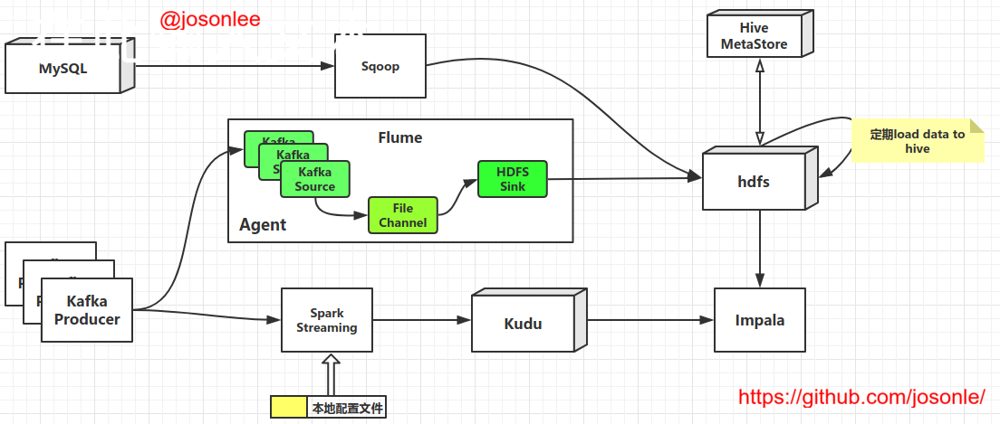
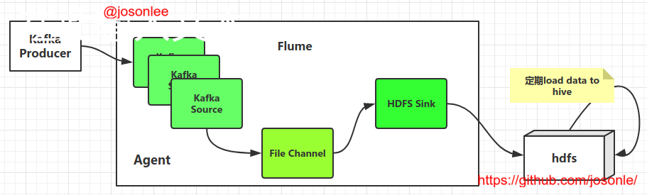
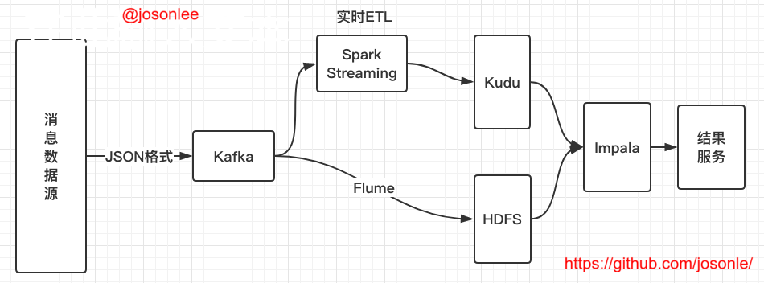

## 目录

- [Coding Now](#Coding-Now)
    - [初衷](#初衷)
    - [每周推荐](#每周推荐)
    - [GitHub及Git使用](#GitHub及Git使用)
    - [Linux系统下开发环境搭建](#Linux系统下开发环境搭建)
    - [Linux命令及Shell脚本学习笔记](#Linux命令及Shell脚本学习笔记)
    - [爬虫篇（Python）](#爬虫篇（Python）)
    - [数据分析篇](#数据分析篇)
    - [机器学习及深度学习篇](#机器学习及深度学习篇)
        - [机器学习网站及教程](#机器学习网站及教程)
        - [GitHub上相关项目推荐](#GitHub上相关项目推荐)
        - [数据分析竞赛](#数据分析竞赛)
    - [大数据篇](#大数据篇)
        - [大数据开发环境安装配置](#大数据开发环境安装配置)
        - [Hadoop系列](#Hadoop系列)
            - 涉及MapReduce、Hdfs、Hive、Kafka、ZooKeeper等hadoop生态圈组件
        - [Spark系列](#Spark系列)
        - [Flink系列](#Flink系列)
        - [实战项目](#实战项目)
            - [推荐系统](#推荐系统)
            - [实时数据仓库搭建](#实时数据仓库搭建)
        - [大数据相关面试](#大数据相关面试)
    - [算法篇](#算法篇)
    - [Java篇](#Java篇)
      - [Java Web](#Java-Web)
    - [数据库和分布式篇](#数据库和分布式篇)
    - [GitHub上一些技术书籍、翻译书籍、面试题库推荐](#GitHub上一些技术书籍、翻译书籍、面试题库推荐)
    - [eBook和视频资源](#eBook和视频资源)
        - [Python](#Python)
        - [Java系列](#Java系列)
        - [Hadoop系列资源](#Hadoop系列资源)
        - [Spark系列资源](#Spark系列资源)
        - [系列资源](#系列资源)
        - [业内大数据技术ebook分享](#业内大数据技术ebook分享 )
        - [算法系列](#算法系列)
        - [数据库](#数据库)
        - [计算机网络](#计算机网络)
        - [基础书籍](#基础书籍)
    - [常用网站收纳](#常用网站收纳)
    - [工具](#工具)
        - [搜索](#搜索)
        - [翻译](#翻译)
        - [文档编辑](#文档编辑)
        - [制图、图床](#制图、图床)
        - [Chrome插件](#Chrome插件)
# Coding Now

## 初衷

一是平时看的一些自己认为不错的文章总是很难整理，所以打算开一个项目管理这些，也可以分享给大家；二是记录自己平时所学的一些笔记，一些经历，以供将来翻阅；三是想系统地进阶学习一番，记录这个项目也是想激励自己；四是分享一些平时看的电子书啊、视频等等

## 每周推荐
- [如何阅读源码？](https://github.com/josonle/Interview-Summary/tree/master/EveryDay-Reading/2019-05-28#%E5%A6%82%E4%BD%95%E9%98%85%E8%AF%BB%E6%BA%90%E7%A0%81)
> 没办法，要深入学习必须要看源码。身为小菜鸟的我，每逢看源码时就找不到个准头，看着看着就迷糊了。恰巧今天逛知识星球时，看一个球友的回答觉得非常好，特此转录一下

- 如何写好注释
  - [请停止代码注释](https://juejin.im/post/5cf60bc8f265da1baa1e609e)
  - [如何写Java文档注释(Java Doc Comments)](https://www.cnblogs.com/boring09/p/4274893.html)
> 注释也很重要啊，菜的抠脚的我，每次都是写完代码后再补充注释，哈哈哈。。。


## GitHub及Git使用

- [如何选择开源许可证？ from 阮一峰的网络日志](http://www.ruanyifeng.com/blog/2011/05/how_to_choose_free_software_licenses.html) 


> 原文链接：https://paulmillr.com/posts/simple-description-of-popular-software-licenses/


- [Git使用教程：最详细、最傻瓜、最浅显、真正手把手教！from 龙恩0707 www.cnblogs.com/tugenhua0707](https://blog.csdn.net/lzw2016/article/details/86633909) 
- GitHub如何快速给README.md添加目录

  - [ghtoc Github地址（pyhon）](https://link.jianshu.com/?t=https%3A%2F%2Fgithub.com%2Fsk1418%2Fghtoc) 见toc.py，（python2.7，使用方法·：`python toc.py MDFile`，会生成一个.bak备份文件）【推荐这个可以用，也不用装其他工具】
  - [gh-md-toc Github地址](https://link.jianshu.com/?t=https%3A%2F%2Fgithub.com%2Fekalinin%2Fgithub-markdown-toc)
- git团队协作项目操作说明.md [放在博客上的外链](https://blog.csdn.net/lzw2016/article/details/89791579)

## Linux系统下开发环境搭建

- [Win10下安装双系统Deepin 15.8.md](https://github.com/josonle/Coding-Now/blob/master/Linux%E7%B3%BB%E7%BB%9F%E4%B8%8B%E5%BC%80%E5%8F%91%E7%8E%AF%E5%A2%83%E6%90%AD%E5%BB%BA/Win10%E4%B8%8B%E5%AE%89%E8%A3%85%E5%8F%8C%E7%B3%BB%E7%BB%9FDeepin%2015.8.md)
- [Deepin15.8下搭建Python开发环境.md](https://github.com/josonle/Coding-Now/blob/master/Linux%E7%B3%BB%E7%BB%9F%E4%B8%8B%E5%BC%80%E5%8F%91%E7%8E%AF%E5%A2%83%E6%90%AD%E5%BB%BA/Deepin15.8%E4%B8%8B%E6%90%AD%E5%BB%BAPython%E5%BC%80%E5%8F%91%E7%8E%AF%E5%A2%83.md)
  - 含有如何在Deepin Linux下安装pip、pip3
  - 安装pycharm、jupyter notebook
  - 虚拟环境使用等
- [Deepin下搭建Hadoop、Spark等大数据开发环境.md](https://github.com/josonle/Coding-Now/blob/master/Linux%E7%B3%BB%E7%BB%9F%E4%B8%8B%E5%BC%80%E5%8F%91%E7%8E%AF%E5%A2%83%E6%90%AD%E5%BB%BA/Deepin%E4%B8%8B%E6%90%AD%E5%BB%BAHadoop%E3%80%81Spark%E7%AD%89%E5%A4%A7%E6%95%B0%E6%8D%AE%E5%BC%80%E5%8F%91%E7%8E%AF%E5%A2%83.md)
  - 含有如何在Deepin Linux下安装java、scala、VMware虚拟机、eclipse
  - 如何搭建centos集群
  - 搭建hadoop、hive、
  - 搭建Spark
  - 待续

- [Deepin下如何科-学(地)上-网.md](https://github.com/josonle/Coding-Now/blob/master/Linux%E7%B3%BB%E7%BB%9F%E4%B8%8B%E5%BC%80%E5%8F%91%E7%8E%AF%E5%A2%83%E6%90%AD%E5%BB%BA/Deepin%E4%B8%8B%E5%A6%82%E4%BD%95%E7%A7%91-%E5%AD%A6(%E5%9C%B0)%E4%B8%8A-%E7%BD%91.md)
- [Deepin常用快捷键及其他便利操作.md](https://github.com/josonle/Coding-Now/blob/master/Linux%E7%B3%BB%E7%BB%9F%E4%B8%8B%E5%BC%80%E5%8F%91%E7%8E%AF%E5%A2%83%E6%90%AD%E5%BB%BA/Deepin%E5%B8%B8%E7%94%A8%E5%BF%AB%E6%8D%B7%E9%94%AE%E5%8F%8A%E5%BF%AB%E6%8D%B7%E5%85%B6%E4%BB%96%E6%93%8D%E4%BD%9C.md)
- [Deepin使用体验、资源及问题归纳贴.md](https://github.com/josonle/Coding-Now/blob/master/Linux%E7%B3%BB%E7%BB%9F%E4%B8%8B%E5%BC%80%E5%8F%91%E7%8E%AF%E5%A2%83%E6%90%AD%E5%BB%BA/Deepin%E4%BD%BF%E7%94%A8%E4%BD%93%E9%AA%8C%E3%80%81%E8%B5%84%E6%BA%90%E5%8F%8A%E9%97%AE%E9%A2%98%E5%BD%92%E7%BA%B3%E8%B4%B4.md)
- [Deepin自定义右键新建文件模版.md](https://github.com/josonle/Coding-Now/blob/master/Linux%E7%B3%BB%E7%BB%9F%E4%B8%8B%E5%BC%80%E5%8F%91%E7%8E%AF%E5%A2%83%E6%90%AD%E5%BB%BA/Deepin%E8%87%AA%E5%AE%9A%E4%B9%89%E5%8F%B3%E9%94%AE%E6%96%B0%E5%BB%BA%E6%96%87%E4%BB%B6%E6%A8%A1%E7%89%88.md)
- [Deepin设置开机自启动脚本问题.md](https://github.com/josonle/Coding-Now/blob/master/Linux%E7%B3%BB%E7%BB%9F%E4%B8%8B%E5%BC%80%E5%8F%91%E7%8E%AF%E5%A2%83%E6%90%AD%E5%BB%BA/Deepin%E8%AE%BE%E7%BD%AE%E5%BC%80%E6%9C%BA%E8%87%AA%E5%90%AF%E5%8A%A8%E8%84%9A%E6%9C%AC%E9%97%AE%E9%A2%98.md)
- [AppImage打包方式、相关应用、相关Linux游戏站推荐](https://github.com/josonle/Coding-Now/blob/master/Linux%E7%B3%BB%E7%BB%9F%E4%B8%8B%E5%BC%80%E5%8F%91%E7%8E%AF%E5%A2%83%E6%90%AD%E5%BB%BA/AppImage%E6%89%93%E5%8C%85%E6%96%B9%E5%BC%8F%E5%8F%8A%E7%9B%B8%E5%85%B3Linux%E6%B8%B8%E6%88%8F%E7%AB%99%E6%8E%A8%E8%8D%90.md)
- [【Deepin】最新XMind for Linux 破解版安装](https://blog.csdn.net/lzw2016/article/details/88622874)


## Linux命令及Shell脚本学习笔记

- [Windows转Linux之常用Linux命令学习（一）.md](https://github.com/josonle/Coding-Now/blob/master/Linux%E5%91%BD%E4%BB%A4%E5%8F%8AShell%E8%84%9A%E6%9C%AC%E5%AD%A6%E4%B9%A0%E7%AC%94%E8%AE%B0/Windows%E8%BD%ACLinux%E4%B9%8B%E5%B8%B8%E7%94%A8%E5%91%BD%E4%BB%A4%E5%AD%A6%E4%B9%A0%EF%BC%88%E4%B8%80%EF%BC%89.md)
- [Windows转Linux之常用Linux命令学习（二）.md](https://github.com/josonle/Coding-Now/blob/master/Linux%E5%91%BD%E4%BB%A4%E5%8F%8AShell%E8%84%9A%E6%9C%AC%E5%AD%A6%E4%B9%A0%E7%AC%94%E8%AE%B0/Windows%E8%BD%ACLinux%E4%B9%8B%E5%B8%B8%E7%94%A8%E5%91%BD%E4%BB%A4%E5%AD%A6%E4%B9%A0%EF%BC%88%E4%BA%8C%EF%BC%89.md)
- [包管理工具apt使用.md](https://github.com/josonle/Coding-Now/blob/master/Linux%E5%91%BD%E4%BB%A4%E5%8F%8AShell%E8%84%9A%E6%9C%AC%E5%AD%A6%E4%B9%A0%E7%AC%94%E8%AE%B0/%E5%8C%85%E7%AE%A1%E7%90%86%E5%B7%A5%E5%85%B7apt%E4%BD%BF%E7%94%A8.md)
- [包管理工具yum使用.md](https://github.com/josonle/Coding-Now/blob/master/Linux%E5%91%BD%E4%BB%A4%E5%8F%8AShell%E8%84%9A%E6%9C%AC%E5%AD%A6%E4%B9%A0%E7%AC%94%E8%AE%B0/%E5%8C%85%E7%AE%A1%E7%90%86%E5%B7%A5%E5%85%B7yum%E4%BD%BF%E7%94%A8.md)
- [包管理工具rpm使用.md](https://github.com/josonle/Coding-Now/blob/master/Linux%E5%91%BD%E4%BB%A4%E5%8F%8AShell%E8%84%9A%E6%9C%AC%E5%AD%A6%E4%B9%A0%E7%AC%94%E8%AE%B0/rpm%E5%91%BD%E4%BB%A4%E4%BD%BF%E7%94%A8.md)
- [AppImage打包方式、相关应用及如何安装运行]()
- [终端常用快捷键.md](https://github.com/josonle/Coding-Now/blob/master/Linux%E5%91%BD%E4%BB%A4%E5%8F%8AShell%E8%84%9A%E6%9C%AC%E5%AD%A6%E4%B9%A0%E7%AC%94%E8%AE%B0/%E7%BB%88%E7%AB%AF%E5%B8%B8%E7%94%A8%E5%BF%AB%E6%8D%B7%E9%94%AE.md)
- 附一份linux学习课程的课件：[PDF](https://github.com/josonle/Coding-Now/tree/master/Linux命令及Shell脚本学习笔记)

- [超全整理 - Linux性能分析工具汇总合集](https://mp.weixin.qq.com/s?__biz=MzU0MzQ5MDA0Mw==&mid=2247484990&idx=1&sn=e9682a51d8d9f90cd9a58423fc241b03&chksm=fb0becaacc7c65bcfe3383af47ea0ff67e3f1d937b529e64315fd6bf412f41840cd2126ffcd3&mpshare=1&scene=1&srcid=0309IVq6twbjH7g89X9S8hMS&pass_ticket=igsIEGXM1UhrBkCT3yw8Er2%2B%2B8Xo7vGvVpXlMxnW0rQ%3D#rd)
- vi/vim使用 【了解些简单使用即可，现在不都是用编辑器的多嘛】
    - [Vim初学者入门指南](https://linux.cn/article-8143-1.html)
    - [Vim 快捷键速查表](https://linux.cn/article-8144-1.html)
    - [5 个针对有经验用户的 Vim 技巧](https://linux.cn/article-8148-1.html)
    - [3 个针对高级用户的 Vim 编辑器有用技巧](https://linux.cn/article-8149-1.html)

- [ctolib的Linux开发社区](https://www.ctolib.com/linux.html)
  - 上面有很多小玩意挺有意思的

- 分享两个学习Linux命令的
  - [Linux-command](https://wangchujiang.com/linux-command/)，linux命令搜索引擎
  - [cheat.sh](https://cheat.sh/)，不仅仅是linux命令，还包括一些语言像java、scala脚本的使用

- [打造高效的工作环境 – SHELL 篇](https://coolshell.cn/articles/19219.html)

## 爬虫篇（Python）

爬虫这一块我也没多少可以说的，距离我上次写爬虫程序都有一年多了。谈谈感想吧，别听什么培训机构诳你什么爬虫工程师有前途啥的，当然学好学精爬虫也能拿到高薪，但这一行也有不少人了，精通的自然不用说。而且现在有很多像八爪鱼、火车头这些可以定制的爬虫软件，还有一些自学习的爬虫框架。所以我觉得爬虫这一块只要稍微学下，了解下即可

我建议如果是python的话，了解urllib（http请求），requests（http请求），lxml（文本解析），Scrapy（爬虫框架），多线程爬虫就可以了

原来也在csdn上写过一些scrapy的文章，当然学习一门语言官方文档才是最重要的（scrapy也有中文的）

- [Scrapy入门学习初步总览](https://blog.csdn.net/lzw2016/article/details/79198041)
- [解决Windows下pip install scrapy 出错 及 pycharm使用安利](https://blog.csdn.net/lzw2016/article/details/79174271)
- [scrapy入门学习初步探索之数据保存](https://blog.csdn.net/lzw2016/article/details/79302374)
- [爬取通过ajax动态加载的页面（实时监控华尔街见闻资讯与快讯）](https://blog.csdn.net/lzw2016/article/details/79327340)
- [Python爬虫：人人影视追剧脚本](https://blog.csdn.net/lzw2016/article/details/80384481)
- [爬取大西洋月刊每日新闻](https://blog.csdn.net/lzw2016/article/details/82950192)
- [（补充）爬取大西洋月刊并 使用彩云小译翻译 API 脚本](https://blog.csdn.net/lzw2016/article/details/82952235)


## 数据分析篇

- [Data Science - Quora](https://www.quora.com/topic/Data-Science/faq)

- [How to learn data analysis with Python - Quora](https://www.quora.com/How-do-I-learn-data-analysis-with-Python)

- 之前写过的这篇文章，见：[Python数据分析学习文章归纳](https://blog.csdn.net/lzw2016/article/details/80472162)
  >
  > #### 数据分析如何入门学习[How do I learn data analysis with Python?](https://top.quora.com/How-do-I-learn-data-analysis-with-Python)
  >
  > 虽然是英文的，不过看一遍很大收获（可以用百度翻译看一下）
  > #### Numpy使用
  > - [快速入门Numpy](https://docs.scipy.org/doc/numpy/user/quickstart.html)
  > - [Stack Overflow Numpy问题汇集](https://stackoverflow.com/tags/numpy/info)
  > - 书籍推荐NumPy Cookbook -第二版 by Ivan Idris（用中文版）
  > - 8.3 更新，[自己的笔记，凑合看下吧](https://github.com/josonle/datas-processing/blob/master/code/2018007%E5%A4%8F/20180729_%E5%A4%8F_%E6%95%B0%E6%8D%AE%E5%88%86%E6%9E%90.ipynb)，有些我觉得没太重要的就没记上去（也包括Matplotlib的那一部分）
  > - 待续
  > #### Pandas使用
  > - 入门级神作，没错就是[10 Minutes to pandas](http://pandas.pydata.org/pandas-docs/stable/10min.html#minutes-to-pandas)
  > - 进阶级神作，没错就是[Stack Overflow Pandas问题汇集](https://stackoverflow.com/questions/tagged/pandas)——>强烈推荐
  > > Pandas is a Python library for Panel Data manipulation and analysis, e.g. multidimensional time series and cross-sectional data sets commonly found in statistics, experimental science results, econometrics, or finance. IMPORTANT: When asking a question with this tag, please tag your questions: [python]; [pandas]; [dataframe]/[series]; (optional) [groupby]/[merge]/etc., depending on your specific requirements.
  >
  >
  > - Pandas神书[Pandas Cookbook](https://stackoverflow.com/tags/pandas/info)
  >
  > - Pandas数据结构之Series：
  >   - [【pandas】[1] Series 入门(创建和增删改查)](https://blog.csdn.net/zutsoft/article/details/51482573)
  >   - [Pandas中兼并数组和字典功能的Series](http://blog.chinaunix.net/xmlrpc.php?r=blog/article&uid=23100982&id=3540311)
  > > Series也就是Numpy的一维数组，很多方法是通用的。以上两篇足以掌握。
  > >
  > > > 关键是DateFrame使用
  > - [pandas分块处理大文件](https://blog.csdn.net/lzw2016/article/details/80471771)
  > - [drop函数使用](https://www.cnblogs.com/zenan/p/8404964.html)————>强烈推荐
  > - [Pandas GroupBy对象](https://blog.csdn.net/claroja/article/details/71080293)——>强力推荐，系统的讲了groupby对象创建及一系列函数使用
  > - Pandas合并与重塑
  >   - [PANDAS 数据合并与重塑（concat篇）](https://blog.csdn.net/stevenkwong/article/details/52528616)
  >   - [PANDAS 数据合并与重塑（join/merge篇）](https://blog.csdn.net/stevenkwong/article/details/52540605)
  > - isin()函数用于构建布尔对象，便于删选dateframe的行，[ pandas中isin()函数及其逆函数使用](https://blog.csdn.net/lzw2016/article/details/80472649)
  > - 建议用loc和iloc选择行
  >   - loc以行索引和列索引key来选择元素
  >   - iloc以行列所在的整数索引来选择元素，不过都从0开始
  > - 待续
  > #### matplotlib使用（建议还是学下seaborn）
  > - [自己的笔记，凑合看下吧](https://github.com/josonle/datas-processing/blob/master/code/2018007%E5%A4%8F/20180729_%E5%A4%8F_%E6%95%B0%E6%8D%AE%E5%88%86%E6%9E%90.ipynb)，有些我觉得没太重要的就没记上去（也包括Matplotlib的那一部分）
  > - 推荐B站上的一个up主的视频，[莫烦·Matplotlib中文视频教程——基于python3](https://www.bilibili.com/video/av9448753/)，看完差不多就OK了
  > #### Scipy
  > 因为还不怎么用，所以以后再说吧。。。
  > - [Scipy Doc](https://docs.scipy.org/doc/)
  > #### 杂文汇集
  > - [Python读取文件以及读取大文件](http://milletpu.com/2017/07/20/python-read/)
  > - [gensim之Word2vec使用](https://radimrehurek.com/gensim/models/word2vec.html)
  >
  > #### 心得：多动手，别只看

## 机器学习及深度学习篇

### 机器学习网站及教程

- [机器学习入门教程与实例-SofaSofa](http://sofasofa.io/tutorials.php)
- [scikit-learn: Python 中的机器学习 — scikit-learn 0.19.0 中文文档 - ApacheCN](http://sklearn.apachecn.org/cn/0.19.0/index.html)
- [问题构建 (Framing)：机器学习主要术语  |  机器学习速成课程  |  Google Developers](https://developers.google.cn/machine-learning/crash-course/framing/ml-terminology)
- [机器学习实战-ApacheCN-github](https://ailearning.apachecn.org/#/)
- [MachineLearning100/100-Days-Of-ML-Code: 100-Days-Of-ML-Code中文版](https://github.com/MachineLearning100/100-Days-Of-ML-Code)
- [机器学习、图像声音处理文章列表 - TinyMind](https://www.tinymind.cn/articles)
- [机器学习-Label Encoding与One Hot的区别-20180513](https://zhuanlan.zhihu.com/p/36804348)
- [机器学习与深度学习 - 连载 - 简书](https://www.jianshu.com/nb/16049126)
- [【干货】史上最全的Tensorflow学习资源汇总](https://zhuanlan.zhihu.com/p/35515805)
- [GitHub - apachecn/hands_on_Ml_with_Sklearn_and_TF: OReilly Hands On Machine Learning with Scikit Learn and TensorFlow (Sklearn与TensorFlow机器学习实用指南)](https://github.com/apachecn/hands_on_Ml_with_Sklearn_and_TF)
- [AI研习社 - 研习AI产学研新知，助力AI学术开发者成长。](https://ai.yanxishe.com/)

### GitHub上相关项目推荐

- [homemade-machine-learning](https://github.com/trekhleb/homemade-machine-learning) (在家学习机器学习)，现在6.9K星，确实不错，不过全英文的

### 数据分析竞赛

- 哪里可以参加比赛？【我常去的就这几个】
  - 进行中[百度点石](https://dianshi.baidu.com/competition/26/data)
  - [竞赛信息-DC竞赛](http://www.dcjingsai.com/)
  - [大数据挑战赛 - Kesci.com](https://www.kesci.com/)
  - [Kaggle: Your Home for Data Science](https://www.kaggle.com/getting-started)
  - 还有阿里天池大赛，但参加了几次，自我感觉还是段位不够啊，太难了

- 赛事代码学习资源
  - [TianChi_IJCAI17_KouBei: 2017天池口碑商家客流量预测](https://github.com/liangyaorong/TianChi_IJCAI17_KouBei)
  - [天池资金流入流出预测-挑战Baseline | 赛题与数据](https://tianchi.aliyun.com/competition/information.htm?spm=5176.100067.5678.2.48573f93Mza8fB&raceId=231573)
  - [Daya-Jin/rental-prediction: 2018年全国大学生计算机应用能力大赛之住房月租金预测大数据赛第一名代码](https://github.com/Daya-Jin/rental-prediction)
- 竞赛相关系列文章
  - [机器学习中特征工程，如何进行数据分析嘞？ - 知乎](https://zhuanlan.zhihu.com/p/33436879)
  - [几个相关系数：Pearson、Spearman、pointbiserialr、kendalltau - 程序园](http://www.voidcn.com/article/p-apdxxgqj-zw.html)
  - [Kaggle: 房价预测 - 代码天地](https://www.codetd.com/article/1548187)
  - [如何在 Kaggle 首战中进入前 10% | Wille](http://dnc1994.com/2016/04/rank-10-percent-in-first-kaggle-competition/)
  - [python进行机器学习（一）之数据预处理 - 光彩照人 - 博客园](https://www.cnblogs.com/gczr/p/6761613.html)
  - [随机森林sklearn FandomForest，及其调参 - 码灵薯的博客 - CSDN博客](https://blog.csdn.net/geduo_feng/article/details/79558572)
  - [【集成学习】scikit-learn随机森林调参小结 - sun_shengyun的专栏 - CSDN博客](https://blog.csdn.net/sun_shengyun/article/details/54618121)
  - [加州房价预测数据预处理 - 多一点 - 博客园](https://www.cnblogs.com/onemorepoint/p/9602734.html)
  - [加州房价预测项目精细解释 - CSDN博客](https://blog.csdn.net/jiaoyangwm/article/details/81671084)
  - [机器学习：数据预处理之独热编码（One-Hot）_慕课手记](http://www.imooc.com/article/35900)

## 大数据篇
### 学习大数据的一点感悟
- 我的学习记录：[BigData-Learning](https://github.com/josonle/BigData-Learning)
- 我阅读《Spark: The Definitive Guide Big Data Processing Made Simple》（Spark权威指南）的笔记和心得：
  - github上 [Spark-The-Definitive-Guide-Learning](https://github.com/josonle/Spark-The-Definitive-Guide-Learning)
  - [更好的阅读体验，同步于掘金](https://juejin.im/post/5cd3dc06e51d456e2d69a83e)
- 推荐一个国外的 Big Data 入门学习网站：[Simple and Easy Learning for Big Data & Analytics](https://www.tutorialspoint.com/big_data_tutorials.htm)（要好好学English( ⊙ o ⊙ )啊！）

其实，不管是大数据还是其他知识的学习，我认为最好的方法无非是先找个视频快速过一遍，总体上了解这门技术干嘛的，是否适合自己。然后结合官网文档细致地过一遍，学习过程中最好结合前人大牛的博客，都是经验之得你说要不要看。最后就是项目了，实际就是在工作中应用，这个我也说不好，每个人都有自己的方法吧。当然，深入看源码是躲不过的，[分享一个如何阅读Flink源码的回答](https://github.com/josonle/Interview-Summary/tree/master/EveryDay-Reading/2019-05-28#%E5%A6%82%E4%BD%95%E9%98%85%E8%AF%BB%E6%BA%90%E7%A0%81)，我自以为是有很大的帮助的

### 大数据开发环境安装配置

以下出自我在csdn上的一些文章，https://blog.csdn.net/lzw2016/

- [大数据之Hadoop学习（环境配置）——Hadoop伪分布式集群搭建](https://blog.csdn.net/lzw2016/article/details/84197986)
- [【向Linux迁移记录】Deepin Linux下快速Hadoop完全分布式集群搭建](https://mp.csdn.net/postedit/86618345)
- [【向Linux迁移记录】基于Hadoop集群的Hive安装与配置详解](https://blog.csdn.net/lzw2016/article/details/86631115) 
- [Spark本地安装及Linux下伪分布式搭建](https://blog.csdn.net/lzw2016/article/details/84673410)
- [【向Linux迁移记录】Deepin Linux下Spark本地模式及基于Yarn的分布式集群环境搭建](https://blog.csdn.net/lzw2016/article/details/86718403) 

### Hadoop系列

- [Apache Hadoop](http://hadoop.apache.org/): 是Apache开源组织的一个分布式计算开源框架，提供了一个分布式文件系统子项目(HDFS)和支持MapReduce分布式计算的软件架构

  - [认识HDFS](https://github.com/josonle/Coding-Now/blob/master/%E5%A4%A7%E6%95%B0%E6%8D%AE/hadoop%E7%B3%BB%E5%88%97/%E8%AE%A4%E8%AF%86HDFS.md)

  - 转载自 [Matt's Blog](http://matt33.com/) 原作者：王蒙
    - HDFS 架构学习总结.pdf [-->放这里了](https://github.com/josonle/Coding-Now/tree/master/%E5%A4%A7%E6%95%B0%E6%8D%AE/hadoop%E7%B3%BB%E5%88%97/%E8%BD%AC%E8%BD%BD)
    - YARN 架构学习总结.pdf

  - [唯品会 HDFS 性能挑战和优化实践](https://github.com/josonle/Coding-Now/tree/master/%E5%A4%A7%E6%95%B0%E6%8D%AE/hadoop%E7%B3%BB%E5%88%97/%E8%BD%AC%E8%BD%BD)

  - [漫谈千亿级数据优化实践：数据倾斜（纯干货）](https://segmentfault.com/a/1190000009166436)

  - [MapReduce、Hive、Spark中数据倾斜问题解决归纳总结](https://blog.csdn.net/lzw2016/article/details/89284124)

  - [百 PB 级 Hadoop 集群存储空间治理](https://mp.weixin.qq.com/s?__biz=MzU2MzY1MjQwNg==&mid=2247483741&idx=1&sn=1c2c46ee447f2e38488d83002289463c&chksm=fc57b304cb203a123434ac842e0fd97d448c434f35faa41022718eee428805f9f11ddcba5417&mpshare=1&scene=1&srcid=0505MJXy1wWOu2kvTcMC84Ax&pass_ticket=vPMuI9TAnmzdbyz0qcM4OQqDvmete3IBSHcVmBeVTYs%3D#rd)

  - [使用Java API对HDFS进行系列操作](https://github.com/josonle/Coding-Now/blob/master/%E5%A4%A7%E6%95%B0%E6%8D%AE/hadoop%E7%B3%BB%E5%88%97/%E4%BD%BF%E7%94%A8Java%20API%E5%AF%B9HDFS%E8%BF%9B%E8%A1%8C%E7%B3%BB%E5%88%97%E6%93%8D%E4%BD%9C.md)

  - [Hadoop NameNode 高可用 (High Availability) 实现解析](https://www.ibm.com/developerworks/cn/opensource/os-cn-hadoop-name-node/index.html)

  - 掌握MapReduce编程

    - [01MapReduce编程初步及源码分析.md](https://github.com/josonle/Coding-Now/blob/master/%E5%A4%A7%E6%95%B0%E6%8D%AE/hadoop%E7%B3%BB%E5%88%97/01MapReduce%E7%BC%96%E7%A8%8B%E5%88%9D%E6%AD%A5%E5%8F%8A%E6%BA%90%E7%A0%81%E5%88%86%E6%9E%90.md)
    - [02【MapReduce详解及源码解析（一）】——分片输入、Mapper及Map端Shuffle过程](https://github.com/josonle/Coding-Now/blob/master/%E5%A4%A7%E6%95%B0%E6%8D%AE/hadoop%E7%B3%BB%E5%88%97/02%E3%80%90MapReduce%E8%AF%A6%E8%A7%A3%E5%8F%8A%E6%BA%90%E7%A0%81%E8%A7%A3%E6%9E%90%EF%BC%88%E4%B8%80%EF%BC%89%E3%80%91%E2%80%94%E2%80%94%E5%88%86%E7%89%87%E8%BE%93%E5%85%A5%E3%80%81Mapper%E5%8F%8AMap%E7%AB%AFShuffle%E8%BF%87%E7%A8%8B.md)
    - [03 MapReduce-Demo](https://github.com/josonle/MapReduce-Demo)——这是我另外一个项目，从多个设计模式实战 MapReduce 编程实例

    > 仅供参考：
    >
    > 
    >
    > 

    - [原生态在hadoop上运行java程序](http://blog.51cto.com/computerdragon/1260871) ——引自[@zhao_xiao_long](http://blog.51cto.com/computerdragon) 

  - 推荐几个博客分类[博主LanceToBigData：Hadoop](https://www.cnblogs.com/zhangyinhua/category/1093575.html) ，[小小默’s Blog](https://blog.xiaoxiaomo.com/categories/%E6%8A%80%E6%9C%AF/)，分类很乱但是内容确实不错

- [Apache Hive](http://hive.apache.org/): 是基于Hadoop的一个数据仓库工具，可以将结构化的数据文件映射为一张数据库表，通过类SQL语句快速实现简单的MapReduce统计，不必开发专门的MapReduce应用，十分适合数据仓库的统计分析
    - 笔记
        - [Hive篇](https://github.com/josonle/BigData-Learning/tree/master/Hive)
        - [Hive 插入动态分区表时遇到的一些坑](https://blog.csdn.net/lzw2016/article/details/97818080)
        - [Hive中Create table... as 和 Create table ... like 的区别和使用注意](https://blog.csdn.net/lzw2016/article/details/97811799)
    - 博文
        - [Hive 性能优化](https://mp.weixin.qq.com/s?__biz=MzA3MDY0NTMxOQ==&mid=2247486550&idx=1&sn=8151680a70613fb7a06d019acfb390b7&chksm=9f38ef7ea84f66688cdeb8666d2c16d4da8bae1bab385eafacb9e7b085c673507c93d8bc3eca&mpshare=1&scene=1&srcid=&pass_ticket=igsIEGXM1UhrBkCT3yw8Er2%2B%2B8Xo7vGvVpXlMxnW0rQ%3D#rd)
        - [戳破 | hive on spark 调优点](https://mp.weixin.qq.com/s?__biz=MzA3MDY0NTMxOQ==&mid=2247486657&idx=1&sn=3b480c42f9743b6a8a97f37e4263a3a7&chksm=9f38efe9a84f66ff665d47e5b3fffaf06cb7cd18e3355f8491d1340eb92fe46ea954d967beff&mpshare=1&scene=1&srcid=0409bFXgGdTpiTqR0asiTqX0&pass_ticket=vPMuI9TAnmzdbyz0qcM4OQqDvmete3IBSHcVmBeVTYs%3D#rd)
        - [实时离线融合在唯品会的进展](https://www.infoq.cn/article/progress-of-real-time-offline-fusion-in-vip)
        - [数据仓库系列篇——唯品会大数据架构](https://zhuanlan.zhihu.com/p/45123018)
        - [数据仓库系统|框架结构](https://www.jianshu.com/p/397c9f45d0f2)

- [Apache Pig](http://pig.apache.org/): 是一个基于Hadoop的大规模数据分析工具，它提供的SQL-LIKE语言叫Pig Latin，该语言的编译器会把类SQL的数据分析请求转换为一系列经过优化处理的MapReduce运算 【**不准备学，计划Hive代替Pig**】

- [Apache HBase](http://hbase.apache.org/): 是一个高可靠性、高性能、面向列、可伸缩的分布式存储系统，利用HBase技术可在廉价PC Server上搭建起大规模结构化存储集群

    - HBase入门————[《HBase不睡觉》](http://kittyandpuppy.coolplayer.net/HBase.pdf)
    - 《HBase实战》见下方[ebook](#eBook和视频资源)
    - [一条数据的HBase之旅，简明HBase入门教程](http://www.nosqlnotes.com/technotes/hbase/hbase-overview-concepts/)————推荐一个HBase入门系列博客
    - 博文
        - [基于HBase实时数仓探索实践](https://mp.weixin.qq.com/s?__biz=MzU1NTMyOTI4Mw==&mid=2247486259&idx=1&sn=1264cf5f59a8b8474ed0e876d95f37b7&chksm=fbd4b95fcca33049a39fa564a2514d45298b1747dbb876b0157365cb3303136701eb0b814fff&mpshare=1&scene=1&srcid=1014LExoNkCOEVNHyl08oH52&pass_ticket=igsIEGXM1UhrBkCT3yw8Er2%2B%2B8Xo7vGvVpXlMxnW0rQ%3D#rd)
        - [HBase 读流程解析与优化的最佳实践](https://mp.weixin.qq.com/s?__biz=MzI4OTY3MTUyNg==&mid=2247496587&idx=1&sn=fa62a4ab7e69b7500408350a2f395650&chksm=ec292382db5eaa94906d50af44c9ef03e28e21a37f92ecb44eb9715586272a2f98bb2127b6a2&mpshare=1&scene=1&srcid=&pass_ticket=igsIEGXM1UhrBkCT3yw8Er2%2B%2B8Xo7vGvVpXlMxnW0rQ%3D#rd)
        - [HBase优化 | 探索regionserver参数优化](https://mp.weixin.qq.com/s?__biz=MzU5OTQ1MDEzMA==&mid=2247485913&idx=1&sn=2cf84ff9bbef4fd5216777543025fb5b&chksm=feb5fea4c9c277b215dc76dcbcc8436c7b053255d2e063ce55109931be709db66799c43945e4&mpshare=1&scene=1&srcid=&pass_ticket=igsIEGXM1UhrBkCT3yw8Er2%2B%2B8Xo7vGvVpXlMxnW0rQ%3D#rd)
        - [服务平台化，知乎 HBase 实践](https://www.infoq.cn/article/oZCcFAC7J4-01yFTG5r3?utm_source=rss&utm_medium=article)
        - [HBase 八大应用场景](https://mp.weixin.qq.com/s?__biz=MzUzMTA2NTU2Ng==&mid=2247485514&idx=1&sn=349acddbaf78f14ecebd2a30582b9f74&chksm=fa4977fbcd3efeed3ce65a13f08698a9a16a3718ad218f6579ab19b46c6268ff36c633445dde&scene=27#wechat_redirect)
        - [Apache HBase 的现状和发展](https://www.infoq.cn/article/yETztPsQPWgLK-dRyOtk)
        - [InfoQ 百度智能监控场景下的 HBase 实践](https://www.infoq.cn/article/cFqcz5q*Amg68Bs9iPtC)
        - [NoSQL 数据库不应该放弃 Consistency](https://www.infoq.cn/article/rhzs0KI2G*Y2r9PMdeNv)
        - [HBase优化 | 合理的使用编码压缩](https://mp.weixin.qq.com/s?__biz=MzU5OTQ1MDEzMA==&mid=2247486295&idx=1&sn=d09ea57635d69eff0d019bc0932683ac&chksm=feb5fc2ac9c2753c11b3b16f8f46b7d25d7417f26e33c4a826ecfed30704698f3adcbc8f72ae&mpshare=1&scene=1&srcid=&pass_ticket=g47IpqbBUy279OZCQ48ENy0Ldd2cAi0OcIQyk9%2BzTlU%3D#rd)
        - [Phoenix重磅 | Phoenix(云HBase SQL)核心功能原理及应用场景介绍](https://mp.weixin.qq.com/s?__biz=MzU5OTQ1MDEzMA==&mid=2247486436&idx=1&sn=e588c3909a22a49a39169992bf5c788c&chksm=feb5fc99c9c2758fb9d974cf2e05081ff3abafe8848cb7a3ae6a421f8bf4ca2e54632443a491)
        - [HBase解读 | 阿里云HBase SQL(Phoenix)服务深度解读](https://mp.weixin.qq.com/s?__biz=MzU5OTQ1MDEzMA==&mid=2247486361&idx=1&sn=0a5b4000c07040c5795e00fe1a73eb88&chksm=feb5fce4c9c275f2b93c5d1cf4cf672d072c03cb7ed1afd5363b39e8b5ead0a5941229ad6b64)
        - [BigData NoSQL：ApsaraDB HBase数据存储与分析平台概览](https://mp.weixin.qq.com/s?__biz=MzIxNTQ0MDQxNg==&mid=2247485179&idx=1&sn=a1f2d64476162d9606a4a9d881db0c46&chksm=97990bb4a0ee82a2ac8123b8bb6c92ca0694438a6b4cb006f954a503cd5f64360f58fd6cc78d)

- [Apache Sqoop](http://sqoop.apache.org/): 是一个用来将Hadoop和关系型数据库中的数据相互转移的工具，可以将一个关系型数据库（MySQL ,Oracle ,Postgres等）中的数据导进到Hadoop的HDFS中，也可以将HDFS的数据导进到关系型数据库中

- [Apache Mahout](http://mahout.apache.org/):是基于Hadoop的机器学习和数据挖掘的一个分布式框架。【**不打算学，计划利用SparkMLLib代替**】

- [Apache Zookeeper](http://zookeeper.apache.org/): 是一个为分布式应用所设计的分布的、开源的协调服务，它主要是用来解决分布式应用中经常遇到的一些数据管理问题，简化分布式应用协调及其管理的难度，提供高性能的分布式服务
    - 我的笔记
      - [初窥门径ZooKeeper](https://github.com/josonle/BigData-Learning/tree/master/ZooKeeper)
      - [渐入佳境ZooKeeper](https://github.com/josonle/BigData-Learning/tree/master/ZooKeeper)
      - 登堂入室ZooKeeper
    - [什么是ZooKeeper？](https://mp.weixin.qq.com/s?__biz=MzI4Njg5MDA5NA==&mid=2247485115&idx=1&sn=5d269f40f820c82b460993669ca6242e&chksm=ebd747badca0ceac9953f82e08b1d1a49498ebd4af77ec5d628a0682bb9f0ac5ab347411f654&mpshare=1&scene=1&srcid=0420JmkBjUJVKdyGAr3iJRAA&pass_ticket=vPMuI9TAnmzdbyz0qcM4OQqDvmete3IBSHcVmBeVTYs%3D#rd)

    - [ZooKeeper从入门到专家](https://blog.csdn.net/wo541075754/column/info/14599)
    - [跟着实例学习ZooKeeper的用法](https://colobu.com/2014/12/16/zookeeper-recipes-by-example-summary/)
    - [ZooKeeper八期学习-博客园-Sunddenly(⊙_⊙)](https://www.cnblogs.com/sunddenly/category/620563.html)  【**墙推**】
    - 找到的[ZooKeeper教程资源收集（简介/原理/示例/解决方案）](http://www.cnblogs.com/EasonJim/p/7481825.html)

- [Apache Flume](http://flume.apache.org/): 是一个分布的、可靠的、高可用的海量日志聚合的系统，可用于日志数据收集，日志数据处理，日志数据传输

- [Apache Kafka](kafka.apache.org)

    - [Kafka资源和记录](https://github.com/josonle/BigData-Learning#kafka%E7%AF%87) 
    - 阅读
      - [Kafka在字节跳动的实践和灾备方案](https://mp.weixin.qq.com/s?__biz=MzU3MzgwNTU2Mg==&mid=2247484788&idx=1&sn=5ca9db609918d04b156231b88744c2d6&chksm=fd3d43e1ca4acaf745acd281477e4f72024174add70f9f46d5c179637f31a6eeb373fc576520&mpshare=1&scene=1&srcid=&pass_ticket=g47IpqbBUy279OZCQ48ENy0Ldd2cAi0OcIQyk9%2BzTlU%3D#rd)
      - [快手万亿级别Kafka集群应用实践与技术演进之路](https://mp.weixin.qq.com/s?__biz=MzU1NDA4NjU2MA==&mid=2247496484&idx=1&sn=4238cc7f88860559861178a083e5b475&chksm=fbea4aebcc9dc3fdb370a413e38daace82cbfb431108b1348bd20b13dc896c31eff39978a525&mpshare=1&scene=1&srcid=&pass_ticket=g47IpqbBUy279OZCQ48ENy0Ldd2cAi0OcIQyk9%2BzTlU%3D#rd)
      - [基于磁盘的Kafka为什么这么快](https://mp.weixin.qq.com/s/Hy3npWsrJg6w9gvgkRD89Q)

- 等等，当然不可能全学的


- 视频资源见下方 


### Spark系列

- [使用 Alluxio 加速 Spark DataFrame 计算速度](https://mp.weixin.qq.com/s?__biz=MzA5MTc0NTMwNQ==&mid=2650716511&idx=1&sn=a5e42d50a7961f80e39bc52fa6411ad0&chksm=887da429bf0a2d3f9f477bb4d4f8a5ffed688df5a0dbc6d0bfccdd059b2722794013ceab1295&mpshare=1&scene=1&srcid=&pass_ticket=igsIEGXM1UhrBkCT3yw8Er2%2B%2B8Xo7vGvVpXlMxnW0rQ%3D#rd)
- [谈谈Spark join](https://mp.weixin.qq.com/s?__biz=MzI1NDc5MzIxMw==&mid=2247485030&idx=1&sn=65319c4a055faba8df35fd6f4b28990f&chksm=ea3e82f4dd490be24741f302f4de56a9fe56df3b006bfb1b65d8013b44e6d05ca7499ed87e09&mpshare=1&scene=1&srcid=0315avfUHDjEEkhbi9s1xcq2&pass_ticket=igsIEGXM1UhrBkCT3yw8Er2%2B%2B8Xo7vGvVpXlMxnW0rQ%3D#rd)
- [SparkSQL—用之惜之](https://mp.weixin.qq.com/s?__biz=MzU0Mjc0NDk2OQ==&mid=2247483718&idx=1&sn=2813b852d5082d3154158713e4ecd053&chksm=fb1749a0cc60c0b6c5c099912b59cdeff8f42e66a02ee4f1f1d49d13e2d4fc1c578722d9f892&mpshare=1&scene=1&srcid=0312miupZ1rDEMWztY9TswWN&pass_ticket=igsIEGXM1UhrBkCT3yw8Er2%2B%2B8Xo7vGvVpXlMxnW0rQ%3D#rd)
- [Learning Spark项目](https://github.com/josonle/Learning-Spark)
  - [Spark_With_Scala_Testing](https://github.com/josonle/Learning-Spark/tree/master/Spark_With_Scala_Testing) 存放平时练习代码
  - notes存放笔记
    - [LearningSpark(1)数据来源.md](https://github.com/josonle/Learning-Spark/blob/master/notes/LearningSpark(1)%E6%95%B0%E6%8D%AE%E6%9D%A5%E6%BA%90.md)
    - [LearningSpark(2)spark-submit可选参数.md](https://github.com/josonle/Learning-Spark/blob/master/notes/LearningSpark(2)spark-submit%E5%8F%AF%E9%80%89%E5%8F%82%E6%95%B0.md)
    - [LearningSpark(3)RDD操作.md](https://github.com/josonle/Learning-Spark/blob/master/notes/LearningSpark(3)RDD%E6%93%8D%E4%BD%9C.md)
    - [LearningSpark(4)Spark持久化操作](https://github.com/josonle/Learning-Spark/blob/master/notes/LearningSpark(4)Spark%E6%8C%81%E4%B9%85%E5%8C%96%E6%93%8D%E4%BD%9C.md)
    - [LearningSpark(5)Spark共享变量.md](https://github.com/josonle/Learning-Spark/blob/master/notes/LearningSpark(5)Spark%E5%85%B1%E4%BA%AB%E5%8F%98%E9%87%8F.md)
    - [LearningSpark(6)Spark内核架构剖析.md](https://github.com/josonle/Learning-Spark/blob/master/notes/LearningSpark(6)Spark%E5%86%85%E6%A0%B8%E6%9E%B6%E6%9E%84%E5%89%96%E6%9E%90.md)
    - [LearningSpark(7)SparkSQL之DataFrame学习（含Row）.md](https://github.com/josonle/Learning-Spark/blob/master/notes/LearningSpark(7)SparkSQL%E4%B9%8BDataFrame%E5%AD%A6%E4%B9%A0.md)
    - [LearningSpark(8)RDD如何转化为DataFrame](https://github.com/josonle/Learning-Spark/blob/master/notes/LearningSpark(8)RDD%E5%A6%82%E4%BD%95%E8%BD%AC%E5%8C%96%E4%B8%BADataFrame.md)
    - [LearningSpark(9)SparkSQL数据来源](https://github.com/josonle/Learning-Spark/blob/master/notes/LearningSpark(9)SparkSQL%E6%95%B0%E6%8D%AE%E6%9D%A5%E6%BA%90.md)
    - [RDD如何作为参数传给函数.md](https://github.com/josonle/Learning-Spark/blob/master/notes/RDD%E5%A6%82%E4%BD%95%E4%BD%9C%E4%B8%BA%E5%8F%82%E6%95%B0%E4%BC%A0%E7%BB%99%E5%87%BD%E6%95%B0.md)
    - [判断RDD是否为空](https://github.com/josonle/Learning-Spark/blob/master/notes/%E5%88%A4%E6%96%ADRDD%E6%98%AF%E5%90%A6%E4%B8%BA%E7%A9%BA)
    - [高级排序和topN问题.md](https://github.com/josonle/Learning-Spark/blob/master/notes/%E9%AB%98%E7%BA%A7%E6%8E%92%E5%BA%8F%E5%92%8CtopN%E9%97%AE%E9%A2%98.md)
    - [Spark1.x和2.x如何读取和写入csv文件](https://blog.csdn.net/lzw2016/article/details/85562172)
    - [Spark DataFrame如何更改列column的类型.md](https://github.com/josonle/Learning-Spark/blob/master/notes/Spark%20DataFrame%E5%A6%82%E4%BD%95%E6%9B%B4%E6%94%B9%E5%88%97column%E7%9A%84%E7%B1%BB%E5%9E%8B.md)
    - [使用JDBC将DataFrame写入mysql.md](https://github.com/josonle/Learning-Spark/blob/master/notes/%E4%BD%BF%E7%94%A8JDBC%E5%B0%86DataFrame%E5%86%99%E5%85%A5mysql.md)
    - Scala 语法糖
      - [Scala排序函数使用.md](https://github.com/josonle/Learning-Spark/blob/master/notes/Scala%E6%8E%92%E5%BA%8F%E5%87%BD%E6%95%B0%E4%BD%BF%E7%94%A8.md)
    - [报错和问题归纳.md](https://github.com/josonle/Learning-Spark/blob/master/notes/%E6%8A%A5%E9%94%99%E5%92%8C%E9%97%AE%E9%A2%98%E5%BD%92%E7%BA%B3.md)
- [Spark性能优化之道——解决Spark数据倾斜（Data Skew）的N种姿势](<http://www.jasongj.com/spark/skew/?hmsr=toutiao.io&utm_medium=toutiao.io&utm_source=toutiao.io>)
- [Spark性能优化：数据倾斜调优](<https://www.iteblog.com/archives/1671.html>)
- [Spark性能优化指南——基础篇](https://tech.meituan.com/2016/04/29/spark-tuning-basic.html)
- [Spark性能优化指南——高级篇](https://tech.meituan.com/2016/05/12/spark-tuning-pro.html)
- [hive on spark 调优点](<https://blog.csdn.net/rlnLo2pNEfx9c/article/details/89117446>)
- [Koalas：让 pandas 轻松切换 Apache Spark，在大数据中规模应用](https://github.com/josonle/Coding-Now/tree/master/%E5%A4%A7%E6%95%B0%E6%8D%AE/spark%E7%B3%BB%E5%88%97)
- [不可不知的spark shuffle](<https://cloud.tencent.com/developer/article/1346661>)
- [SparkSQL的两种UDAF的讲解](<https://cloud.tencent.com/developer/article/1172850>)
- [SparkSQL性能分析与优化及相关工具小结](https://blog.csdn.net/kisimple/article/details/79426826)
- [使用 Spark SQL 高效地读写 HBase](https://mp.weixin.qq.com/s?__biz=MzA5MTc0NTMwNQ==&mid=2650716619&idx=1&sn=0745298922471c9a90b561e6661a3ad1&chksm=887da4bdbf0a2dab9f846518e18a5cc99974483f09af5523e6ffa0451fac4caee77d6141902c&mpshare=1&scene=1&srcid=&pass_ticket=vPMuI9TAnmzdbyz0qcM4OQqDvmete3IBSHcVmBeVTYs%3D#rd)
- Intel-Spark SQL优化实践.pdf
- [Spark Shuffle在网易的优化](https://mp.weixin.qq.com/s?__biz=MzU5OTQ1MDEzMA==&mid=2247486455&idx=1&sn=b9896d9763df33a1624929ebd128dba0&chksm=feb5fc8ac9c2759ce596fbaa0c5977a9ec90a38d4e12449d4abc7a236389005de094769b37d6&mpshare=1&scene=1&srcid=&pass_ticket=UH54DeEP7T2eQkMQOxZLYgsAEOXnrb7XYWWvrlqptTk%3D#rd)
- [Spark中如何向已存在Schema新增StructFields](https://blog.csdn.net/lzw2016/article/details/98877235)
- [Structured Streaming中如何通过schema_of_json方法动态解析Kafka传入的JSON数据的Schema](https://blog.csdn.net/lzw2016/article/details/98958016)
- [《Spark: The Definitive Guide 》Spark权威指南学习计划](https://blog.csdn.net/lzw2016/article/details/94655429)
- [Spark2.4.0和Scala2.11集成Kudu1.8.0遇到的坑](https://blog.csdn.net/lzw2016/article/details/98762277)
- Spark SQL 的自适应执行（Adaptive Execution）优化设置
  - [Adaptive Execution 让 Spark SQL 更高效更智能](http://www.jasongj.com/spark/adaptive_execution/)
  - [SparkSQL自适应执行](https://yq.aliyun.com/articles/642598?spm=a2c4e.11153940.0.0.29771896kVHTtf)
  > 如何自动调整Shuffle Partition个数，BroadcastJoin使用，Join过程数据倾斜的skewedJoin设置

- 视频和书籍资源见下方

### Flink系列
阿里强推的flink，取而代之二次开发的流计算和批处理引擎blink，spark的强势竞争对手

- [Apache Flink 中文学习官方网站](https://zh.ververica.com)
- [云栖社区-Apache Flink漫谈系列](https://yq.aliyun.com/album/206)
- [精通Apache Flink必读系列文章](https://blog.csdn.net/ffjl1985/article/details/81775019)
- [用Flink取代Spark Streaming！知乎实时数仓架构演进](https://mp.weixin.qq.com/s?__biz=MzU1NDA4NjU2MA==&mid=2247495210&idx=1&sn=64a97593442d8746230604b54a65a1a1&chksm=fbea57e5cc9ddef3b634595f8bc9d7faf59754b8fb63e10ed8293c4b12ef42c8e95adfb304fe&mpshare=1&scene=1&srcid=03068M6lWxlMKwklX4DfJJJ3&pass_ticket=igsIEGXM1UhrBkCT3yw8Er2%2B%2B8Xo7vGvVpXlMxnW0rQ%3D#rd)
- [美团点评基于 Flink 的实时数仓建设实践](https://mp.weixin.qq.com/s?__biz=MjM5NjQ5MTI5OA==&mid=2651749037&idx=1&sn=4a448647b3dae50779bc9ec0e9c10275&chksm=bd12a3e08a652af6ed8b305b0523716e08a81cf99296425cdaf2bbee1e9d8a6aca06c81cdcc1&mpshare=1&scene=1&srcid=1018u6hMl6XlaVFqqnbJdX5g&pass_ticket=igsIEGXM1UhrBkCT3yw8Er2%2B%2B8Xo7vGvVpXlMxnW0rQ%3D#rd)
- [推荐两个不错的flink项目](<https://cloud.tencent.com/developer/article/1358487>)
- [OPPO数据中台之基石：基于Flink SQL构建实数据仓库](https://mp.weixin.qq.com/s/JsoMgIW6bKEFDGvq_KI6hg?comefrom=https://blogread.cn/news/)

### Kudu + Impala 系列
- 教程
  - [Kudu 入门](https://github.com/josonle/BigData-Learning/blob/master/Kudu%2BImpala/Kudu%E5%85%A5%E9%97%A8.md)
- 博文
  - [网易数据基础平台建设经验谈](https://www.infoq.cn/article/uT2hOw7fUDxx1jHgN-3e)
  - [SparkStreaming读Kafka数据写Kudu](https://cloud.tencent.com/developer/article/1158193)
  - [Spark2.4.0和Scala2.11集成Kudu1.8.0遇到的坑](https://blog.csdn.net/lzw2016/article/details/98762277)
### 实战项目

#### 推荐系统

- [【推荐系统入门】推荐系统理论初探 及 豆瓣推荐应用举例分析](https://blog.csdn.net/lzw2016/article/details/85140764)
- [itemcf](https://github.com/josonle/MapReduce-Demo/tree/master/src/main/java/ssdut/training/mapreduce/itemcf)——ItemCF算法的MapReduce实现代码

#### 实时数据仓库搭建
链接：https://github.com/josonle/Realtime-Data-Warehouse
> 涉及离线数仓和实时数仓两部分，涉及大数据组件包括Sqoop、Kafka、Flume、Spark Streaming、Hive、Spark SQL、Kudu、Impala
> 
> Kafka+Flume+HDFS 构建消息采集系统
> 
> 实时消息处理流程
> 

### 大数据相关面试

- [面试大数据分析师，你需要掌握的基础技术栈](https://mp.weixin.qq.com/s?__biz=MzI1NjM1ODEyMg==&mid=2247483793&idx=1&sn=949a02c0068ec323281a75a647ac74dc&chksm=ea26a214dd512b0259799849553282275fb8835c024decb15511ceb954a0b05a50882f61a7df&mpshare=1&scene=1&srcid=0308aaAXVGx00PyJue8gqc4D&pass_ticket=igsIEGXM1UhrBkCT3yw8Er2%2B%2B8Xo7vGvVpXlMxnW0rQ%3D#rd)

- [Hadoop/Spark相关面试问题总结](https://mp.weixin.qq.com/s?__biz=MzU3NDgzNDExNw==&mid=2247483823&idx=1&sn=03d56b1ea6d806f0753e315e06f9268f&chksm=fd2d1505ca5a9c138d7d932eafb9aeffaea62110991af03a8b58fe5c4be70b5b64e12029f8fb&mpshare=1&scene=1&srcid=0310SO7WacvSUmIgh0MC7hvW&pass_ticket=igsIEGXM1UhrBkCT3yw8Er2%2B%2B8Xo7vGvVpXlMxnW0rQ%3D#rd)

- [Hadoop和Hive一些面试题](https://github.com/josonle/Coding-Now/blob/master/%E5%A4%A7%E6%95%B0%E6%8D%AE/hadoop%E7%B3%BB%E5%88%97/hadoop%E5%92%8Chive%E7%9A%84%E4%B8%80%E4%BA%9B%E9%9D%A2%E8%AF%95%E9%A2%98.zip)

- [数据分析/hadoop/机器学习面试题集锦](https://mp.weixin.qq.com/s?__biz=MjM5MzM4Mjc4MQ==&mid=2652424061&idx=1&sn=2476b8f3f5ebcb450c51ebb78a45c386&chksm=bd7b8f6f8a0c0679fa3e23f4940f9330fdf4beb76a3b9e4c680d6753a8c8631520ff04727026&mpshare=1&scene=1&srcid=03103PWKotw3YDAX0eXDKQQT&pass_ticket=igsIEGXM1UhrBkCT3yw8Er2%2B%2B8Xo7vGvVpXlMxnW0rQ%3D#rd)

## 算法篇

- 网课
  - [《算法第四版》-Coursera网课](https://www.coursera.org/learn/algorithms-part1/supplement/icGHT/welcome-to-algorithms-part-i)
  > 算法课程Coursera网上主推的是Robert Sedgewick的算法课【红宝书的作者，普林斯顿计算机系创始人】

  - [《算法第四版》在线资源](https://algs4.cs.princeton.edu/)
  - 还有一门是Coursera上的斯坦福大学的算法课，我感觉偏理论，难度不如上面的那门

- 推荐一门面试课，我感觉还是可以的，极客时间的【数据结构与算法之美】

- 在线刷题：[LeetCode练手](https://leetcode.com/problemset/all/)

  > LeetCode现在有中文版的了，[力扣中国](https://leetcode-cn.com/problemset/all/)

- 每周基于Java、C++的LeetCode刷题记录

  - [文档记录：LeetCode刷题心得.md](https://github.com/josonle/Coding-Now/blob/master/LeetCode/LeetCode刷题心得/LeetCode刷题心得.md)
  - 代码驱动：【待补充】

- GitHub项目推荐

  - [**LeetCodeAnimation** 用动画的形式呈现解LeetCode题目的思路](https://github.com/MisterBooo/LeetCodeAnimation) 

## Java篇
- [高并发编程知识体系](https://mp.weixin.qq.com/s/qaj37YYxz7afD-WfAZeN8Q)
- [JVM核心知识体系](https://mp.weixin.qq.com/s/3_DEPdZTnGmdGBd5iTrVjQ)
- [Java笔记](https://github.com/josonle/Coding-Now/tree/master/Java%E7%AC%94%E8%AE%B0)

### Java-Web
秋招已经结束有一段时间了，闲来无事，想着学点新的东西。刚好在B站上看到一个SSM到Spring boot的教程，所以打算学习一下Java Web相关的内容。
***
- 博文
  - [CDN是什么鬼](https://www.jianshu.com/p/57433bc34659)
- 视频 
  - [Java进阶SSM分布式项目实战视频教程](https://wistbean.github.io/java-ssm-video.html)
  - 
## 数据库和分布式篇
数据库主要面向MySQL。pdf中附有转载自相关博客的引用链接，脑图是自己总结的，参考《深入浅出mysql》及相关博客。

- 脑图归纳
    - MySQL掌握.km [在线打开](http://naotu.baidu.com/file/397f5be4bd76f152ceaba6b705b036cf?token=6c3c7a81d6f16f5b)
        - 涉及存储引擎InnoDB、MyISAM特点和区别
        - 各大索引分类、底层、区别、优化、使用
        - 数据库锁（行锁、页锁、表锁）
        - 事务ACID如何实现
    - sql相关脑图我就不放了，最好还是自己总结下
- 博文    【[相关PDF收录于此](https://github.com/josonle/Coding-Now/tree/master/eBook/%E7%AE%97%E6%B3%95%E5%8F%8A%E5%85%B6%E4%BD%99%E5%9F%BA%E7%A1%80%E4%B9%A6%E7%B1%8D/%E6%95%B0%E6%8D%AE%E5%BA%93%E5%92%8C%E5%88%86%E5%B8%83%E5%BC%8F)】
    - 数据库两大神器【索引和锁】.pdf

    - 20个数据库常见面试题讲解 - 搜云库技术团队.pdf

    - [深入理解Mysql——锁、事务与并发控制](https://juejin.im/entry/5aa9ed73518825558b3da65e)

    - [MySQL中的行级锁,表级锁,页级锁](https://www.hollischuang.com/archives/914)

    - 『浅入深出』MySQL 中事务的实现.pdf————【讲的确实不错】

    - [分布式一致性原理](https://github.com/josonle/BigData-Learning/tree/master/ZooKeeper)，涉及CAP理论，2PC、3PC、Paxos、Raft、ZAB协议
    - 分布式系统一致性（ACID、CAP、BASE、二段提交、三段提交、TCC、幂等性）原理详解 .pdf
        > 原文出自<https://www.jianshu.com/p/1156151e20c8>
    - 理解分布式事务 -贝聊科技.pdf

    - 分布式锁实现（基于redis-mysql）.pdf
        > 分布式锁可基于数据库、zookeeper、缓存(像redis、tair)实现
        > http://www.hollischuang.com/archives/1716

    - [MYSQL解密：INNODB存储引擎重做日志漫游](https://www.qiancheng.me/post/coding/mysql-001)

    - [MySQL事务日志undo log和redo log分析](https://blog.csdn.net/lzw2016/article/details/89420391) 

    - [MySQL索引背后的数据结构及算法原理](https://blog.csdn.net/lzw2016/article/details/89421065) 

    - [MySQL-InnoDB-MVCC多版本并发控制](https://segmentfault.com/a/1190000012650596)

    - [MySQL · 引擎特性 · InnoDB 事务子系统介绍](http://mysql.taobao.org/monthly/2015/12/01/)
- 推荐博客

    - [何登成的技术博客](http://hedengcheng.com/)————MySQL相关的大佬
    - [面向信仰编程-Draveness’s Blog](https://draveness.me/tag/%E6%95%B0%E6%8D%AE%E5%BA%93)———大佬图画的很好看
    - [淘宝mysql月报](http://mysql.taobao.org/monthly/)

## GitHub上一些技术书籍、翻译书籍、面试题库推荐

**《Python最佳实践指南！》**

​      为什么推荐这份实践指南？这份指南与官方文档有什么不同吗？这份指南包含了作者非常强烈地主观感受，不单单是Python的安装、配置或者每个框架的使用，作者通过个人实践，对自己比较看好的框架标注了强烈推荐，对一些需要注意的地方也进行了标注，基本相当于作者的实践心得，阅读过程中会感受到与作者的思想碰撞。

（Github开源地址：http://pythonguidecn.readthedocs.io/zh/latest/）

**《国内一线互联网公司内部面试题库》**

​      该开源项目在Github上已有6000多Star，主要是来自国内一线互联网公司的面试题集锦，涉及Java和Android两大方向，涉及的公司有百度、小米、美团、58、猎豹、360、新浪、搜狐等。据说，掌握这些知识点可以大大增加前两轮技术面试的通过概率。

（Github开源地址：https://github.com/JackyAndroid/AndroidInterview-Q-A/blob/master/README-CN.md）

**《Java学习+面试指南》** <https://github.com/Snailclimb/JavaGuide>
【Java学习+面试指南】 一份涵盖大部分Java程序员所需要掌握的核心知识。

      推荐使用 https://snailclimb.top/JavaGuide/ 在线阅读(访问速度慢的话，请使用 https://snailclimb.gitee.io/javaguide )，在线阅读内容本仓库同步一致。这种方式阅读的优势在于：有侧边栏阅读体验更好，Gitee pages 的访问速度相对来说也比较快。
> 我面试时看的就是这个，自己也归纳了面试过程中遇到的笔试、面试题和看到的文章

      (Github开源地址：https://github.com/Snailclimb/JavaGuide）
> git@github.com:Snailclimb/JavaGuide.git

**《技术面试必备基础知识》** <https://cyc2018.github.io/CS-Notes>

​      本项目包含了技术面试必备的基础知识，浅显易懂，你不需要花很长的时间去阅读和理解成堆的技术书籍就可以快速掌握这些知识，从而节省宝贵的面试复习时间。你也可以订阅 [面试进阶专栏]，包含了学习指导和面试技巧，让你更轻松拿到满意的 Offer。

​     (Github开源地址：https://github.com/CyC2018/CS-Notes )
> `git@github.com:CyC2018/CS-Notes.git`

**《神经网络与深度学习》相关代码 Python 实现**

​      该开源项目是对《神经网络与深度学习》一书中相关Python代码的实现。建议先弄明白书中所讲的神经网络、反向传播等概念，再结合代码实现，会有更深的理解。

（Github开源地址：https://github.com/mnielsen/neural-networks-and-deep-learning）

**百度前端研发团队的文档与源码编写风格**

​     该项目存放了百度前端研发研发部门的代码编写规范及统一文档，主要涉及JavaScript、CSS、HTML编码规范以及Markdown编写规范等。

（Github开源地址：https://github.com/fex-team/styleguide）

**《自上而下的学习路线: 软件工程师的机器学习》**

​      该项目的作者是一名自学成才的移动端软件开发者，后又转型成为一名机器学习工程师，他在Github上公布了自己整个实践过程中的学习方法、参考资料以及知识竞赛等。内容非常全面且丰富，涉及的参考书籍就多达十几本，还有一些博客资源。如果你正在思考如何转型成为一名机器学习工程师，这个开源项目或许是最适合你的。

（中文版本：https://github.com/ZuzooVn/machine-learning-for-software-engineers/blob/master/README-zh-CN.md）

**《Shell 编程范例》**

​      本项目贡献者是一名重度的开源项目贡献者。他认为，这本书与传统Shell书籍非常不同，没有用大量的篇幅去介绍Shell语法，而是直接以面向“对象”的方式开始介绍大量Shell操作，从实践入手，涵盖了数值、逻辑值、字符串、文件、进程等方方面面。

（Github开源地址：https://github.com/tinyclub/open-shell-book）

**《Docker — 从入门到实践》**

​     Docker现在变得越来越流行，无论是开发者、运维人员还是其他信息技术人员都很有必要对Docker知识有所了解。本书更适合具备Linux基础的Docker初学者，前六章为基础内容，可以帮助初学者梳理Docker的基本概念和操作。六章之后，逐渐介绍了一些高级操作，包括高级应用场景和实操案例。这对初学者和老司机都非常有帮助，同时本书也对安全或技术实现等话题进行了说明，强烈推荐。

（Github开源地址：https://github.com/yeasy/docker_practice）

**Alibaba开源的Java诊断工具**

当你遇到以下类似问题而束手无策时，Arthas可以帮助你解决：

    - 这个类从哪个 jar 包加载的？为什么会报各种类相关的 Exception？
    - 我改的代码为什么没有执行到？难道是我没 commit？分支搞错了？
    - 遇到问题无法在线上 debug，难道只能通过加日志再重新发布吗？
    - 线上遇到某个用户的数据处理有问题，但线上同样无法 debug，线下无法重现！
    - 是否有一个全局视角来查看系统的运行状况？
    - 有什么办法可以监控到JVM的实时运行状态？

Arthas支持JDK 6+，支持Linux/Mac/Windows，采用命令行交互模式，同时提供丰富的 Tab 自动补全功能，进一步方便进行问题的定位和诊断
(Github 开源地址：https://github.com/alibaba/arthas/)

在线教程：
    - 基础：https://alibaba.github.io/arthas/arthas-tutorials?language=cn&id=arthas-basics
    - 进阶：https://alibaba.github.io/arthas/arthas-tutorials?language=cn&id=arthas-advanced
**待续**

## eBook和视频资源

只推荐我看过的，且个人觉得不错的

### Python

视频资源 点这里--->[eBook/Python](https://github.com/josonle/Coding-Now/tree/master/eBook/Python)

- Python3数据分析与挖掘（某课网）
- python分布式爬虫打造搜索引擎【完整版 某课网】
- Python升级3.6 强力Django+Xadmin打造在线教育平台

电子书推荐，下面给了几个可以下载电子书的网站，都能找得到的

- 入门
  - 《Python基本教程》，貌似出第三版了
  - 《Python核心编程》
  - 《Python CookBook》
- 爬虫
  - 《Python网络数据采集》
  - 也有人推荐崔庆才的书，我只看过他的博客觉得挺不错的，书想比也可以吧
  - 我更推荐看博客，爬虫这一块更新太快了，书跟不上步伐
- 数据分析
  - 《用Python进行数据分析》足以
- 机器学习和深度学习
  - 《机器学习实战》
  - 我看的更多的是官方文档和博客，反正不推荐看国人写的书（好多都是骗钱的，我原来看过一本封面画了个鹦鹉的，叫什么一步一步什么走向机器学习之类的，就是把sklearn文档翻译了一遍加了几个案例，烂）

### Java系列

- 《Java核心编程卷一》

- 《深入理解Java虚拟机》周志明老师著
- 《Java并发编程的艺术》方腾飞 魏鹏 程晓明著

### Hadoop系列资源

- Hadoop大数据视频教程：真实电商数据仓库全流程开发详解(共46讲)视频教程下载：https://pan.baidu.com/s/1bpMzOyr 提取密码：m3yt 
- 基于Hadoop，Spark大数据技术的推荐系统算法实战教程：https://pan.baidu.com/s/1dFnP9K1	提取密码：djyk
- Hadoop、Hive、Hbase、Mahout源码解析及项目实战：https://pan.baidu.com/s/1nZuakR3DUJYJBiH0NaA1ZA 提取码: 2uyg 

### Spark系列资源

书籍资源

- 《Spark: The Definitive Guide Big Data Processing Made Simple》Spark权威指南，Spark框架开发者所写，入门必读
    - 我这里翻译了下————[josonle/Spark-The-Definitive-Guide-Learning](https://github.com/josonle/Spark-The-Definitive-Guide-Learning)

- [《深入解析Spark内核架构设计与实现原理》](https://mega.nz/#!X41lSAJK!-OT3owGN0_05l2Q1xkKt66WinEdYMEiotxZe7bmr7Bs)
- [《深入理解Spark核心思想与源码分析》](https://mega.nz/#!LxkDwKCT!Yy5LKaUY9wX56tEOzOqX4oJhz8TDMfH9Ag54568GInE)
- [《快学Scala》和代码](https://mega.nz/#F!GslxxS6A!sn6-YpeRQiNHIyS90ZwoSg)  【推荐】
- 《Spark 内核设计的艺术 架构设计与实现》【推荐】
- 《Spark SQL内核解析》【推荐】

视频资源 点这里--->[eBook/Spark系列](https://github.com/josonle/Coding-Now/tree/master/eBook/Spark系列) 

- 学习 Scala 进击大数据 Spark 生态圈：https://pan.baidu.com/s/1Ld35QE4xfsOQ9o6qFwxL0A 密码：detm

- Spark 2.0从入门到精通245讲 【**墙推**】
- 基于大数据技术之电视收视率企业项目实战（hadoop+Spark）: https://pan.baidu.com/s/1-M_I0Woi-Wq9mKhjEorGfA 提取码: v3j7
    - 我个人比较推荐这个，这个是从hadoop生态逐渐过渡到Spark生态的学习
- 01-基于Spark2.x新闻网大数据实时分析可视化系统项目
- 02-Spark离线和实时电影推荐系统直播回放(视频+文档+代码）
- 03-Spark项目实战：爱奇艺用户行为实时分析系统
- 04-Spark企业级实战项目：道路交通实时流量监控预测系统
- 05-Spark企业级实战项目：知名手机厂商用户行为实时分析系统
- 06-Spark大型项目实战：电商用户行为分析大数据平台
- 2018年最新Spark机器学习课程：智能客户系统项目实战视频教程：https://pan.baidu.com/s/12SrMtvLBlVJGOlOt5NQFjw	提取密码：uu9v ——【这个是Spark on Mesos框架的】
- Spark 2.0大型项目实战：移动电商app交互式数据分析平台：https://pan.baidu.com/s/1o8EAk2Y	提取密码：gcsq
- Spark MLlib 机器学习算法与源码解析：https://pan.baidu.com/s/1pLptvMN	提取密码：ncek
- Spark面试宝典 链接: https://pan.baidu.com/s/143GneWVcH4tmrK1gdwuc5w 提取码: 95b2

> 以上来源于大数据学习资源群的分享

- 知识星球上球友分享的资源
  - Spark SQL最佳实践.pdf
  - RDD完整.pdf
  - SparkSQL子查询源码阅读.pdf
### HBase系列资源

[eBook/HBase系列](https://github.com/josonle/Coding-Now/tree/master/eBook/HBase系列)
- 《HBase实战》
- [《HBase不睡觉》](http://kittyandpuppy.coolplayer.net/HBase.pdf)

### 业内大数据技术ebook分享 

[见这里](https://github.com/josonle/Coding-Now/tree/master/%E5%A4%A7%E6%95%B0%E6%8D%AE)

- 增加 用户画像相关资料
- 18年京东大数据白皮书
- DataFun社区技术年货分享
- 今日头条推荐系统架构设计
- 快看漫画大数据平台的模型思维与用户增长实践
- 有赞百亿级日志系统架构设计
- [SQL on Hadoop 在快手大数据平台的实践与优化](https://www.infoq.cn/article/BN9cJjg1t-QSWE6fqkoR)
### 算法系列

- [牛客网算法](https://github.com/josonle/Coding-Now/tree/master/eBook/%E7%AE%97%E6%B3%95%E5%8F%8A%E5%85%B6%E4%BD%99%E5%9F%BA%E7%A1%80%E4%B9%A6%E7%B1%8D)

- 《算法 第四版》

### 数据库

- 《SQL 基础教程》（日）

- 《深入浅出MySQL》

### 计算机网络

- 《计算机网络 自顶向下方法》
- 《TCP/IP卷》

### 基础书籍


## 常用网站收纳


- [谷歌 机器学习速成课程](https://developers.google.cn/machine-learning/crash-course/)

- [云+社区](https://cloud.tencent.com/developer/search/article-Spark)

- [Stack Overflow搜索栏](https://stackoverflow.com/tags)，程序猿都该去的网站（当然还有GayHub）

- [Coursera](https://www.coursera.org)，没事可以听听网课

- [All IT eBooks - Free IT eBooks Download](http://www.allitebooks.com/)——电子书下载【English】

- [LiveBook](https://livebook.manning.com/)——最新IT电子书在线阅读 【English】

- [Kindle 电子书下载](https://kindle.51nazhun.pub/)

- [门户 Linux公社论坛 ](http://www.linuxidc.net/portal.php)

- 在线SQL练习：<https://sqlbolt.com>

- 推荐一个国外的 Big Data 入门学习网站：[Simple and Easy Learning for Big Data & Analytics](https://www.tutorialspoint.com/big_data_tutorials.htm)（要好好学English( ⊙ o ⊙ )啊！）

#### Java各大开发者网站
  - [Java知音-一个专注于技术分享的网站](https://www.javazhiyin.com/)
  - [并发编程网](http://ifeve.com/)——有很多不错的Java文章及外文翻译文章
  - [Learn Java information, news, and how-to advice | JavaWorld](https://www.javaworld.com/category/learn-java/)
  - [DZone Open Source](https://dzone.com/open-source-news-tutorials-tools) 
  - [Java Platform SE 8帮助文档](http://blog.fondme.cn:8000/apidoc//jdk-1.8-baidu/)

#### Python各大开发者网站

  - [PythonTab：Python中文开发者社区门户](http://www.pythontab.com/)
  - [Planet Python](http://planetpython.org/)
  - [话题列表 | PythonCaff - 高品质的 Python 开发者社区](https://pythoncaff.com/topics)
  - [Practical Business Python -](http://pbpython.com/)
  - [Ricequant & 课程 - RiceQuant米筐量化交易平台](https://www.ricequant.com/courses)
  - [量化课堂 - JoinQuant](https://www.joinquant.com/study#math)
  - [集智俱乐部](https://mp.weixin.qq.com/s?__biz=MzIzMjQyNzQ5MA==&mid=2247483667&idx=1&sn=658da85489324e125dbd2941cca50bd6&scene=0#wechat_redirect)

#### 我订阅的一些RSS


```
<?xml version="1.0" encoding="ISO-8859-1"?><opml version="2.0"><head><title>Slick RSS OPML Export</title></head>
<body>

<outline type="rss" text="阮一峰网络分享" xmlUrl="http://www.ruanyifeng.com/blog/atom.xml"/>

<outline type="rss" text="ImportNew---Java" xmlUrl="http://www.importnew.com/feed"/>

<outline type="rss" text="InfoQ" xmlUrl="https://www.infoq.cn/feed"/><outline type="rss" text="掘金AI" xmlUrl="https://rsshub.app/juejin/category/ai"/>

<outline type="rss" text="掘金后端" xmlUrl="https://rsshub.app/juejin/category/backend"/>

<outline type="rss" text="掘金架构" xmlUrl="https://rsshub.app/juejin/tag/%E6%9E%B6%E6%9E%84"/>

<outline type="rss" text="Comic" xmlUrl="https://xkcd.com/atom.xml"/>

<outline type="rss" text="郭俊 Jason的博客" xmlUrl="http://www.jasongj.com/atom.xml"/>

<outline type="rss" text="浪尖BigData" xmlUrl="https://blog.csdn.net/rlnlo2pnefx9c/rss/list"/>

<outline type="rss" text=" 彷徨的博客" xmlUrl="https://blog.csdn.net/weixin_35353187/rss/list"/>

<outline type="rss" text="推酷" xmlUrl="https://rsshub.app/tuicool/mags/design"/>

<outline type="rss" text="开发者头条" xmlUrl="https://rsshub.app/toutiao/today"/>

<outline type="rss" text="技术头条" xmlUrl="https://rsshub.app/blogread/newest"/>

</body></opml>
```

## 工具

#### 搜索

- [Bird.so 小众搜索引擎](http://caup.cn/)——已经无法使用
  - 更新为：[萌搜 为小众搜索](https://mengso.com/)
- [Google 镜像站](http://scholar.hedasudi.com/)
- [GF导航_想你所想](http://www.gatherfind.com/)——网址收纳导航
- [百度盘提取码查询](https://pnote.net/pan/)
  - [github上的一个项目: baidupankey](https://github.com/wu-dada/baidupankey)

#### 翻译

- 程序员翻译工具——[彩云小译](http://caiyunapp.com/fanyi/)
  - [插件获取](http://caiyunapp.com/#xiaoyi-web)
- [中日在线翻译](https://www.excite.co.jp/world/jiantizi/)

#### 文档编辑

- [Online LaTeX Equation Editor ](http://latex.codecogs.com/eqneditor/editor.php)——在线 LaTeX 编辑器
- PDF在线转换工具
  - [编辑PDF —— 可在你的浏览器直接使用的免费PDF编辑器](https://smallpdf.com/cn/edit-pdf)
  - [iLovePDF | Online PDF tools for PDF lovers](https://www.ilovepdf.com/)
  - [Free Online OCR - convert scanned PDF and images to Word, JPEG to Word](https://www.onlineocr.net/)

#### 制图、图床

- [ProcessOn ](https://processon.com/)
- [百度脑图](http://naotu.baidu.com/)
- 路过图床

#### 存储

- MEGA网盘，	https://mega.nz/

#### 应用软件
- Typora——markdown笔记应用
- Vnote——markdown笔记应用，我觉得可以完全代替Typora
- Go For it！时间管理

#### Chrome插件

- [Chrome Extension Downloader](https://chrome-extension-downloader.com/)——可以通过此网站来下载因为某些原因无法在线安装 Chrome 插件
> 现在最新版chrome不支持直接离线安装插件了，但还是有办法的，见：[Linux（Deepin）下解决最新版Chrome无法离线安装插件问题](https://blog.csdn.net/lzw2016/article/details/86374870)
>
> 离线安装谷歌插件方法：
> 1、打开谷歌浏览器输入：chrome://extensions/
> 2、勾选开发者模式
> 3、把下载的后缀为crx的文件拖进来即可

- 插件推荐
  - OneTab：合并页面，用了就知道
  - Adblock Plus：去广告
  - LastPass：密码管理
  - 新浪微博图床
  - Imagus：放大页面中的图片
  - Json View：方便查看 Json 结构的插件
  - GitNote：一款基于git的笔记插件
  - github插件
    - OctTree：以树形结构展示github项目
    - GitZip：下载github项目中单个文件

  - Listen 1插件：汇集网易云、虾米、qq音乐、酷我等音乐，github上搜索
- 今天逛github时发现一个Chrome插件英雄榜的项目，分享一下，[Chrome插件英雄榜, 为优秀的Chrome插件写一本中文说明书, 让Chrome插件英雄们造福人类](https://github.com/zhaoolee/ChromeAppHeroes)
- 今天又看到一个通过链接下载github项目文件的网站，分享一下，[DownGit](https://minhaskamal.github.io/DownGit/#/home)
