## 20191022
开始学习Spring Boot，参考了一些博文，列出以下注意项
> jdk 1.8
> spring boot 2.2
> IDEA Community版本

### Tip1：如何新建一个Spring boot项目
- 借助 https://start.spring.io/ 官网的*Spring Initializr*新建
  - 选中 *Spring Web* 依赖
  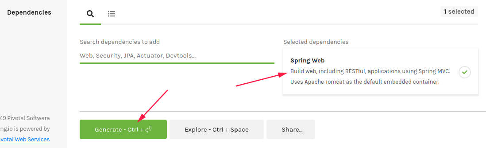
  - 下载后导入Maven即可
  > 点击IDEA File --> New --> Project from Existing Sources... --> 选择你解压后的项目文件夹目录 --> 点击Ok --> 选择Import project from external model --> 选中Maven --> 一路点击Next直到项目导入成功

- 借助IDEA新建

和有些博客不同的是，依赖项选择*Spring Web*（版本更新，所以名字也变了）
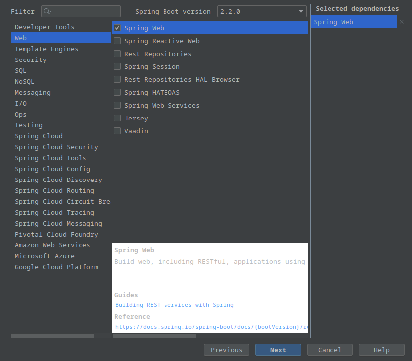

其实可以直接创建Maven项目，只要配置好pom.xml就行了。从上面创建的项目下POM中可以看出添加了以下项：

```xml
<parent>
		<groupId>org.springframework.boot</groupId>
		<artifactId>spring-boot-starter-parent</artifactId>
		<version>2.2.0.RELEASE</version>
		<relativePath/> <!-- lookup parent from repository -->
	</parent>
```
引入了一个名为spring-boot-starter-parent的父项目，里面包含了常用的依赖和合适版本

```xml
<dependency>
			<groupId>org.springframework.boot</groupId>
			<artifactId>spring-boot-starter-web</artifactId>
		</dependency>

		<dependency>
			<groupId>org.springframework.boot</groupId>
			<artifactId>spring-boot-starter-test</artifactId>
			<scope>test</scope>
			<exclusions>
				<exclusion>
					<groupId>org.junit.vintage</groupId>
					<artifactId>junit-vintage-engine</artifactId>
				</exclusion>
			</exclusions>
		</dependency>
```
两个依赖，主要是*spring-boot-starter-web*这个web启动器(Strater)，具体是啥我还不太清楚（待我先过一遍再来补充），看着应该是包含Spring MVC、RESTful和tomcat。另一个应该是测试相关的依赖吧
> 看到有地方说，Spring Boot就是把一些应用场景提取出来写成一个个启动器，项目需要哪些场景/功能就引入哪些启动器，也就引入了对应依赖

### Tip2：社区版的IDEA缺少Springboot初始化的插件
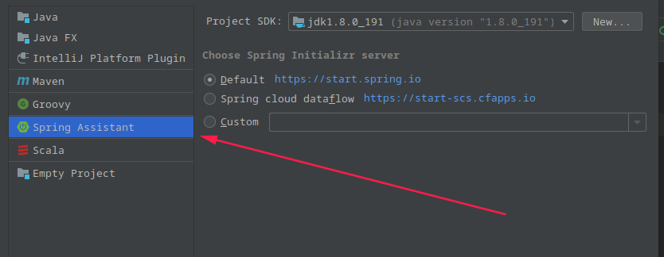
如图，缺少箭头所指的这个选项，解决办法如下：
- 进入*Settings*项（**Ctrl+Alter+S**）
- 如下图安装*Spring Assistant*插件，重启即可，然后新建项目就能看到上图所示的选项了
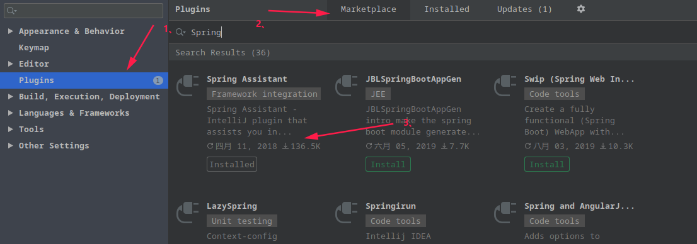

### running。。。
先写一个Controller类，如图新建一个包controller，然后定义一个hello的类
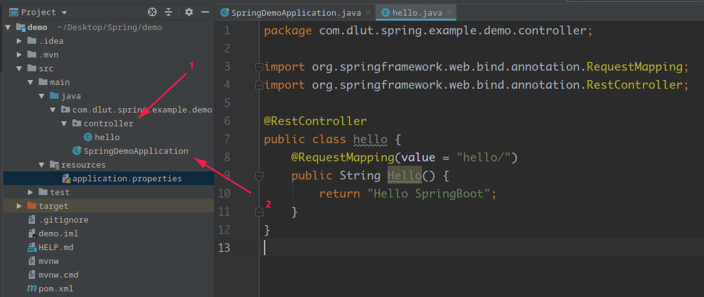

```java
import org.springframework.web.bind.annotation.RequestMapping;
import org.springframework.web.bind.annotation.RestController;

@RestController
public class hello {
    @RequestMapping(value = "hello/")
    public String Hello() {
        return "Hello SpringBoot";
    }
}
```
> 今天看到@RestController是@Controller 和 @ResponseBody的组合注解

运行上图的SpringDemoApplication类的main方法，然后在浏览器访问 localhost:8080/hello/ (默认是8080端口)
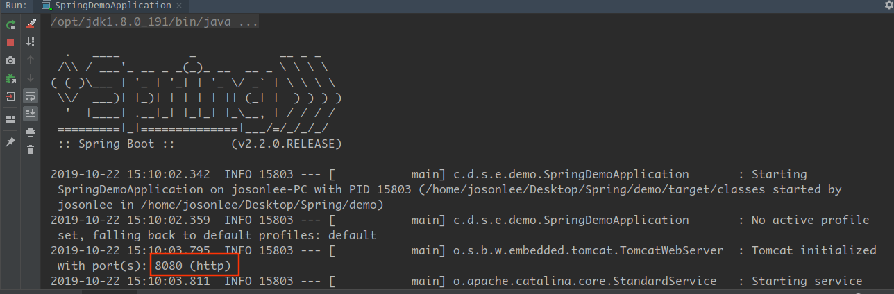
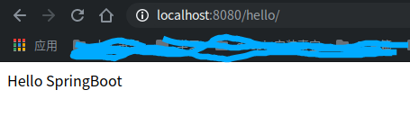

### Tip3：配置文件和如何添加并获取系统配置
下图中的application.properties文件就是全局配置文件，用来改变Spring Boot中的默认配置项，命名是application（默认）。除此之外，还有application.yml这种格式的配置文件
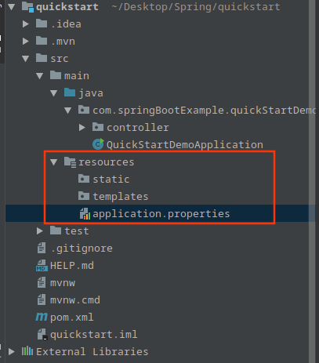

创建application.properties文件时，会根据不同环境创建application-dev.properties、application-test.properties、application-prod.properties三个配置文件分别用于开发、测试、线上正式运行环境的配置，而application.properties适合任何环境。如果你想测试并读取application-test.properties文件中的配置，只需要在全局配置文件中配置`spring.profiles.active=test`，同理开发环境就是设成dev
> 要是部署在服务器上运行打包的jar，可以通过参数设置`java -jar XXX.jar --spring.profiles.active=test`读取application-test.properties文件中的配置

还有一种是在代码中指定读取哪个配置文件，即在启动类的main方法中改成如下：
```java
public static void main(String[] args) {
		SpringApplicationBuilder builder = new SpringApplicationBuilder(QuickStartDemoApplication.class);
		builder.application().setAdditionalProfiles("dev");// dev表示读取开发环境的配置文件
		builder.run(args);
		//SpringApplication.run(QuickStartDemoApplication.class, args);
	}
```

在`java -jar`可以通过`--spring.config.name=xxx`参数指定配置文件的名字，`--spring.config.location=xxx`指定配置文件的位置

- 添加配置的语法
  - [深入Spring Boot (三)：Properties属性配置文件使用详解](https://blog.csdn.net/qq_21806621/article/details/79598183)
  - [深入Spring Boot (四)：YAML属性配置文件使用详解](https://blog.csdn.net/qq_21806621/article/details/79598233)
- 获取配置内容

比如说要配置运行环境的ip地址和端口号，我这里没有额外的ip，所以只改变端口号。在application.properties中设置
```xml
server.ip=127.0.0.1
server.port=8081
...
```
一样在Controller控制类中写一个获取当前运行环境的IP地址和端口号的方法，运行后在浏览器可查看（注意端口是8081）
```java
import org.springframework.beans.factory.annotation.Value;
import org.springframework.web.bind.annotation.RequestMapping;
import org.springframework.web.bind.annotation.RestController;

@RestController
public class hello {
    @Value("${server.ip}")
    public String serverIp;
    @Value("${server.port}")
    public String serverPort;
    
    @RequestMapping(value = "/getip")
    public String getServerIp() {
        return serverIp+":"+serverPort;
    }
}
```
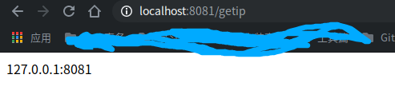

从上面代码可知，可以通过`@Value("${xxx}")`这个注解获取配置文件中的值

> 还有一种把配置赋值给一个javabean的写法，现在还不懂javabean是啥，以后再看吧～～～

## 20191023
### Tip1：配置文件中的属性值注入Java Bean对象
这部分是承接昨天的内容，也就是上面通过`@Value`注解把配置文件中的值注入bean中。还有另一种方法，通过`@ConfigurationProperties`注解，这个不同于`@Value`将属性值一个一个绑定，是类型安全的，适合将批量的配置文件中的数据一一映射到bean中

先看下配置文件怎么个写法：
```xml
server.ip=xxx
server.port=8081
...
```

```java
@Component
@ConfigurationProperties(prefix = "server")
public class ServerProperties{
  private String ip;
  private String port;
  //...
}
```
- prefix值是要加载的配置的前缀
- bean类中的属性名要和配置中属性名对应，但不是很严格，比如port可以对应PORT、po-rt等

### Tip2：配置文件的优先级
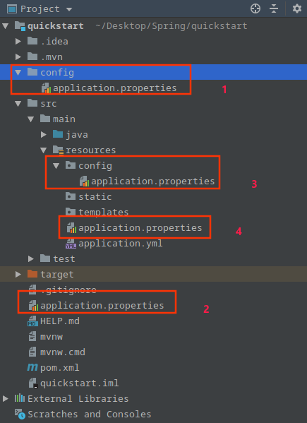

如图，配置文件（.properties/.yml）的加载位置可以是图中四个地方，数字1代表最高优先级。这里的优先级指的是，如果4个地方的配置文件中都有相同属性值，则1处属性值会覆盖掉其他文件对应的属性值。

### Tip3：yaml配置文件的写法
引入的*spring-boot-starter-web* 依赖间接地引入了 *snakeyaml* 依赖, *snakeyaml* 会实现对 yaml 配置的解析。看到很多博客都专门讲了yaml文件的配置，我看了下，确实比properties文件写法简单，省略了很多相同前缀的书写。**但是无法使用 `@PropertySource` 注解加载 yaml 文件**

> ？？？？？？？？？？？？？？？ 留白待续

### Tip4：日志相关

- Spring Boot支持的日志工具

Logback、Java Util Logging、Log4J2
> 默认情况下使用Logback作为日志记录工具，会记录ERROR、WARN和INFO级别的日志信息，输出到控制台
> ERROR、WARN、INFO这些是日志级别，其次还有DEBUG 和 TRACE。可以设置`debug=true`、`trace=true`来开启记录DEBUG、TRACE级别的日志（有啥用不清楚）

- 配置日志输出到文件

在application.properties中配置`logging.file`或者`logging.path`，前者指定日志文件输出到某文件，比如`logging.file=logs.log`，可以是相对/绝对路径；后者指定输出到某目录下，其下会有spring.log输出，比如`logging.path=logs`
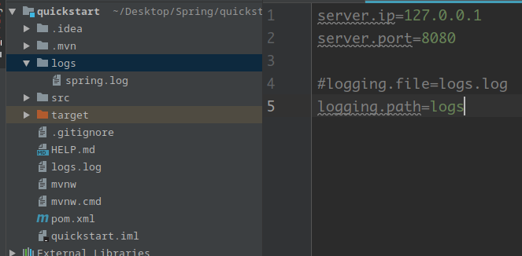

还有就是二者同时设置，只有`logging.file`会生效

默认情况下使用Logback记录日志，日志文件大小超过10MB后，日志文件将会被打包成`.gz`的压缩文件，且压缩文件名称会依时间排序累加。使用Logback时可以通过`logging.file.max-size`设置文件最大多大，单位是kb、mb、gb。而且日志文件会不断累积，可以设置`logging.file.max-history`限制历史日志最多多大
***
大概就这些吧，日志这部分现在还不太作要求
参考：https://blog.csdn.net/qq_24871519/article/details/82194372 ，还涉及了自定义日志配置啥的

## 20191024

### Tip1：静态资源的访问
**发现一个神坑，Spring Boot 1.x** 对静态资源（图片、js、css代码等）有默认要求：
```
提供静态资源目录位置需置于classpath（resources目录）下，目录名需符合如下规则：
classpath:/static
classpath:/public
classpath:/resources
classpath:/META-INF/resources
```
比如说classpath（resource目录）下的static目录下有test.png，则可直接通过localhost:8080/test.png访问
以上对于Spring Boot 2.x没用了，但是网上还是一堆复制粘贴的文章这样写，csdn尤其是。

Spring Boot 2.x版本实现方法：

搜到了两种解决办法，方法一没试通过，但也列在这吧
```xml
# application.properties中设置
# 也可以是/public/**
spring.mvc.static-path-pattern=/static/**
```
方法二
这里说下我查到的原因，spring boot 2.x静态资源会被HandlerInterceptor拦截，因为spring boot 2.x采用的是spring 5.x，会对静态资源拦截
```java
package com.springBootExample.quickStartDemo;

import org.springframework.stereotype.Component;
import org.springframework.web.servlet.config.annotation.ResourceHandlerRegistry;
import org.springframework.web.servlet.config.annotation.WebMvcConfigurer;

@Component
public class WebMvcConfig implements WebMvcConfigurer {
    /**
     * 添加静态资源文件，外部可以直接访问地址
     *
     * @param registry
     */
    @Override
    public void addResourceHandlers(ResourceHandlerRegistry registry) {
        registry.addResourceHandler("/static/**").addResourceLocations("classpath:/static/");
    }
}
```
这两函数从源码看都是可变长参数，所以可以设置多个目录来区别哪里放图片哪里放js代码等，如`registry.addResourceHandler("/public/**","/static/**").addResourceLocations("classpath:/public/","classpath:/static/");`

```java
  /**
	 * Add a resource handler for serving static resources based on the specified URL path patterns.
	 * The handler will be invoked for every incoming request that matches to one of the specified
	 * path patterns.
	 * <p>Patterns like {@code "/static/**"} or {@code "/css/{filename:\\w+\\.css}"} are allowed.
	 * See {@link org.springframework.util.AntPathMatcher} for more details on the syntax.
	 * @return a {@link ResourceHandlerRegistration} to use to further configure the
	 * registered resource handler
	 */
	public ResourceHandlerRegistration addResourceHandler(String... pathPatterns) {
		ResourceHandlerRegistration registration = new ResourceHandlerRegistration(pathPatterns);
		this.registrations.add(registration);
		return registration;
	}

  /**
	 * Add one or more resource locations from which to serve static content.
	 * Each location must point to a valid directory. Multiple locations may
	 * be specified as a comma-separated list, and the locations will be checked
	 * for a given resource in the order specified.
	 * <p>For example, {{@code "/"}, {@code "classpath:/META-INF/public-web-resources/"}}
	 * allows resources to be served both from the web application root and
	 * from any JAR on the classpath that contains a
	 * {@code /META-INF/public-web-resources/} directory, with resources in the
	 * web application root taking precedence.
	 * <p>For {@link org.springframework.core.io.UrlResource URL-based resources}
	 * (e.g. files, HTTP URLs, etc) this method supports a special prefix to
	 * indicate the charset associated with the URL so that relative paths
	 * appended to it can be encoded correctly, e.g.
	 * {@code [charset=Windows-31J]https://example.org/path}.
	 * @return the same {@link ResourceHandlerRegistration} instance, for
	 * chained method invocation
	 */
	public ResourceHandlerRegistration addResourceLocations(String... resourceLocations) {
		this.locationValues.addAll(Arrays.asList(resourceLocations));
		return this;
	}
```

参考：
  - https://my.oschina.net/dengfuwei/blog/1795346
  - https://blog.csdn.net/woaiqianzhige/article/details/82771258
  - https://blog.csdn.net/yu514950381/article/details/78015088

## 20191027
### Tip1：模版引擎？？？
看别人写的博客中谈到了一个叫thymeleaf的模板引擎，查了一番，发现好像就是一个在前后端不分离的情况下数据渲染的工具吧。有查到一个概念——前后端分离，通过vue.js+SpringBoot作前后端分离，通过fetch ，ajax等异步请求java封装的数据接口。高内聚低耦合，想想还是前后端分离一切组件化更优秀，所以模版引擎只是简单看一下

Thymeleaf模版引擎，官方推荐的视图层模板引擎，提供了对Thymeleaf的自动化配置解决方案。需要在pom中添加该依赖，如下：
```xml
<dependency>
	<groupId>org.springframework.boot</groupId>
	<artifactId>spring-boot-starter-thymeleaf</artifactId>
</dependency>
```
以下是ThymeleafProperties配置类部分源码
```java
@ConfigurationProperties(prefix = "spring.thymeleaf")
public class ThymeleafProperties {

	private static final Charset DEFAULT_ENCODING = StandardCharsets.UTF_8;

	public static final String DEFAULT_PREFIX = "classpath:/templates/";

	public static final String DEFAULT_SUFFIX = ".html";

	/**
	 * Whether to check that the template exists before rendering it.
	 */
	private boolean checkTemplate = true;

	/**
	 * Whether to check that the templates location exists.
	 */
	private boolean checkTemplateLocation = true;

	/**
	 * Prefix that gets prepended to view names when building a URL.
	 */
	private String prefix = DEFAULT_PREFIX;
  //...
}
```
下图是类中几个属性的默认值，可以在application.properties中通过前缀`spring.thymeleaf.xxx`自定义配置
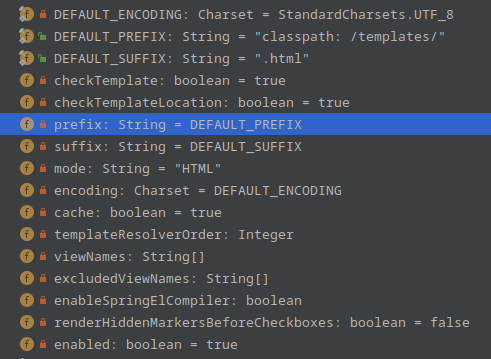

|          属性          |         默认值         |         含义          |
| ---------------------- | ---------------------- | --------------------- |
| checkTemplate         | true                   | 注册前是否检测模版存在 |
| checkTemplateLocation | true                   | 是否检测模版存在       |
| prefix                | classpath:/templates/  | 模版位置              |
| suffix                | .html                  | 后缀                  |
| mode                  | HTML                   | 模版模型              |
| encoding              | StandardCharsets.UTF_8 | 文件编码              |
| cache                 | true                    | 模版是否缓存          |
|                        |                        |                       |
|                        |                        |                       |
|                        |                        |                       |

### Tip2：以json格式向前端返回数据
首先json格式是比较通用的传输数据方式，之前用django时也是用的这个。其次，Spring MVC提供了一个json格式转换的消息转换器（`HttpMessageConverter`）——`jackson-databind`。然后也可以使用第三方的`fastjson`、`Gson` 处理器，`fastjson`是阿里开源的json处理工具，据说目前是解析json最快的工具，所以这里也看一下
- `jackson-databind`的使用

```xml
<dependency>
    <groupId>com.fasterxml.jackson.core</groupId>
    <artifactId>jackson-databind</artifactId>
</dependency>
```
上面是这个包的依赖，但`spring-boot-starter-web`该依赖中默认带了`jackson-databind`作为json处理工具的，所以也就不用在pom中写入
在搜索jackson这个包的用法时，看到了有关的一些注解：`@JsonProperty、@JsonIgnore、@JsonFormat` 用法说明
| 注解    |  用法   |
| --- | --- |
|  @JsonIgnore   |用在属性或方法上，序列化时忽略该属性，也就是生成的json没有该属性     |
|  @JsonFormat   |  用在属性或方法上，用来格式化，像格式化日期属性   |
|@JsonProperty     |  用在属性上或set/get方法上，该属性序列化后可重命名，也就是json中对应的key改变了，也可用来避免遗漏属性   |
|@JsonIgnoreProperties|作用在类上，批量的@JsonIgnore操作，可列出要忽略的属性，或表示将忽略任何未知的属性。|
- 貌似没讲请`@JsonIgnoreProperties`的用法
  - 序列化时，通过`@JsonIgnoreProperties({“a”,”b”})`过滤掉属性a、b
  - 反序列化时，通过`@JsonIgnoreProperties(ignoreUnknown=true)`过滤掉不含`getter/setters`的属性

如图，还有很多用法，也可以在这里找到：https://github.com/FasterXML/jackson-annotations/wiki/Jackson-Annotations
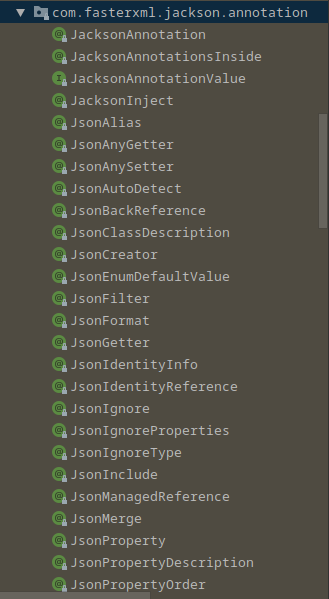

```java
/**
 *定义一个User用来测试
 */
public class User {
    @JsonProperty("userName")
    private String name;
    private String city;
    @JsonIgnore
    private int age;
    @JsonFormat(pattern = "yyyy-MM-dd")
    private Date birthday;
    //省略getter、setters
}

/**
 *定义controller测试
 */
@RequestMapping("/users")
public User getUser() {
    User user = new User();
    user.setName("JosonLee");
    user.setAge(20);
    user.setCity("深圳");
    user.setBirthday(new Date());

    return user;
}
```
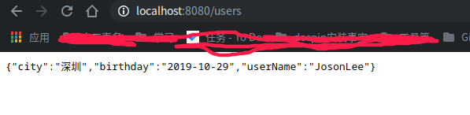

以下内容出自：[Spring Boot jackson配置使用详解](https://blog.csdn.net/z28126308/article/details/90276705)
```xml
  spring:
    jackson:
      # 设置属性命名策略,对应jackson下PropertyNamingStrategy中的常量值，SNAKE_CASE-返回的json驼峰式转下划线，json body下划线传到后端自动转驼峰式
      property-naming-strategy: SNAKE_CASE
      # 空值字段不传递
      default-property-inclusion: non_null
      # 全局设置@JsonFormat的格式pattern
      date-format: yyyy-MM-dd HH:mm:ss
      # 当地时区
      locale: zh
      # 设置全局时区
      time-zone: GMT+8
      # 常用，全局设置pojo或被@JsonInclude注解的属性的序列化方式
      default-property-inclusion: NON_NULL #不为空的属性才会序列化,具体属性可看JsonInclude.Include
      # 常规默认,枚举类SerializationFeature中的枚举属性为key，值为boolean设置jackson序列化特性,具体key请看SerializationFeature源码
      serialization:
        WRITE_DATES_AS_TIMESTAMPS: true # 返回的java.util.date转换成timestamp
        FAIL_ON_EMPTY_BEANS: true # 对象为空时是否报错，默认true
      # 枚举类DeserializationFeature中的枚举属性为key，值为boolean设置jackson反序列化特性,具体key请看DeserializationFeature源码
      deserialization:
        # 常用,json中含pojo不存在属性时是否失败报错,默认true
        FAIL_ON_UNKNOWN_PROPERTIES: false
      # 枚举类MapperFeature中的枚举属性为key，值为boolean设置jackson ObjectMapper特性
      # ObjectMapper在jackson中负责json的读写、json与pojo的互转、json tree的互转,具体特性请看MapperFeature,常规默认即可
      mapper:
        # 使用getter取代setter探测属性，如类中含getName()但不包含name属性与setName()，传输的vo json格式模板中依旧含name属性
        USE_GETTERS_AS_SETTERS: true #默认false
      # 枚举类JsonParser.Feature枚举类中的枚举属性为key，值为boolean设置jackson JsonParser特性
      # JsonParser在jackson中负责json内容的读取,具体特性请看JsonParser.Feature，一般无需设置默认即可
      parser:
        ALLOW_SINGLE_QUOTES: true # 是否允许出现单引号,默认false
      # 枚举类JsonGenerator.Feature枚举类中的枚举属性为key，值为boolean设置jackson JsonGenerator特性，一般无需设置默认即可
      # JsonGenerator在jackson中负责编写json内容,具体特性请看JsonGenerator.Feature
```

- `fastjson`的使用

集成`fastjson`后，还需提供相应的 HttpMessageConverter 后才能使用（`jackson-databind`是因为Spring默认提供的 MappingJackson2HttpMessageConverter 来实现）

1. 引入`fastjson`依赖，接触默认的`jackson-databind`依赖
2. 配置 `fastjson` 的 HttpMessageConverter

  ```xml
  <dependency>
	<groupId>org.springframework.boot</groupId>
	<artifactId>spring-boot-starter-web</artifactId>
	<exclusions>
		<exclusion>
			<groupId>com.fasterxml.jackson.core</groupId>
			<artifactId>jackson-databind</artifactId>
		</exclusion>
	</exclusions>
</dependency>

<dependency>
	<groupId>com.alibaba</groupId>
	<artifactId>fastjson</artifactId>
	<version>1.2.6</version>
</dependency>
  ```
> 以上pom写法看不懂可以参考我之前的笔记：？？？？？？？？？

> 这里需要注意，fastjson 1.2.7之后改动了很多，像FastJsonConfig类都没了。暂时先留个问题在这～
> 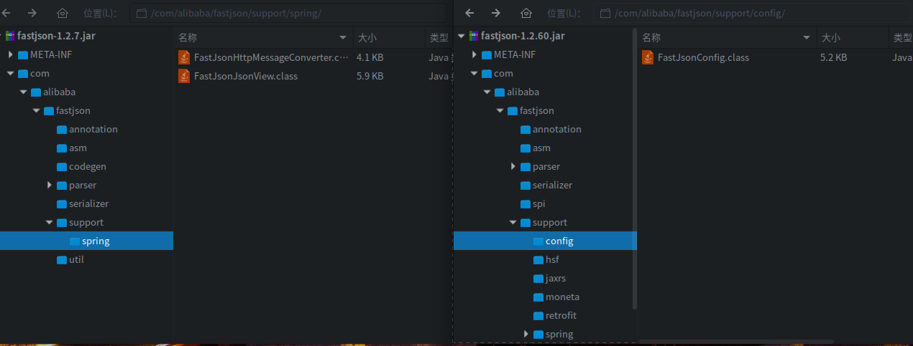

配置 HttpMessageConverter 有两种方法，方法一：
```java
// 新建一个类
@Configuration
public class FastJsonConfigs {
    @Bean
    FastJsonHttpMessageConverter fastJsonHttpMessageConverter() {
        FastJsonHttpMessageConverter converter = new FastJsonHttpMessageConverter();
        FastJsonConfig config = new FastJsonConfig();
        config.setSerializerFeatures(
                SerializerFeature.PrettyFormat,
                SerializerFeature.WriteClassName,
                SerializerFeature.WriteMapNullValue,
                SerializerFeature.WriteNullListAsEmpty,
                SerializerFeature.WriteNullNumberAsZero,
                SerializerFeature.WriteNullStringAsEmpty
        );
        config.setCharset(Charset.forName("UTF-8"));
        config.setDateFormat("yyyy-MM-dd HH:mm:ss");
        converter.setFastJsonConfig(config);
        return converter;
    }
}
```
测试结果如图：
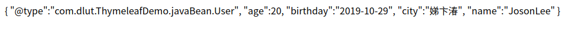

中文无法显示，需要加上全局配置`spring.http.encoding.force-response=true`
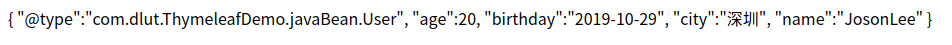

`fastjson` 又有新的注解，其次也没比 `jackson` 快很多，所以还是推荐使用 `jackson`

***
参考：
- https://blog.csdn.net/big_sea_m/article/details/78443738
- https://juejin.im/post/5db647325188251d35344cc2