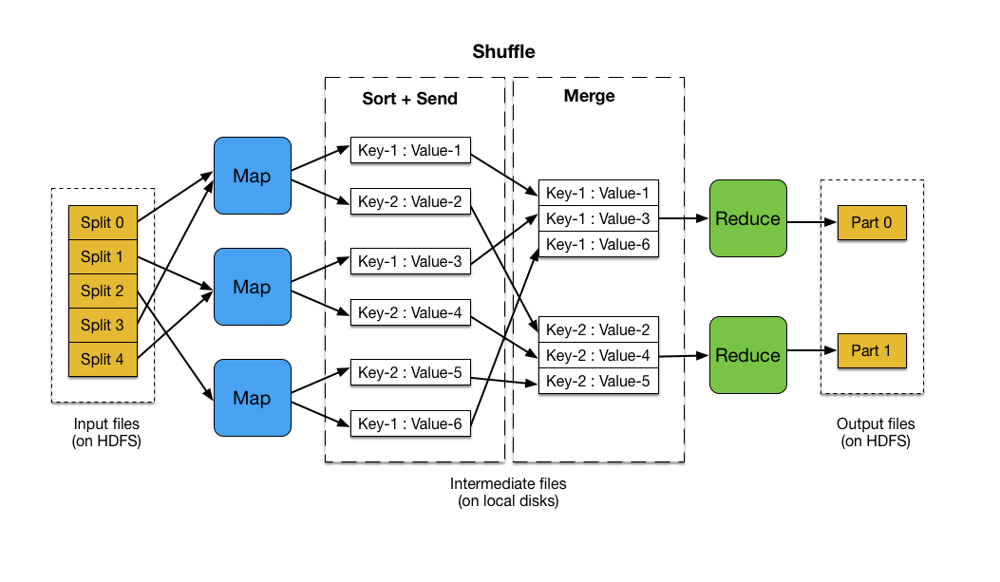
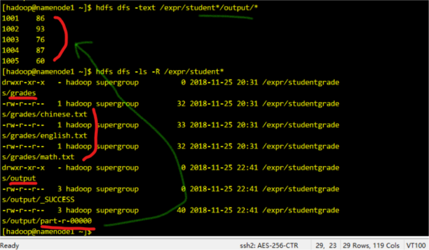

## 初识MapReduce
先看一张图


## MapReduce程序词频统计源码分析
- 前言
    - hdfs中有自己的数据类型，java中的Int对应IntWritable，String对应Text
    - 为了实现文件序列化，编程中必须把Int、String转变为上面的两个

```java
public class WordCount {

  public static class TokenizerMapper 
       extends Mapper<Object, Text, Text, IntWritable>{//定义MAP的输入输出的Key-Value类型，第一对key-value的key不一定是字符串，所以申明为Object类型
    
    private final static IntWritable one = new IntWritable(1);//key-value中经常用到1，申明为常量
    private Text word = new Text();//相当于java中的String
      
//    map方法每次只处理一行【应该是的，我在另一个程序中打印输出是每次一行，还待深究】
    public void map(Object key, Text value, Context context
                    ) throws IOException, InterruptedException {//这里三个变量，前两个对应上面的，context封装了输出的key-value
      StringTokenizer itr = new StringTokenizer(value.toString());//字符串分词器
//      String[] strs = value.toString().split(" "); //等于上面这行，就是分词
      while (itr.hasMoreTokens()) {// 取出子串，并赋1，写入context。不用管context存在什么地方
        word.set(itr.nextToken());
        context.write(word, one);
        //有个概念要知道，这里他给每个词都赋值value=1，实际上value=2也是可以的（
        // 比如hello hello，可以一次计算value=2），看你怎么处理了(value=1省去了一步相同词再汇总过程)
      }
    }
  }
  
  public static class IntSumReducer 
       extends Reducer<Text,IntWritable,Text,IntWritable> {//如上，不过输入、出都是字符串-Int型
    private IntWritable result = new IntWritable();//对每个key，求value的和为result，比如<hello,3>

    public void reduce(Text key, Iterable<IntWritable> values, 
                       Context context
                       ) throws IOException, InterruptedException {
      int sum = 0;
      for (IntWritable val : values) {
        sum += val.get();// get是将IntWritable转为Int类型，set相反，见下面
      }
      result.set(sum);// sum是Int类型，hadoop无法将之序列化，所以转为IntWritable类型
      context.write(key, result);
    }
  }

  public static void main(String[] args) throws Exception {
    Configuration conf = new Configuration();
    String[] otherArgs = new GenericOptionsParser(conf, args).getRemainingArgs();
    if (otherArgs.length < 2) {
      System.err.println("Usage: wordcount <in> [<in>...] <out>");
      System.exit(2);
    }
    // 作业调度
    Job job = new Job(conf, "word count");
    job.setJarByClass(WordCount.class);// 指定作业调度的类
    job.setMapperClass(TokenizerMapper.class);//指定Mapper类
    job.setCombinerClass(IntSumReducer.class);//指定Combiner类
    job.setReducerClass(IntSumReducer.class);//指定Reducer类
    job.setOutputKeyClass(Text.class);
    job.setOutputValueClass(IntWritable.class);
    for (int i = 0; i < otherArgs.length - 1; ++i) {    //传入的文件参数可为多个【最后一个是输出文件】
      FileInputFormat.addInputPath(job, new Path(otherArgs[i]));
    }
    FileOutputFormat.setOutputPath(job,
      new Path(otherArgs[otherArgs.length - 1]));
    System.exit(job.waitForCompletion(true) ? 0 : 1);//等待执行，0是正常退出，1是错误退出
  }
}

```

## Windows下实现MapReduce编程初步
### 宿主机上开发环境配置

### 基于MapReduce统计学生平均成绩
如图，在hdfs的`/expr/studentgrades/grades/` 下创建，几个文件，随便写几行数据，类似如下(学号 成绩)：
```
1001 90
1002 100
...

```

代码及注释如下：
```java
package gradesAverage;

import java.io.IOException;
import java.util.StringTokenizer;


import org.apache.hadoop.conf.Configuration;
import org.apache.hadoop.fs.FileSystem;
import org.apache.hadoop.fs.Path;
import org.apache.hadoop.io.IntWritable;
import org.apache.hadoop.io.Text;
import org.apache.hadoop.mapreduce.Job;
import org.apache.hadoop.mapreduce.Mapper;
import org.apache.hadoop.mapreduce.Reducer;
import org.apache.hadoop.mapreduce.lib.input.FileInputFormat;
import org.apache.hadoop.mapreduce.lib.output.FileOutputFormat;

import mapReduceTest.wordCount.WordCount;
import mapReduceTest.wordCount.WordCount.IntSumReducer;
import mapReduceTest.wordCount.WordCount.TokenizerMapper;

public class GradesAverage {

    public static class TokenizerMapper extends Mapper<Object, Text, Text, IntWritable> {
        private Text student = new Text();
        private IntWritable grade = new IntWritable();

        /* (non-Javadoc)
         * @see org.apache.hadoop.mapreduce.Mapper#map(KEYIN, VALUEIN, org.apache.hadoop.mapreduce.Mapper.Context)
         */
        /* (non-Javadoc)
         * @see org.apache.hadoop.mapreduce.Mapper#map(KEYIN, VALUEIN, org.apache.hadoop.mapreduce.Mapper.Context)
         */
        public void map(Object key, Text value, Context context) throws IOException, InterruptedException {
//          StringTokenizer iTokenizer = new StringTokenizer(value.toString(),"\n");
            System.out.println("key is："+key+"value is: "+value.toString());
//          while (iTokenizer.hasMoreTokens()) {
//              
//          }
            String[] list_strs = value.toString().split(" ");
            // 因为每行只有一个学号和对应成绩，不需要考虑切分多个词
            student.set(list_strs[0]);
            grade.set(Integer.parseInt(list_strs[1]));
            context.write(student, grade);
            
//          String line = value.toString(); //将输入的纯文本文件的数据转化成String
//          System.out.println(line);//为了便于程序的调试，输出读入的内容   
//                           //将输入的数据先按行进行分割
//          StringTokenizer tokenizerArticle = new StringTokenizer(line,"\n"); 
//                  //分别对每一行进行处理
//          while(tokenizerArticle.hasMoreTokens()){
//                              //每行按空格划分
//          StringTokenizer tokenizerLine = new StringTokenizer(tokenizerArticle.nextToken()); 
//          String strName = tokenizerLine.nextToken(); //学生姓名部分  
//          String strScore = tokenizerLine.nextToken();//成绩部分
//          Text name = new Text(strName);//学生姓名  
//          int scoreInt = Integer.parseInt(strScore);//学生成绩score of student
//          context.write(name, new IntWritable(scoreInt));//输出姓名和成绩
//          }
        }
    }

    public static class gradesAverageReducer extends Reducer<Text, IntWritable, Text, IntWritable> {
        private IntWritable gradesSum = new IntWritable();

        public void reduce(Text key, Iterable<IntWritable> values, Context context)
                throws IOException, InterruptedException {
            int sum = 0;
            int grades = 0;
            for (IntWritable val : values) {
                sum += 1;
                grades += val.get();
            }
            System.out.println("student is:"+key.toString()+",grades is:"+grades+",sum is:"+sum);
            gradesSum.set((int)grades/sum);
            context.write(key, gradesSum);
        }
    }

    public static void main(String[] args) throws IOException, ClassNotFoundException, InterruptedException {
        // 1.设置HDFS配置信息
        String namenode_ip = "192.168.17.10";
        String hdfs = "hdfs://" + namenode_ip + ":9000";
        Configuration conf = new Configuration(); // Hadoop配置类
        conf.set("fs.defaultFS", hdfs);
        conf.set("mapreduce.app-submission.cross-platform", "true"); // 集群交叉提交
        /*
         * conf.set("hadoop.job.user", "hadoop"); conf.set("mapreduce.framework.name",
         * "yarn"); conf.set("mapreduce.jobtracker.address", namenode_ip + ":9001");
         * conf.set("yarn.resourcemanager.hostname", namenode_ip);
         * conf.set("yarn.resourcemanager.resource-tracker.address", namenode_ip +
         * ":8031"); conf.set("yarn.resourcemtanager.address", namenode_ip + ":8032");
         * conf.set("yarn.resourcemanager.admin.address", namenode_ip + ":8033");
         * conf.set("yarn.resourcemanager.scheduler.address", namenode_ip + ":8034");
         * conf.set("mapreduce.jobhistory.address", namenode_ip + ":10020");
         */

        // 2.设置MapReduce作业配置信息
        String jobName = "GradesAverage"; // 定义作业名称
        Job job = Job.getInstance(conf, jobName);
        job.setJarByClass(GradesAverage.class); // 指定作业类
        job.setJar("export\\GradesAverage.jar"); // 指定本地jar包
        job.setMapperClass(TokenizerMapper.class);
        job.setCombinerClass(gradesAverageReducer.class); // 指定Combiner类
        job.setReducerClass(gradesAverageReducer.class);
        job.setOutputKeyClass(Text.class);
        job.setOutputValueClass(IntWritable.class);

        // 3.设置作业输入和输出路径
        String dataDir = "/expr/studentgrades/grades"; // 实验数据目录
        String outputDir = "/expr/studentgrades/output"; // 实验输出目录
        Path inPath = new Path(hdfs + dataDir);
        Path outPath = new Path(hdfs + outputDir);
        FileInputFormat.addInputPath(job, inPath);
        FileOutputFormat.setOutputPath(job, outPath);
        // 如果输出目录已存在则删除
        FileSystem fs = FileSystem.get(conf);
        if (fs.exists(outPath)) {
            fs.delete(outPath, true);
        }

        // 4.运行作业
        System.out.println("Job: " + jobName + " is running...");
        if (job.waitForCompletion(true)) {
            System.out.println("统计 success!");
            System.exit(0);
        } else {
            System.out.println("统计 failed!");
            System.exit(1);
        }
    }
}

```

运行结果如下：
```

```

查看平均成绩结果文件，目录结构如图
